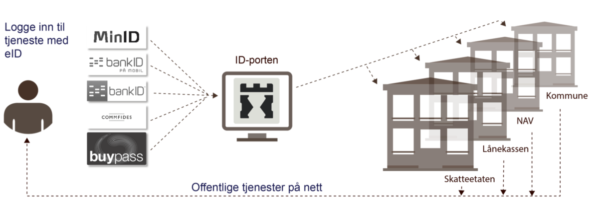
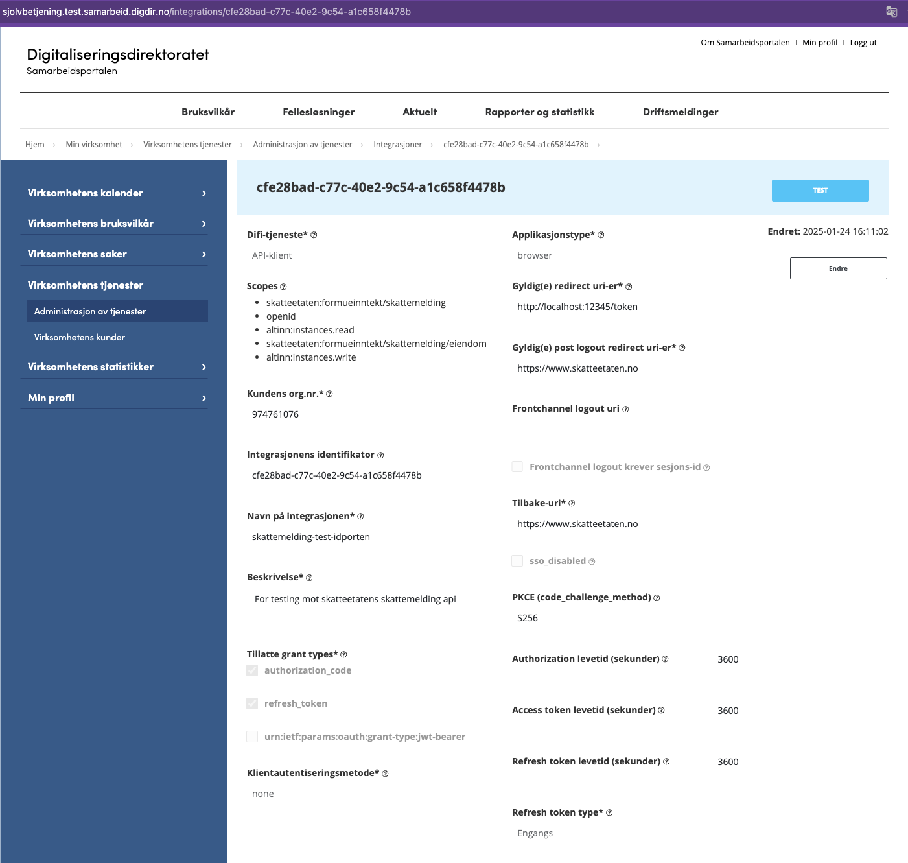
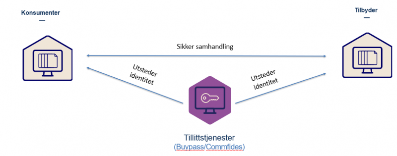

---
icon: "cloud"
title: "API"
description: "Api-beskrivelser"
---

Det tilbys to sett med API-er:

- Skatteetatens-API: har tjenester for hent- og validering av skattemedlinger, eiendomskalkulator, hent vedlegg og
  foreløpig avrenging.
- Altinn3-API: for: har tjenester for opprettelse og innsending av en skattemeldinger.


# Skatteetatens-API

Skatteetaten har utviklet en demo klient (i python/jupyter notebook) som viser hvordan koble seg på ID-porten og kalle
skatteetatens-API, og sende inn skattemeldingen med vedlegg via Altinn3:
[jupyter notebook](../test/testinnsending/person-enk-med-vedlegg-2021.ipynb)

## Autentisering

Når en skattepliktig skal benytte et sluttbrukersystem for å sende inn skattemeldingen og næringsopplysninger gjennom
API må sluttbrukeren og/eller sluttbrukersystemet være autentisert og autorisert gjennom en påloggingsprosess.

Ved kall til skattemelding-API ønsker skatteetaten å kjenne til identiteten til innsender. Identiteten til pålogget
bruker, kombinert med informasjon fra Altinn autorisasjon vil avgjøre hvilken person/selskap en pålogget bruker kan
hente skattemeldingen til eller sende inn skattemelding for.

Autentisering skjer enten via ID-porten eller Maskinporten:

- Personlig innlogging vil skje via ID-porten.
- Systemer/maskiner som ønsker å opptre på vegne av en organisasjon kan autentisere seg via maskinporten.

**Merk** at dagens Altinn innlogging med brukernavn/passord vil ikke lenger kunne brukes.<br/>

### ID-porten

Via ID-porten kan selve sluttbrukeren autentiseres og da via sitt personnummer.



#### Dataflyt og sekvensdiagram

Figuren under skisserer hvordan innloggingsprosessen vil se ut:


#### Registrering av et sluttbrukersystem i ID-porten

Når et sluttbrukersystem initierer en påloggingsprosess mot ID-porten må SBS sende med en klient-ID. Denne klient-id-en
er unik for SBS-typen og vil bli tildelt ved at programvareleverandøren av SBS på forhånd har gjennomført en
registrering (onboarding) i en selvbetjeningsportal hos Digdir/Difi. Dette er beskrevet
her: https://docs.digdir.no/docs/idporten/oidc/. Lenken beskriver også standarden OIDC som ID-porten er basert på.

Under følger en beskrivelse av hvordan en integrasjon kan opprettes hos DigDir slik at dere kan få tildelt en klient-ID.

#### Hvordan opprette ID-porten interasjon hos DigDir

- Først må en integrasjon hos DigDir (gamle DIFI) opprettes gjennom
  deres [selvbetjeningsløsning](https://selvbetjening-samarbeid-ver2.difi.no/).
- Klikk på integrasjoner under Ver2, klikk så på knappen "ny Integrasjon".
- Det er denne integrasjonen som deres applikasjon vil snakke med seinere når deres sluttbruker skal autentisere seg mot
  ID-porten.
    - Verdien i feltet "Integrasjonens identifikator" (kalt klient-ID over) er en GUID som tildeles av Digdir/Difi og
      som SBS må sende med i kallet til ID-porten.
- Velg _"API-klient"_ under "Difi-tjeneste".
- Velg så et scope som angir hvilken offentlig API-tjeneste registreringen gjelder for:
    - Klikk på knappen "Rediger Scopes" og velg _"skatteetaten:formueinntekt/skattemelding"_ fra lista over scopes.
    - PS: hvis dere ikke finner scopet _"skatteetaten:formueinntekt/skattemelding"_ i lista må dere
      ta [kontakt med skatteetaten](mailto:skattemelding-sbs-brukerstotte@skatteetaten.no) slik at vi kan gi dere
      tilgang til scopet (i mellom tiden kan dere forsatt bruke denne integrasjonen da skatteetaen pt. ikke sjekker
      scope ved validering av access tokenet. Men denne sjekken er noe vi på et seinere tidspunkt kommer til å slå på).
- Skriv inn et redirect uri-er (komma seperert og uten mellomrom). Dette er Uri-(er) som klienten får lov å gå til etter
  innlogging (ref. pilnummer 6 i figuren over)
- Sett ønskede verdier for levetiden på autoriasjons-, access og refresh-token.
- Et eksempel på hvordan integrasjonen kan bli seende ut:



### Maskin-porten

Maskinporten sørger for sikker autentisering og tilgangskontroll for datautveksling mellom virksomheter. Løsningen
garanterer identiteten mellom virksomheter og gjør det mulig å binde sammen systemer.

Et sluttbrukersystem som kjører på en sikker server kan integreres i Maskinporten og da være autentisert med sitt
organisasjonsnummer. Det vil da være organisasjonen som autentiserer seg. Hvilken sluttbruker som utfører hvilken
handling i deres system må organisasjonen selv holde kontroll på. En forutsetning for bruk av Maskinporten er derfor at
organisasjonen har bygget et godt tilgangskontroll av sine sluttbrukere.

En autentisering gjort via Maskinporten tilrettelegger for høyere grad av automatisering da det ikke krever en personlig
kodebrikke eller liknende. Vi tror Maskinporten vil passe for store selskap og regnskapsførere som skal levere
skattemeldingen for mange.

Bruk av Maskinporten forutsetter at organisasjonen har et virksomhetssertifikat eller tilsvarende mekanisme. Figuren
under skisserer hvordan samhandlingen fungerer:



Les detaljer om maksinporten her: https://docs.digdir.no/docs/Maskinporten/maskinporten_guide_apikonsument

## Autorisasjon

API-ene som tilbys vil sjekke at sluttbrukeren eller eier av sluttbrukersystemet har tilgang til å utføre operasjoner
gjennom API-et. Slik tilgangskontroll/autorisering skjer via Altinns autorisasjonskomponent.

Dette betyr at sluttbrukeren eller eier av sluttbrukersystemet må ha de nødvendige rollene i Altinn. Dette blir som i
eksisterende løsninger.

## Oppsummering API endepunkt

| TYPE | API path                                                                                                                                 | Virkshomhetssertifikat |
|------|------------------------------------------------------------------------------------------------------------------------------------------|------------------------|
| GET  | [/api/skattemelding/v2/ping](#ping)                                                                                                      | JA                     |
| GET  | [/api/skattemelding/v2/\<inntektsaar\>/\<identifikator\>](#hentGjeldende)                                                                | Nei                    |
| GET  | [/api/skattemelding/v2/\<inntektsaar\>/\<identifikator\>?inkluderUtvidetVeiledning=\<inkluderUtvidetVeiledning\>](#hentGjeldendeUtvidet) | Nei                    |
| GET  | [/api/skattemelding/v2/\<type\>/\<inntektsaar\>/\<identifikator\>](#hentType)                                                            | Nei                    |
| POST | [/api/skattemelding/v2/valider/\<inntektsaar\>/\<identifikator\>](#valider)                                                              | Nei                    |
| POST | [/api/skattemelding/v2/validertest/\<inntektsaar\>/\<identifikator\>](#validerTest)                                                      | Planlagt               |
| GET  | [/api/skattemelding/v2/\<inntektsaar\>/\<identifikator\>/vedlegg/\<vedleggId\>](#hentVedlegg)                                            | Nei                    |
| GET  | [/api/skattemelding/v2/eiendom/soek/\<inntektsår\>?query=\<tekst\>](#eiendomSoek)                                                        | Ja                     |
| GET  | [/api/skattemelding/v2/eiendom/formuesgrunnlag/\<inntektsår\>/\<eiendomsidentifikator\>/\<identifikator\>](#hentFormuesgrunnlag)         | Ja                     |
| POST | [/api/skattemelding/v2/eiendom/markedsverdi/bolig/\<inntektsår\>/\<eiendomsidentifikator\>](#markedsverdiBolig)                          | Ja                     |
| POST | [/api/skattemelding/v2/eiendom/markedsverdi/flerbolig/\<inntektsår\>/\<eiendomsidentifikator\>](#markedsverdiFlerbolig)                  | Ja                     |
| POST | [/api/skattemelding/v2/eiendom/utleieverdi/\<inntektsår\>/\<eiendomsidentifikator\>](#markedsverdiFlerbolig)                             | Ja                     |
| POST | [/api/skattemelding/v2/til-midlertidig-lagret-skattemelding-for-visning](#til-midlertidig-lagret-skattemelding-for-visning)              | Nei                    |
| GET  | [/api/skattemelding/v2/avregning/avregn/\<inntektsaar\>/\<identifikator\>](#avregning)                                                   | Nei                    |
| POST | [/api/skattemelding/v2/klargjoerforhaandsfastsetting/\<inntektsaar\>/\<identifikator\>](#klargjoer-part-for-forhaandsfastsetting)        | Nei                    |

| Miljø                             | Adresse                      | Påloggingsmetode      |
|-----------------------------------|------------------------------|-----------------------|
| Test                              | idporten-api-sbstest.sits.no | OIDC                  |
| Test virksomhetsstertifikat       | api-sbstest.sits.no          | Virksomhetssertifikat |
| Produksjon                        | idporten.api.skatteetaten.no | OIDC                  |
| Produksjon virkshometsstertifikat | api.skatteetaten.no          | Virksomhetssertifikat |

## Ping tjeneste <a name="ping"></a>

API tilbyr en ping tjeneste som kan kalles for å teste at integrasjonen fungerer.

**URL** : `GET https://<env>/api/skattemelding/v2/ping`

**Eksempel URL** : `GET https://idporten.api.skatteetaten.no/api/skattemelding/v2/ping`

**Forespørsel** : `<env>: Miljøspesifikk adresse`

**Respons** :

```json
{
  "ping": "pong"
}
```

## Hent skattemelding <a name="hentGjeldende"></a>

API som returnerer siste gjeldende skattemeldingen for skattepliktige for gitt inntektsår. Den siste gjeldende
skattemeldingen kan enten være utkast eller fastsatt:

- Utkast er en preutfylt skattemelding Skatteetaten har laget for den skattepliktige basert på innrapporterte data og
  data fra skattemeldingen tidligere år.
- Fastsatt betyr at skattemeldingen er manuelt innlevert eller automatisk innlevert ved utløp av innleveringsfrist.
  Dette kan også inneholde et eller flere myndighetsfastsatte felter.

**URL** : `GET https://<env>/api/skattemelding/v2/<inntektsaar>/<identifikator>/`

**Eksempel URL** : `GET https://idporten.api.skatteetaten.no/api/skattemelding/v2/2020/974761076`

**Forespørsel** :

- `<env>: Miljøspesifikk adresse`
- `<inntektsår>: Inntektsåret man spør om informasjon for, i formatet YYYY.`
- `<identifikator>: Fødselsnummer, D-nummer eller organisasjonsnummer til den skattepliktige som man spør om skattemeldingen for.`

**Respons** :

- Iht.
  XSD: [skattemeldingognaeringsspesifikasjonforespoerselresponse_v2_kompakt.xsd](https://github.com/Skatteetaten/skattemeldingen/blob/master/src/resources/xsd/skattemeldingognaeringsspesifikasjonforespoerselresponse_v2_kompakt.xsd)
- Eksempel
  XML: [personligSkattemeldingerOgNaeringsspesifikasjonResponse.xml](https://github.com/Skatteetaten/skattemeldingen/blob/master/src/resources/eksempler/v2/personligSkattemeldingerOgNaeringsspesifikasjonResponse.xml)

skattemeldingerOgNaeringsopplysningerforespoerselResponse:

- dokumenter – konvolutt for dokumenter

    - skattemeldingdokument – complex type
      -
      type – [valg fra xsd](https://github.com/Skatteetaten/skattemeldingen/blob/master/src/resources/xsd/skattemeldingognaeringsspesifikasjonforespoerselresponse_v2_kompakt.xsd#L47:L50)
        - id – dokumentidentifikator til dokumentet i skatteetatens system.
        - encoding – kodeliste – [utf-8]
        - content – serialisert dokumentinnhold i base64 encodet format
    - naeringsopplysningsdokument – complex type
        - id – dokumentidentifikator til dokumentet i skatteetatens system
        - encoding – kodeliste – [utf-8]
        - content – serialisert dokumentinnhold i base64 encodet format
    - utvidetVeiledningdokument - complex type
        - id – dokumentidentifikator til dokumentet i skatteetatens system
        - encoding – kodeliste – [utf-8]
        - content – serialisert dokumentinnhold i base64 encodet format

### Utvidet veiledning <a name="hentGjeldendeUtvidet"></a>

Fra og med inntektsår 2022 er det mulig å etterspørre eventuelle ubesvarte utvidede veiledninger som del av dette API'et, som kan sees i response-spesifikasjonen over. 

En utvidet veiledning representerer opplysninger som Skatteetaten har om skatteyter som muligens burde vært oppgitt i skattmeldingen, men som ikke er det. Disse opplysningene er gjerne ikke komplette, og kan derfor ikke forhåndsutfylles.

`content`-delen av `utvidetVeiledningdokument` inneholder en skattemelding-xml med foreslått tillegg for skatteyter. Dette er ikke en fullstendig XML ihht. skattemelding-XSD og vil ikke nødvendigvis validere mot sistnevnte. 
Normalt inneholder dokumentet informasjon som tilsvarer en entitet i skattemeldingen. I de tilfeller det er flere, så betyr det i praksis at Skatteetaten foreslår at en av entitetene skal legges til (ikke alle).

Det kan være mange `utvidetVeiledningdokument` i `skattemeldingerOgNaeringsopplysningerforespoerselResponse`, en per opplysning Skattetaten ønsker at skatteyter skal ta stilling til.

Bare "ubesvarte" utvidede veiledninger returneres i responsen. En veiledning kan besvares på to måter:
- Gjennom Skatteetatens innleveringsportal for personlige skatteytere, der de kan velge å avvise eller legge til opplysningene
- Ved innsending av `komplett` skattemelding fra et sluttbrukersystem. Når en slik innsending er fullført og fører til fastsetting, så vil alle ubesvarte veiledninger _på fastsettingstidspunktet_ bli besvart som at de er "hentet av SBS".
  - OBS! Siden nye utvidede veiledninger kan oppstå fortløpende, så finnes det en risiko for at det har kommet nye mellom tidspunktet hvor SBS henter veiledningene og fastsetting utføres. Det er derfor en risiko for at veiledninger som ikke har blitt hentet av SBSen og fremvist bruker blir besvart som det. 

**URL** : `GET https://<env>/api/skattemelding/v2/<inntektsaar>/<identifikator>?inkluderUtvidetVeiledning=<inkluderUtvidetVeiledning>`

**Eksempel URL** : `GET https://idporten.api.skatteetaten.no/api/skattemelding/v2/2022/974761076?inkluderUtvidetVeiledning=true`

**Forespørsel** :

- `<inkluderUtvidetVeiledning>: Hvorvidt man ønsker å hente eventuelle ubesvarte utvidede veiledninger. Settes til 'true' eller 'false'`
  - dersom request parameteren ikke sendes med som del av URL'en, så settes den til 'false' som default
  - denne fungerer bare dersom `<inntektsaar>` er 2022 eller senere. Hvis request parameteren sendes med ved tidligere år så vil den ignoreres. 


### Serialisert dokumentinnhold

Det serialiserte dokumentinnholdet er skattemelding eller næringsopplysninger i base64 encodet format.
Dette er formattert i henhold til https://datatracker.ietf.org/doc/html/rfc4648.
Responsen fra Skatteetaten vil alltid inneholde base64 som er formatert på denne måten.

Eksempel (inneholder linjeskift for lesbarhet):

    <content>PD94bWwgdmVyc2lvbj0iMS4wIiBlbmNvZGluZz0iVVRGLTgiPz4KPHNrYXR0ZW1lbGRpbmcgeG1s
    bnM9InVybjpubzpza2F0dGVldGF0ZW46ZmFzdHNldHRpbmc6Zm9ybXVlaW5udGVrdDpza2F0dGVt
    ZWxkaW5nOmVrc3Rlcm46djgiPgogIDxwYXJ0c3JlZmVyYW5zZT4xMjM8L3BhcnRzcmVmZXJhbnNl
    PgogIDxpbm50ZWt0c2Fhcj4yMDIwPC9pbm50ZWt0c2Fhcj4KICA8c2thdHRlbWVsZGluZ09wcHJl
    dHRldD4KICAgIDxicnVrZXJpZGVudGlmaWthdG9yPmlra2UtaW1wbGVtZW50ZXJ0PC9icnVrZXJp
    ZGVudGlmaWthdG9yPgogICAgPGJydWtlcmlkZW50aWZpa2F0b3J0eXBlPnN5c3RlbWlkZW50aWZp
    a2F0b3I8L2JydWtlcmlkZW50aWZpa2F0b3J0eXBlPgogICAgPG9wcHJldHRldERhdG8+MjAyMC0x
    MC0yMVQwNjozMjowNi45OTMwMzlaPC9vcHByZXR0ZXREYXRvPgogIDwvc2thdHRlbWVsZGluZ09w
    cHJldHRldD4KPC9za2F0dGVtZWxkaW5nPg==<content>

## Hent Skattemelding (basert på type)  <a name="hentType"></a>

API som returnerer siste gjeldende skattemeldingen av gitt type for skattepliktige for gitt inntektsår. Følgende type
skattemeldinger er støttet:

- Utkast er en preutfylt skattemelding Skatteetaten har laget for den skattepliktige basert på innrapporterte data og
  data fra skattemeldingen tidligere år.
- Fastsatt betyr at skattemeldingen er manuelt innlevert eller automatisk innlevert ved utløp av innleveringsfrist.
  Dette kan også inneholde et eller flere myndighetsfastsatte felter.

**URL** : `GET https://<env>/api/skattemelding/v2/<type>/<inntektsaar>/<identifikator>/`

**Eksempel URL** : `GET https://idporten.api.skatteetaten.no/api/skattemelding/v2/utkast/2020/974761076`

**Forespørsel** :

- `<env>: Miljøspesifikk adresse`
- `<inntektsår>: Inntektsåret man spør om informasjon for, i formatet YYYY.`
- `<identifikator>: Fødselsnummer, D-nummer eller organisasjonsnummer til den skattepliktige som man spør om skattemeldingen for.`

**Respons** :

- Iht.
  XSD: [skattemeldingognaeringsspesifikasjonforespoerselresponse_v2_kompakt.xsd](https://github.com/Skatteetaten/skattemeldingen/blob/master/src/resources/xsd/skattemeldingognaeringsspesifikasjonforespoerselresponse_v2_kompakt.xsd)
- Eksempel
  XML: [skattemeldingerognaeringsopplysninger_response.xml](https://github.com/Skatteetaten/skattemeldingen/blob/master/docs/documentation/test/eksempler/skattemeldingerognaeringsopplysninger_response.xml)

For nærmere beskrivelse av felt i XSDen eller hvordan man henter ut utvidede veiledninger, se forrige kapittel.

## Valider skattemelding <a name="valider"></a>

Tjenesten validerer innholdet i en skattemelding og returnerer en respons med eventuelle feil, avvik og advarsler.
Tjenesten vil foreta følgende:

1. Kontroll av meldingsformatet.
2. Kontroll av innholdet og sammensetningen av elementene i skattemeldingen.
3. Beregninger/kalkyler.

Skatteetaten ønsker at valideringstjenesten blir kalt i forkant av innsending av skattemeldingen. Dette for å sikre at skattemeldingen er korrekt og vil mest sannsynligvis bli godkjent ved innsending.
Uansett versjon vil skatteetaten ikke lagre eller følge opp informasjonen som sendes inn i valideringstjenesten på noen måte. Skatteetaten anser at disse dataene eies av den skattepliktige og ikke av skatteetaten.


**URL** : `POST https://<env>/api/skattemelding/v2/valider/<inntektsaar>/<identifikator>`

**Eksempel URL** : `POST https://idporten.api.skatteetaten.no/api/skattemelding/v2/valider/2021/01028312345`

**Forespørsel** :

- `<env>: Miljøspesifikk adresse`
- `<inntektsår>: Inntektsåret man spør om informasjon for, i formatet YYYY.`
- `<identifikator>: Fødselsnummer, D-nummer eller organisasjonsnummer til den skattepliktige`

**Body** :

- Iht. XSD: [skattemeldingognaeringsspesifikasjonrequest_v2_kompakt.xsd](../../src/resources/xsd/skattemeldingognaeringsspesifikasjonrequest_v2.xsd)
- Eksempel XML: [personligSkattemeldingOgNaeringsspesifikasjonRequest.xml](../../src/resources/eksempler/2021/personligSkattemeldingOgNaeringsspesifikasjonRequest.xml)

skattemeldingOgNaeringsspesifikasjonRequest:
- dokumenter
  - dokument
    - type - [skattemeldingPersonlig | skattemeldingUpersonlig | naeringsspesifikasjon]
    - encoding - kodeliste – [utf-8]
    - content - base64 encodet xml dokument 
- dokumentreferanseTilGjeldendeDokument
  - dokumenttype (samme som dokumenter.dokument.type)
  - dokumentidentifikator - referanse hentet fra hentSkattemelding kall. Bruk referansen til skattemeldingen
- inntektsår - fire siffer for inntektsår innsendingen gjelder. husk å bruk riktig xsd versjon for skattemeldingen og næringspesifikasjon for tilhørende inntektsår
- innsendingsinformasjon 
  - innsendingstype - [ikkeKomplett | komplett]
  - opprettetAv - system navn brukt for å gjøre innsendingen
  

**Respons** :

- Iht. XSD: [skattemeldingognaeringsspesifikasjonresponse_v2.xsd](../../src/resources/xsd/skattemeldingognaeringsspesifikasjonresponse_v2.xsd)
- Eksempel XML: [personligSkattemeldingerOgNaeringsspesifikasjonResponse.xml](../../src/resources/eksempler/2021/personligSkattemeldingerOgNaeringsspesifikasjonResponse.xml)

skattemeldingOgNaeringsspesifikasjonResponse:

- Dokumenter – konvolutt for relevante dokumenter
  - Dokument – complex type
    - Type – kodeliste [skattemeldingPersonligEtterBeregning|beregnetSkattPersonlig|summertSkattegrunnlagForVisningPersonlig|naeringsspesifikasjonEtterBeregning|skattemeldingUpersonligEtterBeregning|beregnetSkattUpersonlig|summertSkattegrunnlagForVisningUpersonlig]
    - Encoding – kodeliste – [utf-8]
    - Content – serialisert dokumentinnhold
- avvikEtterBeregning – konvolutt for avvik funnet etter beregning
  - avvik – complex type
    - avvikstype – [kodeliste](../../src/resources/kodeliste/2021/2021_avvikskodeVedValidertMedFeil.xml)
      - OBS! manglerSkattemelding kan henvise til følgende dokumenttyper : skattemelding, skattemeldingUpersonlig og selskapsmelding 
    - forekomstidentifikator – identifikator av felt i skattemeldingen
    - mottattVerdi – verdien som ble sendt inn
    - beregnetVerdi – verdien som ble beregnet
    - avvikIVerdi – avviket mellom den innsendte verdien og den beregnede verdien
    - sti – stien til elementet som har avvik
- avvikVedValidering – konvolutt for avvik funnet ved validering
  - avvik – complex type
    - avvikstype – [kodeliste](../../src/resources/kodeliste/2021/2021_avvikskodeVedValidertMedFeil.xml)
    - forekomstidentifikator – identifikator av felt i skattemeldingen
    - mottattVerdi – verdien som ble sendt inn
    - beregnetVerdi – verdien som ble beregnet
    - avvikIVerdi – avviket mellom den innsendte verdien og den beregnede verdien
    - sti – stien til elementet som har avvik
- veiledningEtterKontroll – konvolutt for veiledninger
  - veiledning – complex type
    - veiledningstype – kodeliste [kontrollnavnet i SMIA, mulighetsrom kommer fra dem]
    - forekomstidentifikator – identfikator til felt i skattemeldingen
    - sti – stien til elementet med veiledning

## Valider skattemeldingen uten dokumentreferanseTilGjeldendeDokument <a name="validerTest"></a>

## Valider skattemeldingen uten dokumentreferanseTilGjeldendeDokument
Hvis dere har behov for å gjøre beregninger før Skatteetaten har publisert utkast for et inntektsår, kan dere kalle denne tjenesten.
Den er helt lik som valideringstjenesten, men krever ikke `dokumentreferanseTilGjeldendeDokument`.

**URL** : `POST https://<env>/api/skattemelding/v2/validertest/<inntektsaar>/<identifikator>`

**Eksempel URL** : `POST https://idporten.api.skatteetaten.no/api/skattemelding/v2/validertest/2021/01028312345`

**Forespørsel** :

- `<env>: Miljøspesifikk adresse`
- `<inntektsår>: Inntektsåret man spør om informasjon for, i formatet YYYY.`
- `<identifikator>: Fødselsnummer, D-nummer eller organisasjonsnummer til den skattepliktige`

**Body** 
Likt som valider ovenfor

## Lagre skattemelding midlertidig for visning <a name="midlertidigVisning"></a>
Hvis dere har behov for å vise skattemeldingen i visningsklienten, kan den lastet opp via dette endepunktet. Skattemeldingen vil bli lagret i 24 timer for visning via URLen som returneres i responsen.

**URL** : `POST https://<env>/api/skattemelding/v2/til-midlertidig-lagret-skattemelding-for-visning`

**Eksempel URL** : `POST https://idporten.api.skatteetaten.no/api/skattemelding/v2/til-midlertidig-lagret-skattemelding-for-visning`

**Forespørsel** :

- `<env>: Miljøspesifikk adresse`

**Body** 
Likt som valider ovenfor

**Response**

```json
{
  "url": "https://skatt.skatteetaten.no/web/skattemelding-visning/midlertidig-lagret-skattemelding-for-visning?id=<id>"
}
```
- `<id>: Unik identifikator på midlertidig lagret skattemeldingen`

## Hent vedlegg <a name="hentVedlegg"></a>

Api som returnerer tidligere innsendte vedlegg til fastsatte skattemeldinger, enten fastsatt i gjeldende/nyeste skattemelding eller fra tidligere fastsettinger.

**URL** : `GET https://<env>/api/skattemelding/v2/<inntektsaar>/<identifikator>/vedlegg/<vedleggId>`

**Eksempel URL** : `GET https://idporten.api.skatteetaten.no/api/skattemelding/v2/<inntektsaar>/<identifikator>/vedlegg/<vedleggId>`

**Forespørsel** :

- `<env>: Miljøspesifikk adresse`
- `<inntektsår>: Inntektsåret man spør om informasjon for, i formatet YYYY`
- `<identifikator>: Fødselsnummer, D-nummer eller organisasjonsnummer til den skattepliktige`
- `<vedleggId>: ID fra XML-stien "/skattemelding/vedlegg/id"`

**Respons** :

- nedlastbar fil

## Eiendom API

Eiendom API tilbyr endepunkter for å søke opp eiendommer, hente eiendommeners formuesgrunnlag og for å beregne eiendommers markedsverdi.

### Testdata

Oversikt over hvilke eiendommer dere kan søke opp ligger i [dette regnearket](Syntetiske_eiendommer.xlsx)

### Søk

Det er mulig å søke på alle norske vegadresser, matrikkelnummer og boligselskap (organisasjonsnummer og andelsnr/aksjeboenhetsnr)

**URL** : `GET https://<env>/api/skattemelding/v2/eiendom/soek/<inntektsår>?query=<tekst>`

**Eksempel URL vegadress** : `GET https://idporten.api.skatteetaten.no/api/skattemelding/v2/eiendom/soek/2021?query=Storgata 1`

**Eksempel URL matrikkelnummer** : `GET https://idporten.api.skatteetaten.no/api/skattemelding/v2/eiendom/soek/2021?query=36/120`

**Forespørsel** :

- `<env>: Miljøspesifikk adresse.`
- `<inntektsår>: Inntektsåret man spør om informasjon for, i formatet YYYY.`
- `<query>: Fritekst søkestreng.`

**_Fritekst søkestreng_**

- `Hvis første tegn man angir er et tall vil søket kun lete blant matrikkeladresser.`
- `Hvis første tegn man angir er en bokstav vil søket kun lete blant veiadresser.`
- `Søket krever streng plassering av tegn.`

**Respons vegadresse** :

```json
{
  "resultatStorrelse": 1,
  "eiendommer": [],
  "vegadresser": [
    {
      "sergEiendomsidentifikator": 200,
      "unikeiendomsidentifikator": 200,
      "adressenavn": "Storgata",
      "husnr": 1,
      "postnummer": "4900",
      "poststedsnavn": "TVEDESTRAND",
      "highlight": "<em>Storgata</em> 1, 4900 Tvedestrand",
      "eiendommer": [
        {
          "sergEiendomsidentifikator": 200,
          "unikeiendomsidentifikator": 200,
          "eiendometablertdato": "2018-06-01",
          "kommunenr": "0914",
          "kommunenavn": "TVEDESTRAND",
          "gaardsnr": 97,
          "bruksnr": 13,
          "festenr": 0,
          "seksjonsnr": 0,
          "historisk": false,
          "highlight": "0914-97/13/0/0"
        }
      ]
    }
  ],
  "sokStart": "2021-10-05T09:53:06.118374",
  "sokSlutt": "2021-10-05T09:53:06.149235"
}
```

**Respons matrikkelnummer** :

```json
{
  "resultatStorrelse": 1,
  "eiendommer": [
    {
      "sergEiendomsidentifikator": 1,
      "unikeiendomsidentifikator": 1,
      "eiendometablertdato": "1925-03-31",
      "kommunenr": "1919",
      "kommunenavn": "GRATANGEN",
      "gaardsnr": 36,
      "bruksnr": 120,
      "festenr": 0,
      "seksjonsnr": 0,
      "highlight": "1919-<em>36/120</em>/0/0"
    }
  ],
  "vegadresser": [],
  "sokStart": "2020-10-05T09:55:03.197953",
  "sokSlutt": "2020-10-05T09:55:03.206961"
}
```

**_Forklaring til respons_**

- `sergEiendomsidentifikator: eiendomsidentifkator som skal benyttes for å hente eiendom og formuesinformajon.`

### Hent formuesgrunnlag <a name="hentFormuesgrunnlag"></a>

Hent formuesgrunnlag for valgt unik eiendomsidentifikator og inntektsår.

Merk at hvilken informasjon responsen vil inneholde avhenger av valgt inntektsår, og at formuesopplysninger vil variere basert på hvilken eiendomstype eiendomsidentifikator har. Noen detaljer vil fjernes fra responsen hvis skatteyter ikke er eier av eiendommen.

**URL** : `GET https://<env>/api/skattemelding/v2/eiendom/formuesgrunnlag/<inntektsår>/<eiendomsidentifikator>/<identifikator>`

**Eksempel URL** : `GET https://idporten.api.skatteetaten.no/api/skattemelding/v2/eiendom/formuesgrunnlag/2021/1/02095300173`

**Forespørsel** :

- `<env>: Miljøspesifikk adresse.`
- `<inntektsår>: Inntektsåret man spør om informasjon for, i formatet YYYY.`
- `<eiendomsidentifikator>: Unik eiendomsidentifikator.`
- `<identifikator>: Fødselsnummer, D-nummer eller organisasjonsnummer til den skattepliktige som man henter eiendom for.`

**Respons** :

```json
{
  "formuesspesifikasjonForBolig": [
    {
      "eiendomstype": "selveidBolig",
      "byggeaar": "2000",
      "boligensAreal": "150",
      "boligtype": "enebolig",
      "internEiendomsidentifikator": "d7ea5b46-1b6c-4d74-9a72-f92282b5288dfastEiendom",
      "andelAvFormuesverdi": "100.00"
    }
  ],
  "fastEiendom": [
    {
      "vegadresse": [
        {
          "husnummer": "2",
          "husbokstav": "A",
          "adressenavn": "Storgata"
        }
      ],
      "kommunenummer": "1919",
      "postnummer": "9471",
      "poststedsnavn": "GRATANGEN",
      "sergEiendomsidentifikator": "1",
      "bruksnummer": "120",
      "gaardsnummer": "36",
      "internEiendomsidentifikator": "d7ea5b46-1b6c-4d74-9a72-f92282b5288dfastEiendom",
      "eierandel": "100.00"
    }
  ]
}
```

```json
{
  "ukjentEiendomINorge": [
    {
      "internEiendomsidentifikator": "bdb3a6b8-61d9-48e0-86e3-e4777edde687fastEiendom"
    }
  ],
  "fastEiendom": [
    {
      "vegadresse": [
        {
          "husnummer": "1",
          "husbokstav": "C",
          "adressenavn": "Giraffveien"
        }
      ],
      "kommunenummer": "1919",
      "postnummer": "9471",
      "poststedsnavn": "GRATANGEN",
      "sergEiendomsidentifikator": "3",
      "bruksnummer": "113",
      "gaardsnummer": "38",
      "internEiendomsidentifikator": "bdb3a6b8-61d9-48e0-86e3-e4777edde687fastEiendom"
    }
  ]
}
```

**_Forklaring til respons_**

`Responsen kan inneholde følgende objekt:`

- `fastEiendom: innholder eiendommens adresseinfomasjon og gjeldende skatteyters eierandel. Merk at det kan være flere vegadresser knyttet til eiendommen.`
- `formuesspesifikasjonFor*: innholder eiendommens formuesspesifikasjon og gjeldende skatteyters andel av formuesverdi. Detaljer som xxxx er med hvis skatteyter er eier av eiendommen. * Kan ha følgende verdier: Bolig, Flerboligbygning, SkalIkkeFastsettes, Tomt, SelveidFritidseiendom, AnnenFastEiendomInnenforInntektsgivendeAktivitet, AnnenFastEiendomUtenforInntektsgivendeAktivitet.`
- `ukjentEiendomINorge: hvis vi ikke støtter denne eiendomstypen.`

### Beregn markedsverdi for bolig <a name="markedsverdiBolig"></a>

Beregningen er basert på sjablong fra SSB hvor boligeegenskaper, inntektsår inngår i beregningen.

Det er også mulig å oppgi dokumentert markedsverdi. Gyldig verdi skal være under klagegrense. Ugyldig dokumntert markedsverdi vil ikke hensyntas.

Sender man inn hele responsen fra hent formuesgrunnlag vil responsen på beregn innholde alt som ble sendt inn pluss de beregnede feltene.

**URL** : `POST https://<env>/api/skattemelding/v2/eiendom/markedsverdi/bolig/<inntektsår>/<eiendomsidentifikator>`

**Eksempel URL** : `POST https://idporten.api.skatteetaten.no/api/skattemelding/v2/eiendom/markedsverdi/bolig/2021/1`

**Forespørsel** :

- `<env>: Miljøspesifikk adresse.`
- `<inntektsår>: Inntektsåret man spør om informasjon for, i formatet YYYY.`
- `<eiendomsidentifikator>: Unik eiendomsidentifikator.`

**Body uten dokumentert markedsverdi**

```json
{
  "formuesspesifikasjonForBolig": [
    {
      "eiendomstype": "selveidBolig",
      "byggeaar": "2000",
      "boligensAreal": "150",
      "boligtype": "enebolig",
      "andelAvFormuesverdi": "100.00"
    }
  ]
}
```

**Body med dokumentert markedsverdi**

```json
{
  "formuesspesifikasjonForBolig": [
    {
      "eiendomstype": "selveidBolig",
      "byggeaar": "2000",
      "boligensAreal": "150",
      "boligtype": "enebolig",
      "andelAvFormuesverdi": "100.00",
      "dokumentertMarkedsverdi": "2000000"
    }
  ]
}
```

**_Body full eiendom_**

```json
{
  "formuesspesifikasjonForBolig": [
    {
      "eiendomstype": "selveidBolig",
      "byggeaar": "2000",
      "boligensAreal": "150",
      "boligtype": "enebolig",
      "internEiendomsidentifikator": "1fb46159-19d5-4dc5-b5d6-706839b65103fastEiendom",
      "andelAvFormuesverdi": "100.00"
    }
  ],
  "fastEiendom": [
    {
      "vegadresse": [
        {
          "husnummer": "2",
          "husbokstav": "A",
          "adressenavn": "Storgata"
        }
      ],
      "kommunenummer": "1919",
      "postnummer": "9471",
      "poststedsnavn": "GRATANGEN",
      "sergEiendomsidentifikator": "1",
      "bruksnummer": "120",
      "gaardsnummer": "36",
      "internEiendomsidentifikator": "1fb46159-19d5-4dc5-b5d6-706839b65103fastEiendom",
      "eierandel": "100.00"
    }
  ]
}
```

**Respons uten dokumentert markedsverdi** :

```json
{
  "formuesspesifikasjonForBolig": [
    {
      "eiendomstype": "selveidBolig",
      "andelAvFormuesverdi": "100.00",
      "byggeaar": "2000",
      "boligensAreal": "150",
      "boligtype": "enebolig",
      "beregnetMarkedsverdi": "2592619"
    }
  ]
}
```

**Respons med dokumentert markedsverdi** :

```json
{
  "formuesspesifikasjonForBolig": [
    {
      "eiendomstype": "selveidBolig",
      "dokumentertMarkedsverdi": "2000000",
      "andelAvFormuesverdi": "100.00",
      "byggeaar": "2000",
      "boligensAreal": "150",
      "boligtype": "enebolig",
      "justertMarkedsverdi": "2000000",
      "beregnetMarkedsverdi": "2000000"
    }
  ]
}
```

**Respons full eiendom** :

```json
{
  "formuesspesifikasjonForBolig": [
    {
      "eiendomstype": "selveidBolig",
      "andelAvFormuesverdi": "100.00",
      "internEiendomsidentifikator": "1fb46159-19d5-4dc5-b5d6-706839b65103fastEiendom",
      "byggeaar": "2000",
      "boligensAreal": "150",
      "boligtype": "enebolig",
      "beregnetMarkedsverdi": "2592619"
    }
  ],
  "fastEiendom": [
    {
      "vegadresse": [
        {
          "husnummer": "2",
          "husbokstav": "A",
          "adressenavn": "Storgata"
        }
      ],
      "kommunenummer": "1919",
      "postnummer": "9471",
      "internEiendomsidentifikator": "1fb46159-19d5-4dc5-b5d6-706839b65103fastEiendom",
      "eierandel": "100.00",
      "poststedsnavn": "GRATANGEN",
      "sergEiendomsidentifikator": "1",
      "bruksnummer": "120",
      "gaardsnummer": "36"
    }
  ]
}
```

**_Forklaring til respons_**

- `beregnetMarkedsverdi: beregnet markedverdi for boligen.`
- `dokumentertMarkedsverdi: dokumentert markedsverdi når denne er innefor reglene slik at den er hensynstatt.`
- `justertMarkedsverdi: justert markedsverdi er med når dokumentert markedsverdi er hensynstatt.`

### Beregn markedsverdi for flerbolig <a name="markedsverdiFlerbolig"></a>

Beregningen er basert på sjablong fra SSB hvor boligeegenskaper, inntektsår inngår i beregningen.

Det beregnes markedsverdi for hver useksjonert boenhet.

Det er også mulig å oppgi dokumentert markedsverdi. Gyldig verdi skal være under klagegrense. Ugyldig dokumntert markedsverdi vil ikke hensyntas.

Sender man inn hele responsen fra hent formuesgrunnlag vil responsen på beregn innholde alt som ble sendt inn pluss de beregnede feltene.

**URL** : `POST https://<env>/api/skattemelding/v2/eiendom/markedsverdi/flerbolig/<inntektsår>/<eiendomsidentifikator>`

**Eksempel URL** : `POST https://idporten.api.skatteetaten.no/api/skattemelding/v2/eiendom/markedsverdi/flerbolig/2021/102`

**Forespørsel** :

- `<env>: Miljøspesifikk adresse.`
- `<inntektsår>: Inntektsåret man spør om informasjon for, i formatet YYYY.`
- `<eiendomsidentifikator>: Unik eiendomsidentifikator.`

**Body uten dokumentert markedsverdi**

```json
{
  "formuesspesifikasjonForFlerboligbygning": [
    {
      "useksjonertBoenhet": [
        {
          "boligensAreal": "100",
          "byggeaar": "2016",
          "bruksenhetsnummer": "H0101",
          "boligtype": "leilighet"
        },
        {
          "boligensAreal": "101",
          "byggeaar": "2016",
          "bruksenhetsnummer": "H0102",
          "boligtype": "leilighet"
        },
        {
          "boligensAreal": "102",
          "byggeaar": "2016",
          "bruksenhetsnummer": "H0103",
          "boligtype": "leilighet"
        },
        {
          "boligensAreal": "102",
          "byggeaar": "2016",
          "bruksenhetsnummer": "H0104",
          "boligtype": "leilighet"
        },
        {
          "boligensAreal": "102",
          "byggeaar": "2016",
          "bruksenhetsnummer": "H0105",
          "boligtype": "leilighet"
        }
      ],
      "eiendomstype": "flerboligbygning"
    }
  ]
}
```

**Body med dokumentert markedsverdi**

```json
{
  "formuesspesifikasjonForFlerboligbygning": [
    {
      "useksjonertBoenhet": [
        {
          "boligensAreal": "100",
          "byggeaar": "2016",
          "bruksenhetsnummer": "H0101",
          "boligtype": "leilighet"
        },
        {
          "boligensAreal": "101",
          "byggeaar": "2016",
          "bruksenhetsnummer": "H0102",
          "boligtype": "leilighet"
        },
        {
          "boligensAreal": "102",
          "byggeaar": "2016",
          "bruksenhetsnummer": "H0103",
          "boligtype": "leilighet"
        },
        {
          "boligensAreal": "102",
          "byggeaar": "2016",
          "bruksenhetsnummer": "H0104",
          "boligtype": "leilighet"
        },
        {
          "boligensAreal": "102",
          "byggeaar": "2016",
          "bruksenhetsnummer": "H0105",
          "boligtype": "leilighet"
        }
      ],
      "eiendomstype": "flerboligbygning",
      "dokumentertMarkedsverdi": "11000000"
    }
  ]
}
```

**Respons uten dokumentert markedsverdi** :

```json
{
  "formuesspesifikasjonForFlerboligbygning": [
    {
      "useksjonertBoenhet": [
        {
          "boligensAreal": "100",
          "byggeaar": "2016",
          "bruksenhetsnummer": "H0101",
          "boligtype": "leilighet",
          "boligverdi": "2621994"
        },
        {
          "boligensAreal": "101",
          "byggeaar": "2016",
          "bruksenhetsnummer": "H0102",
          "boligtype": "leilighet",
          "boligverdi": "2639856"
        },
        {
          "boligensAreal": "102",
          "byggeaar": "2016",
          "bruksenhetsnummer": "H0103",
          "boligtype": "leilighet",
          "boligverdi": "2657663"
        },
        {
          "boligensAreal": "102",
          "byggeaar": "2016",
          "bruksenhetsnummer": "H0104",
          "boligtype": "leilighet",
          "boligverdi": "2657663"
        },
        {
          "boligensAreal": "102",
          "byggeaar": "2016",
          "bruksenhetsnummer": "H0105",
          "boligtype": "leilighet",
          "boligverdi": "2657663"
        }
      ],
      "eiendomstype": "flerboligbygning",
      "beregnetMarkedsverdi": "13234839"
    }
  ]
}
```

**Respons med dokumentert markedsverdi** :

```json
{
  "formuesspesifikasjonForFlerboligbygning": [
    {
      "useksjonertBoenhet": [
        {
          "boligensAreal": "100",
          "byggeaar": "2016",
          "bruksenhetsnummer": "H0101",
          "boligtype": "leilighet",
          "boligverdi": "2621994"
        },
        {
          "boligensAreal": "101",
          "byggeaar": "2016",
          "bruksenhetsnummer": "H0102",
          "boligtype": "leilighet",
          "boligverdi": "2639856"
        },
        {
          "boligensAreal": "102",
          "byggeaar": "2016",
          "bruksenhetsnummer": "H0103",
          "boligtype": "leilighet",
          "boligverdi": "2657663"
        },
        {
          "boligensAreal": "102",
          "byggeaar": "2016",
          "bruksenhetsnummer": "H0104",
          "boligtype": "leilighet",
          "boligverdi": "2657663"
        },
        {
          "boligensAreal": "102",
          "byggeaar": "2016",
          "bruksenhetsnummer": "H0105",
          "boligtype": "leilighet",
          "boligverdi": "2657663"
        }
      ],
      "eiendomstype": "flerboligbygning",
      "dokumentertMarkedsverdi": "11000000",
      "justertMarkedsverdi": "11000000",
      "beregnetMarkedsverdi": "11000000"
    }
  ]
}
```

**_Forklaring til respons_**

- `beregnetMarkedsverdi: beregnet markedverdi for boligen.`
- `boligverdi: beregnet markedsverdi for useksjonert boenhet. Beregnes uavhenig av dokumentert markedsverdi.`
- `dokumentertMarkedsverdi: dokumentert markedsverdi når denne er innefor reglene slik at den er hensynstatt.`
- `justertMarkedsverdi: justert markedsverdi er med når dokumentert markedsverdi er hensynstatt.`

**Feil response ifm bad request**

```json
{
  "feilkode": "EIENDOM-014",
  "beskrivelse": "Eiendommen finnes ikke."
}
```

**_Feilkoder ifm bad request_**

- EIENDOM-001: Ugyldig verdi: boligtype må være (enebolig, leilighet, smaahus).
- EIENDOM-002: Ugyldig verdi: byggeaar må være tall.
- EIENDOM-003: Ugyldig verdi: byggeaar må være mindre eller lik skatteleggingsperiode og større enn 1250.
- EIENDOM-004: Ugyldig verdi: boligensAreal må være et tall større enn 9 og mindre enn 10000.
- EIENDOM-005: Ugyldig verdi: dokumentertMarkedsverdiForBolig må være et tall.
- EIENDOM-008: Ugyldig verdi: Boligtype for boenhet må være leilighet.
- EIENDOM-013: Eiendom kunne ikke entydig identifiseres med oppgitte verdier.
- EIENDOM-014: Eiendommen finnes ikke.
- EIENDOM-015: Eiendommen er utgått.
- EIENDOM-016: Ingen bruksareal.
- EIENDOM-017: Ingen bruksareal. Flere bygninger har registrert bruksareal.
- EIENDOM-018: Ugyldig bruksareal.
- EIENDOM-019: Formuesgrunnlag mangler for denne eiendommen. Forespørselen kunne ikke fullføres.
- EIENDOM-020: Ugyldig verdi: Dokumentert markedsverdi kan ikke overstige 2.1 milliarder.
- EIENDOM-021: Ugyldig Naeringstype. Naeringstypen er ikke en gyldig naeringstype for ikke utleid naeringseiendom.
- EIENDOM-022: Ugyldig verdi: Dokumentert markedsverdi må være stoerre enn 0.
- EIENDOM-050: støtter ikke inntektsaar: <inntektsår>.
- EIENDOM-051: <Ulike mangler på input>.
- EIENDOM-999: Noe gikk galt. Forespørselen kunne ikke fullføres.

### Beregn utleieverdi for ikke-utleid næringseiendom <a name="markedsverdiIkkeUtiledNaeringseiendom"></a>

BeregnetUtleieverdi er basert på næringssjablong fra SSB hvor næringstype, areal, bystatus, sentralitet og skatteleggingsperiode inngår i beregningen.

Det er også mulig å oppgi dokumentert markedsverdi. Gyldig verdi skal være under klagegrense. Ugyldig dokumntert markedsverdi vil ikke hensyntas.

Sender man inn hele responsen fra hent formuesgrunnlag vil responsen på beregn innholde alt som ble sendt inn pluss de beregnede feltene.

**URL** : `POST https://<env>/api/skattemelding/v2/eiendom/utleieverdi/<inntektsår>/<eiendomsidentifikator>`

**Eksempel URL** : `POST https://idporten.api.skatteetaten.no/api/skattemelding/v2/eiendom/utleieverdi/2021/102`

**Forespørsel** :

- `<env>: Miljøspesifikk adresse.`
- `<inntektsår>: Inntektsåret man spør om informasjon for, i formatet YYYY.`
- `<eiendomsidentifikator>: Unik eiendomsidentifikator.`

**Body uten dokumentert markedsverdi**

```json
{
  "formuesspesifikasjonForIkkeUtleidNaeringseiendomINorge": [
    {
      "eiendomstype": "ikkeUtleidNaeringseiendomINorge",
      "naeringseiendomstype": "tomtGrunnarealHovedfunksjon",
      "areal": "250"
    }
  ]
}
```

**Body med dokumentert markedsverdi**

```json
{
    "formuesspesifikasjonForIkkeUtleidNaeringseiendomINorge": [
        {
            "eiendomstype": "ikkeUtleidNaeringseiendomINorge",
            "naeringseiendomstype": "tomtGrunnarealHovedfunksjon",
            "areal": "250",
            "dokumentertMarkedsverdi": "200000"
        }
    ]
}
```

**Respons uten dokumentert markedsverdi** :

```json
{
    "formuesspesifikasjonForIkkeUtleidNaeringseiendomINorge": [
        {
            "eiendomstype": "ikkeUtleidNaeringseiendomINorge",
            "naeringseiendomstype": "tomtGrunnarealHovedfunksjon",
            "areal": "250",
            "beregnetUtleieverdi": "250000",
            "utleieverdi": "250000"
        }
    ]
}
```

**Respons med dokumentert markedsverdi** :

```json
{
  "formuesspesifikasjonForIkkeUtleidNaeringseiendomINorge": [
    {
      "eiendomstype": "ikkeUtleidNaeringseiendomINorge",
      "naeringseiendomstype": "tomtGrunnarealHovedfunksjon",
      "dokumentertMarkedsverdi": "200000",
      "areal": "250",
      "beregnetUtleieverdi": "200000",
      "utleieverdi": "250000"
    }
  ]
}
```

**_Forklaring til respons_**

- `beregnetMarkedsverdi: beregnet markedverdi for boligen.`
- `boligverdi: beregnet markedsverdi for useksjonert boenhet. Beregnes uavhenig av dokumentert markedsverdi.`
- `dokumentertMarkedsverdi: dokumentert markedsverdi når denne er innefor reglene slik at den er hensynstatt.`
- `justertMarkedsverdi: justert markedsverdi er med når dokumentert markedsverdi er hensynstatt.`

**Feil response ifm bad request**

```json
{
  "feilkode": "EIENDOM-014",
  "beskrivelse": "Eiendommen finnes ikke."
}
```

**_Feilkoder ifm bad request_**

- EIENDOM-001: Ugyldig verdi: boligtype må være (enebolig, leilighet, smaahus).
- EIENDOM-002: Ugyldig verdi: byggeaar må være tall.
- EIENDOM-003: Ugyldig verdi: byggeaar må være mindre eller lik skatteleggingsperiode og større enn 1250.
- EIENDOM-004: Ugyldig verdi: boligensAreal må være et tall større enn 9 og mindre enn 10000.
- EIENDOM-005: Ugyldig verdi: dokumentertMarkedsverdiForBolig må være et tall.
- EIENDOM-008: Ugyldig verdi: Boligtype for boenhet må være leilighet.
- EIENDOM-013: Eiendom kunne ikke entydig identifiseres med oppgitte verdier.
- EIENDOM-014: Eiendommen finnes ikke.
- EIENDOM-015: Eiendommen er utgått.
- EIENDOM-016: Ingen bruksareal.
- EIENDOM-017: Ingen bruksareal. Flere bygninger har registrert bruksareal.
- EIENDOM-018: Ugyldig bruksareal.
- EIENDOM-019: Formuesgrunnlag mangler for denne eiendommen. Forespørselen kunne ikke fullføres.
- EIENDOM-020: Ugyldig verdi: Dokumentert markedsverdi kan ikke overstige 2.1 milliarder.
- EIENDOM-021: Ugyldig Naeringstype. Naeringstypen er ikke en gyldig naeringstype for ikke utleid naeringseiendom.
- EIENDOM-022: Ugyldig verdi: Dokumentert markedsverdi må være stoerre enn 0.
- EIENDOM-050: støtter ikke inntektsaar: <inntektsår>.
- EIENDOM-051: <Ulike mangler på input>.
- EIENDOM-999: Noe gikk galt. Forespørselen kunne ikke fullføres.

## Forløpig avregning <a name="avregning"></a>
Tjenesten avregning er en tjeneste som mottar fødselsnummer og beregnet skatt og retunerer avregning. Denne tjenesten vil IKKE ta høyde for eventuelte tidligere skatteoppgjør for aktuelt inntektsår. Dvs at hvis skattyter har et skatteoppgjør og fått utbetalt tilgode, og skal gjøre en endring så vil denne tjenesten avregne som om det var første skatteoppgjør

*URL** : `POST https://<env>/api/skattemelding/v2/avregning/avregn/{inntektsaar}/{identifikator}`
```json
{
  "beregnetSkatt" : 10000
}
```

**Forespørsel** :

- `<env>: Miljøspesifikk adresse.`
- `<inntektsaar>: Inntektsåret man spør om informasjon for, i formatet YYYY.`
- `<identifikator>: Fødsels eller D -nummer for parten som skal avregnes .`
- `<beregnetSkatt>: Sum beregnet skatt for aktuelt inntektsår.`

**Respons**
responsen er json med disse feltene. Spørsmålstegn indikerer at feltet ikke er obligatorisk og dersom det ikke er noe verdi i dette feltet, blir det ikke retunert

- beregnetSkatt: Long,
- forskuddstrekk: Long?,
- manueltKorrigertForskuddstrekk: Long?,
- manueltRegistrertForskuddstrekk: Long?,
- nektetGodskrevet: Long?,
- tilbakebetaltFoerAvregning: Long?,
- utskrevetForskuddsskatt: Long?,
- betaltTilleggsforskudd: Long?,
- restskatt: Long?,
- overskytende: Long?,
- rentetillegg: Long?,
- rentegodtgjoerelse: Long?,
- beregnedeDebetAvsavnsrenter: Long?,
- beregnedeKreditAvsavnsrenter: Long?,
- forskuddPaaRestskatt: Long?,
- ubetaltForskuddsskatt: Long?,
- utbetaltEtterTidligereSkatteoppgjoer: Long?,
- innbetaltEtterTidligereSkatteoppgjoer: Long?,
- aaBetale: Long?,
- tilGode: Long?,
- aaBetaleFrafaltUnderOrdinaerBeloepsgrense: Long?,
- aaBetaleFrafaltUnderBeloepsgrenseForSjoemenn: Long?,
- tilGodeBlirIkkeUtbetaltUnderOrdinaerBeloepsgrense: Long?,
- tilGodeBlirIkkeUtbetaltUnderBeloepsgrenseForSjoemenn: Long?,
- enoekfradrag: Long?,
- restskattFrafaltUnderOrdinaerBeloepsgrense: Long?,
- fastsattKildeskattPaaLoenn: Long?,
- refusjonAvKildeskattPaaLoenn: Long?

## Forhåndsfastsetting <a name="Forhandsfastsetting"></a>
Det er mulig å be om forhåndsfastsetting for upersonlige skattemelding før ordinær fastsettingsperioden starter.
For eksempel, så skal et selskap kunne få forhåndsfastsetting i mars i 2023. Da skal skattemeldingen for 2022 og 2023 leveres.

Skattemeldingen 2022 leveres i 2022-modellen, som "vanlig". I tillegg skal skattemeldingen for 2023 leveres, også den i 2022-modellen.

Dersom en skal forhåndsfastsette før skattemeldingen er tilgjenglig via vanlig hent api'et så må en kjøre et "klargjøringskall". 
Når skattemeldingen er tilgjenglig så må skattemeldingen inneholde 

```xml
<skattemelding xmlns="urn:no:skatteetaten:fastsetting:formueinntekt:skattemelding:upersonlig:ekstern:v2">
    <partsnummer>900408015031</partsnummer>
    <inntektsaar>2023</inntektsaar>
<!--    resten av skattemelding innformasjon her-->
    <gjelderForhaandsfastsetting>
      <innsendingsformat>
        <forhaandsfastsettingsformattype>fjoraaretsSkattemelding</forhaandsfastsettingsformattype>
      </innsendingsformat>
    </gjelderForhaandsfastsetting>
</skattemelding>
```
I tillegg så må en i skattemeldingOgNaeringsspesifikasjonRequest anngi hvilket navnerom skattemeldingen er lagret på. 
Dersom en skal forhåndsfastsette 2022 og 2023 nå i februrar 2022 så skal følgende være satt:

For skattemeldingen dokumentet:
```xml
<dokument>
    <type>skattemeldingUpersonlig</type>
    <encoding>utf-8</encoding>
    <content><!-- base64-enkodet innhold her --></content>
    <navneromVedForhaandsfastsetting>urn:no:skatteetaten:fastsetting:formueinntekt:skattemelding:upersonlig:ekstern:v2</navneromVedForhaandsfastsetting>
</dokument>
```

For næringspesifikasjonen
```xml
    <dokument>
    <type>naeringsspesifikasjon</type>
    <encoding>utf-8</encoding>
    <content><!-- base64-enkodet innhold her --></content>
    <navneromVedForhaandsfastsetting>urn:no:skatteetaten:fastsetting:formueinntekt:naeringsopplysninger:ekstern:v3</navneromVedForhaandsfastsetting>
</dokument>
```

### Klargjør part for forhåndsfastsetting: <a name="klargjoer-part-for-forhaandsfastsetting"></a> 
Dette kallet skal kjøres for å klargjøre en part for forhåndsfastsetting 
dersom skattemeldingen ikke er klar på forhåndsfastsettingtidspunktet

**URL** `POST https://<env>/api/skattemelding/v2/klargjoerforhaandsfastsetting/<inntektsår>/<identifikator>`

**Eksempel URL** : `POST https://idporten.api.skatteetaten.no/api/skattemelding/v2/klargjoerforhaandsfastsetting/2023/312787016`

**Forespørsel** :

- `<env>: Miljøspesifikk adresse.`
- `<inntektsår>: Inntektsåret man spør om informasjon for, i formatet YYYY.`
- `<identifikator>: Organisasjonsnummer som krever forhåndsfastsetting.`

**Respons**
Ved vellykket klargjøring: 
```json
{
  "status": "OK"
}
```

Part som har utkast tilgjenglig: 
```json
{
  "status": "PART_HAR_GJELDENDE",
  "melding": "part har allerede gjeldende skattemelding for part, inntektsaar=2022, partType=upersonlig"
}
```

Innteksår ikke støttet
```json
{
  "status": "FORHAANDSFASTSETTING_ER_IKKE_STOETTET_FOR_INNTEKTSAAR",
  "melding": "forhåndsfastsetting er ikke støttet for dette inntektsåret, inntektsaar=2021"
}
```

Partstype ikke støttet (per nå støttes kun upersonlig skattemelding)
```json
{
  "status": "PART_TYPE_ER_IKKE_STOETTET",
  "melding": "forhåndsfastsetting er ikke støttet for denne partstypen, inntektsaar=2023, partType=personlig"
}
```

Andre feiltilstander
```json
{
  "status": "UKJENT",
  "melding": "feil tilstand oppdaget ifm klargjøring av forhåndsfastsetting, inntektsaar=2023, partType=personlig"
}
```

# Altinn3-API

For applikasjonsbrukere, dvs. organisasjoner og personer som kaller Altinn gjennom et klient API (typisk skattepliktige som bruker et sluttbrukersystem) tilbyr Altinn API-er med følgende funksjonalitet:

1. opprette en instans i Altinn
2. populere instansen med metadata
3. populere instansen med vedlegg (ved behov)
4. populere instansen med skattemeldingsdata
5. trigger neste steg slik at instansen havner i status _Bekreftelse_ (betyr "data lastet opp").
6. trigger neste steg slik at instansen havner i status _Tilbakemelding_ (betyr "skattemeldingen innsendt").
7. hente kvittering/tilbakemelding. Merk at det kan gå litt tid før kvittering er tilgjengelig (Skatteetaten må laste ned, behandle innsendingen og laste opp kvitteringen)

Les mer om Altinn API-ene på [altinn sine sider](https://docs.altinn.studio/teknologi/altinnstudio/altinn-api/). Altinn har utviklet POSTMAN skript som viser hvordan deres APIer kan bli kalt. Postman skriptene [finnes her](https://github.com/Altinn/altinn-studio/blob/master/src/test/Postman/collections/App.postman_collection.json)

Tjenestene listet under kalles for å sende inn skattemelding til Altinn.

_Merk at Base URL-en_ til applikasjonen vår i Altinn er:

**Testmiljø:** `https://skd.apps.tt02.altinn.no/skd/formueinntekt-skattemelding-v2/`

**Produksjonsmiljø:** `https://skd.apps.altinn.no/skd/formueinntekt-skattemelding-v2/`

## Hent token

Første trinn er å få generert et autentiseringstoken i Altinn. Autentisering skjer enten via maskinporten eller ID-porten. Les mer om det på [altinn sine sider](https://docs.altinn.studio/api/authentication/)

Tokenet fra maskinporten/ID-porten brukes til å veksle det inn i et Altinn JWT access token. Det er Altinn tokenet som brukes videre til å kalle Altinn-APIer beskervet under.

**Testmiljø:** `curl --location --request GET 'https://platform.tt02.altinn.no//authentication/api/v1/exchange/id-porten' \ --header 'Authorization: Bearer <ID-porten/maskinporten Token>'`

**Produksjonsmiljø:** `curl --location --request GET 'https://platform.altinn.no//authentication/api/v1/exchange/id-porten' \ --header 'Authorization: Bearer <ID-porten/maskinporten Token>'`

Responsen til dette kallet vil være et Altinn-token, dette tokenet skal brukes i kallene under.
<br />

## Hent PartyId fra Altinn

Altinn krever at det brukes Altinn sin interne ID-en, kalt _PartyId_ ved kall til Altinn tjenestene.

**Testmiljø:** `curl --location --request GET 'https://skd.apps.tt02.altinn.no/skd/formueinntekt-skattemelding-v2/api/v1/profile/user' \ --header 'Authorization: Bearer <altinn Token>'`

**Produksjonsmiljø:** `curl --location --request GET 'https://skd.apps.altinn.no/skd/formueinntekt-skattemelding-v2/api/v1/profile/user' \ --header 'Authorization: Bearer <altinn Token>'`

<br />

Merk at partyId kan også fås ved å opprette instans basert på fødselsnummer. For detaljer se neste avsnitt.

## Opprett en instans i Altinn

Det er to måter å opprette en instans i Altinn på.
Alternativ 1 er foretrukket, og innebærer å sende med inntektsaar i payloaden. Dette gjør "Oppdater skjema-metadata til instansen" overflødig.

### Opprett en instans i Altinn (Alternativ 1)

For å opprette en instans av skattemeldingen i Altinn3, så skal det tekniske navnet på instansen være `formueinntekt-skattemelding-v2`

Beskrivelse: `inntektsaar: Inntektsår skattemeldingen gjelder for`

Første trinn i innsendingsløpet er opprettelse av en instans av skattemeldingen. Plukk ut partyId fra forrige respons og bruk det i body under. 


**Testmiljø:** `curl --location --request POST 'https://skd.apps.tt02.altinn.no/skd/formueinntekt-skattemelding-v2/instances/' \ --header 'Content-Type: application/json' \ --header 'Authorization: Bearer <altinn Token>' \ --data-raw '{ "instanceOwner": { "partyId": "50006875" }, "appId" : "skd/formueinntekt-skattemelding-v2", "dataValues":{"inntektsaar":2021} }'`

**Produksjonsmiljø:** `curl --location --request POST 'https://skd.apps.altinn.no/skd/formueinntekt-skattemelding-v2/instances/' \ --header 'Content-Type: application/json' \ --header 'Authorization: Bearer <altinn Token>' \ --data-raw '{ "instanceOwner": { "partyId": "50006875" }, "appId" : "skd/formueinntekt-skattemelding-v2", "dataValues":{"inntektsaar":2021} }'`

En instans kan også opprettes ved å oppgi fødselsnummer (i stedet for partyId) i payloaden, da vil partyId bli retunert i responsen og kan brukes til å gjøre resterende kall mot Altinn.

**Testmiljø:** `curl --location --request POST 'https://skd.apps.tt02.altinn.no/skd/formueinntekt-skattemelding-v2/instances/' \ --header 'Content-Type: application/json' \ --header 'Authorization: Bearer <altinn Token>' \ --data-raw '{ "instanceOwner": { "personNumber": "12345678910" }, "appId" : "skd/formueinntekt-skattemelding-v2", "dataValues":{"inntektsaar":2021} }'`

**Produksjonsmiljø:** `curl --location --request POST 'https://skd.apps.altinn.no/skd/formueinntekt-skattemelding-v2/instances/' \ --header 'Content-Type: application/json' \ --header 'Authorization: Bearer <altinn Token>' \ --data-raw '{ "instanceOwner": { "personNumber": "12345678910" }, "appId" : "skd/formueinntekt-skattemelding-v2", "dataValues":{"inntektsaar":2021} }'`

Merk at skattemelding for "personlige skattepliktige med næring (ENK)" skal alltid sendes inn på personens fødselsnummer (det kan ikke benyttes orgnummer til ENK).

Les mer om endepunktet på Altinn sine sider:
https://docs.altinn.studio/teknologi/altinnstudio/altinn-api/app-api/instances/#create-instance

**Respons** : Metadata om instansen som ble opprettet. En unik instanceId vil være med i responen og kan brukes seinere til å hente/oppdatere instansen.
<br />


### Opprett en instans i Altinn (Alternativ 2)
For å opprette en instans av skattemeldingen i Altinn3, så skal det tekniske navnet på instansen være `formueinntekt-skattemelding-v2`


Første trinn i innsendingsløpet er opprettelse av en instans av skattemeldingen. Plukk ut partyId fra forrige responsen og bruk det i body under.

**Testmiljø:** `curl --location --request POST 'https://skd.apps.tt02.altinn.no/skd/formueinntekt-skattemelding-v2/instances/' \ --header 'Content-Type: application/json' \ --header 'Authorization: Bearer <altinn Token>' \ --data-raw '{ "instanceOwner": { "partyId": "50006875" }, "appId" : "skd/formueinntekt-skattemelding-v2" }'`

**Produksjonsmiljø:** `curl --location --request POST 'https://skd.apps.altinn.no/skd/formueinntekt-skattemelding-v2/instances/' \ --header 'Content-Type: application/json' \ --header 'Authorization: Bearer <altinn Token>' \ --data-raw '{ "instanceOwner": { "partyId": "50006875" }, "appId" : "skd/formueinntekt-skattemelding-v2" }'`

En instans kan også opprettes ved å oppgi fødselsnummer (i stedet for partyId) i payloaden, da vil partyId bli retunert i responsen og kan brukes til å gjøre resterende kall mot Altinn.

**Testmiljø:** `curl --location --request POST 'https://skd.apps.tt02.altinn.no/skd/formueinntekt-skattemelding-v2/instances/' \ --header 'Content-Type: application/json' \ --header 'Authorization: Bearer <altinn Token>' \ --data-raw '{ "instanceOwner": { "personNumber": "12345678910" }, "appId" : "skd/formueinntekt-skattemelding-v2" }'`

**Produksjonsmiljø:** `curl --location --request POST 'https://skd.apps.altinn.no/skd/formueinntekt-skattemelding-v2/instances/' \ --header 'Content-Type: application/json' \ --header 'Authorization: Bearer <altinn Token>' \ --data-raw '{ "instanceOwner": { "personNumber": "12345678910" }, "appId" : "skd/formueinntekt-skattemelding-v2" }'`

Merk at skattemelding for "personlige skattepliktige med næring (ENK)" skal alltid sendes inn på personens fødselsnummer (det kan ikke benyttes orgnummer til ENK).

Les mer om endepunktet på Altinn sine sider:
https://docs.altinn.studio/teknologi/altinnstudio/altinn-api/app-api/instances/#create-instance

**Respons** : Metadata om instansen som ble opprettet. En unik instanceId vil være med i responen og kan brukes seinere til å hente/oppdatere instansen.
<br />

### Oppdater skjema-metadata til instansen (Kun hvis alternativ 2 benyttes ved opprettelse av instans)

_Dette erstatter "Oppdater skjema-metadata (skattemeldinv_V1.xml) til instansen" fra v1-piloten.

Neste trinn er å laste opp meta-data om skattemeldingen. Meta-data skal være en json tilsvarende eksempelet under. 

```json
{
  "inntektsaar": 2021
}
```
Beskrivelse: `inntektsaar: Inntektsår skattemeldingen gjelder for`

Plukk ut _id_ og _data.id_ fra forrige responsen og bruk de på slutten av url-en under:

- erstatt 50028539/82652921-88e4-47d9-9551-b9da483e86c2 med verdien fra _id_
- erstatt 58c560b4-90a2-42ac-af26-98e1e60336cd med verdien fra _data.id_

**Testmiljø:** `curl --location --request PUT 'https://skd.apps.tt02.altinn.no/skd/formueinntekt-skattemelding-v2/instances/50028539/82652921-88e4-47d9-9551-b9da483e86c2/data/58c560b4-90a2-42ac-af26-98e1e60336cd' \ --header 'Content-Type: application/json' \ --header 'Authorization: Bearer <altinn Token>' \ --data-raw '{"inntetksaar": 2021}'`

**Produksjonsmiljø:** `curl --location --request PUT 'https://skd.apps.altinn.no/skd/formueinntekt-skattemelding-v2/instances/50028539/82652921-88e4-47d9-9551-b9da483e86c2/data/58c560b4-90a2-42ac-af26-98e1e60336cd' \ --header 'Content-Type: application/json' \ --header 'Authorization: Bearer <altinn Token>' \ --data-raw '{"inntetksaar": 2021}'`

<br />

## Last opp vedlegg (ved behov)

Opplasting av vedlegg utføres etter instansopprettelse og før innsending av skattemeldingdata. 

Ved opplasting av vedlegg må denne prosedyren følges:
1. Last opp vedlegg til instans
2. Oppdater skattemelding.xml med vedleggsreferanse(er) iht. XSD: [skattemelding_v9_kompakt_ekstern.xsd](../../src/resources/xsd). 
   - Ved oppdatering av skattemelding med referanser til vedlegg trengs en vedleggsId. Denne vedleggsId-en finner man i 
    responsen til kallet for opplasting av vedlegg. 

Plukk ut _id_ fra responsen til "Opprett en instans i Altinn"-kallet og bruk det på slutten av url-en under.
Merk at dataType skal settes til **skattemelding-vedlegg**.

**Testmiljø:** `curl --location --request POST 'https://skd.apps.tt02.altinn.no/skd/formueinntekt-skattemelding-v2/instances/50028539/82652921-88e4-47d9-9551-b9da483e86c2/data?dataType=skattemelding-vedlegg' \ --header 'Content-Disposition: attachment; filename=Eksempel_Vedlegg.pdf' \ --header 'Content-Type: application/pdf' \ --header 'Authorization: Bearer <Altinn token>' \ --data-binary '@/home/k83452/Documents/Altinn3/Testfiler/Eksempel_Vedlegg.pdf'`

**Produksjonsmiljø:** `curl --location --request POST 'https://skd.apps.altinn.no/skd/formueinntekt-skattemelding-v2/instances/50028539/82652921-88e4-47d9-9551-b9da483e86c2/data?dataType=skattemelding-vedlegg' \ --header 'Content-Disposition: attachment; filename=Eksempel_Vedlegg.pdf' \ --header 'Content-Type: application/pdf' \ --header 'Authorization: Bearer <Altinn token>' \ --data-binary '@/home/k83452/Documents/Altinn3/Testfiler/Eksempel_vedlegg.pdf'`

**Merk** 
- Aksepterte content-types er: application/pdf, image/jpeg og image/png
- Content-disposition skal være: **attachment; filename=\<filnavn>**

<br />

## Last opp skattemeldingdata (skattemelding.xml) til instansen

Neste trinn er å laste opp skattemeldingsdata.

**Merk:** Hvis vedlegg er lastet opp til instansen må disse være lagt til i skattemeldingen før opplasting av skattemelding.xml. 
Det anbefales å gjøre ny validering etter oppdatering av skattemelding.xml.  

Forklaring av attributter til vedlegg-seksjonen i skattemelding.xml
- id: Identifiserer vedlegget. Denne ideen hentes fra responsen ved opplasting av vedlegget. Se beskrivelse "Last opp vedlegg (ved behov)"
- vedleggsnavn: Forklarende navn på vedlegget. (ikke påkrevd)
- vedleggsfil/opprinneligFilnavn: Filnavnet som filen hadde da vedlegget ble lastet opp.
- vedleggsfil/opprinneligFiltype: Filtypen som filen hadde da vedlegget ble lastet opp.  (jpg, pdf, osv.)
- vedleggsfil/filensOpprinneligDatoOgTid: Tidspunkt for når vedlegget ble lastet opp
- vedleggstype/vedleggskategori: Vedleggstype som velges ut fra en kodeliste.  [2021_vedleggskategori.xml](../../src/resources/kodeliste/2021/2021_vedleggskategori.xml)
- informasjonselementidentifikator: Sti som bekriver hvilket felt vedlegget tilhører. Hvis vedlegget ikke skal tilhøre et felt, skal denne være tom. Stien bygges opp av skattemeldingsdokumentets xml-struktur. Eksempel: "/skattemelding/bankLaanOgForsikring/konto/paaloepteRenter/beloepUtenHensynTilValgtPrioritertFradragstype/beloep/beloepIValuta/beloep" Se fullstendig eksempel: ../../src/resources/eksempler/v2/personligSkattemeldingV9EksempelFeltvedlegg.xml
- forekomstidentifikator: Forekomstid til feltet som vedlegget tilhører. Hvis vedlegget ikke skal tilhøre et felt, skal denne være tom.
- utvekslingsarkividentifikator: Dette er nøkkelen til dokumentet i Skatteetatens arkiv. Nøkkelen skal ikke fylles ut av SBS.

Plukk ut _id_ fra responsen til "Opprett en instans i Altinn"-kallet og bruk det på slutten av url-en under.
(ved ved en hvilken som helst xml-fil). Merk at dataType skal settes til **skattemeldingOgNaeringsspesifikasjon**.

**Testmiljø:** `curl --location --request POST 'https://skd.apps.tt02.altinn.no/skd/formueinntekt-skattemelding-v2/instances/50028539/82652921-88e4-47d9-9551-b9da483e86c2/data?dataType=skattemeldingOgNaeringsspesifikasjon' \ --header 'Content-Disposition: attachment; filename=skattemelding.xml' \ --header 'Content-Type: text/xml' \ --header 'Authorization: Bearer <Altinn token>' \ --data-binary '@/home/k83452/Documents/Altinn3/Testfiler/Eksempel1_skattemeldingen..xml'`

**Produksjonsmiljø:** `curl --location --request POST 'https://skd.apps.altinn.no/skd/formueinntekt-skattemelding-v2/instances/50028539/82652921-88e4-47d9-9551-b9da483e86c2/data?dataType=skattemeldingOgNaeringsspesifikasjon' \ --header 'Content-Disposition: attachment; filename=skattemelding.xml' \ --header 'Content-Type: text/xml' \ --header 'Authorization: Bearer <Altinn token>' \ --data-binary '@/home/k83452/Documents/Altinn3/Testfiler/Eksempel1_skattemeldingen..xml'`

**Merk** følgende i curl-kommandoen over:
- content-type skal være **text/xml** (i dokumetasjonen hos altinn3 står det at content-type skal være application/xml, det er feil)
- Content-Disposition skal være **attachment; filename=skattemelding.xml** (skattemelding.xml skal ikke ha double quotes. Dette vil gi feil: filename="skattemelding.xml").


**Body :** `data-binary '../skattemelding.xml'.`
Innholdet i filen skattemelding.xml skal være på format:
- Iht. XSD: [skattemeldingognaeringsspesifikasjonrequest_v2_kompakt.xsd](../../src/resources/xsd)
- Eksempel XML: [skattemeldingOgNaeringsspesifikasjonRequest.xml](../../src/resources/eksempler/2021)

Merk at det er samme format som benyttes ved kall til valideringstjensten.

**Respons :** `Respons vil inneholde metadata om objektet som ble opprettet. En unik identifikator (id) vil bli retunert som seinere kan brukes til å oppdatere, sjekke status etc..`

<br />

## Trigge prosess/next for å få prosessen til status _Bekreftelse_

Når data opplastingen er gjort kan følgende kall gjøres for å få instansen over i neste status:

Plukk ut _id_ fra responsen til "Opprett en instans i Altinn"-kallet og bruk det på slutten av url-en under.

**Testmiljø:** `curl --location --request PUT 'https://skd.apps.tt02.altinn.no/skd/formueinntekt-skattemelding-v2/instances/50028539/82652921-88e4-47d9-9551-b9da483e86c2/process/next' \ --header 'Content-Type: application/json' \ --header 'Authorization: Bearer <Altinn Token>' \ --data-raw '''`

**Produksjonsmiljø:** `curl --location --request PUT 'https://skd.apps.altinn.no/skd/formueinntekt-skattemelding-v2/instances/50028539/82652921-88e4-47d9-9551-b9da483e86c2/process/next' \ --header 'Content-Type: application/json' \ --header 'Authorization: Bearer <Altinn Token>' \ --data-raw '''`  
<br />

## Åpne visningsklient for å se beregnet skattemelding med næringsspesifikasjon
Skatteetaten tilbyr en visningsklient for å se innholdet av skattemelding og næringsspesifikasjon slik skatteetaten ser den.

Url'en til visningsklient kan åpnes fra nettleser: 

**Testmiljø:** `https://skatt-sbstest.sits.no/web/skattemelding-visning/altinn?appId=skd/formueinntekt-skattemelding-v2&instansId=50091259/d7bdc27a-6d8f-4fee-8d95-8cc46a39504c`

**Produksjonsmiljø:** `https://skatt.skatteetaten.no/web/skattemelding-visning/altinn?appId=skd/formueinntekt-skattemelding-v2&instansId=50091259/d7bdc27a-6d8f-4fee-8d95-8cc46a39504c`

- Erstatt 50091259/d7bdc27a-6d8f-4fee-8d95-8cc46a39504c med verdien _id_ fra instansen

## Trigge prosess/next for å få prosessen til status _Tilbakemelding_

Gjør kall under for å gjøre seg ferdig med instansen/innsendingen, dette slik at skatteetaten kan plukke den opp og behandle:

Plukk ut _id_ fra responsen til "Opprett en instans i Altinn"-kallet og bruk det på slutten av url-en under.

**Testmiljø:** `curl --location --request PUT 'https://skd.apps.tt02.altinn.no/skd/formueinntekt-skattemelding-v2/instances/50028539/82652921-88e4-47d9-9551-b9da483e86c2/process/next' \ --header 'Content-Type: application/json' \ --header 'Authorization: Bearer <Altinn Token>' \ --data-raw ''`

**Produksjonsmiljø:** `curl --location --request PUT 'https://skd.apps.altinn.no/skd/formueinntekt-skattemelding-v2/instances/50028539/82652921-88e4-47d9-9551-b9da483e86c2/process/next' \ --header 'Content-Type: application/json' \ --header 'Authorization: Bearer <Altinn Token>' \ --data-raw ''`

<br />

## Hente kvittering

Etter at innsendingen er blitt behandlet hos skatteetaten vil det bli lastet opp en kvitteirng/tilbakemelding på instansen i altinn.
Kvitteringen (xml-fil) kan lastes ned ved å:
1. hente ut instans-data:
  * **Testmiljø:** `curl --location --request GET 'https://skd.apps.tt02.altinn.no/skd/formueinntekt-skattemelding-v2/instances/50006869/060d4d74-dbb9-4ba3-a7d2-968e9b6e31ed' \ --header 'Authorization: Bearer <altinn Token>'`
  * **Produksjonsmiljø:** `curl --location --request GET 'https://skd.apps.altinn.no/skd/formueinntekt-skattemelding-v2/instances/50006869/060d4d74-dbb9-4ba3-a7d2-968e9b6e31ed' \ --header 'Authorization: Bearer <altinn Token>'`

   Les mer om det hos Altinn [get-instance](https://docs.altinn.studio/teknologi/altinnstudio/altinn-api/app-api/instances/#get-instance)
2. plukke ut id-en til vedlegget 'tilbakemelding' fra payloaden i #1 (data --> dataType=tilbakemelding).
3. bruke Id-en fra #2 og kalle følgende API for å hente ut tilbakemeldingen:
  * **Testmiljø:** `curl --location --request GET 'https://skd.apps.tt02.altinn.no/{{appId}}/instances/50006869/060d4d74-dbb9-4ba3-a7d2-968e9b6e31ed/data/<ID til vedlegget>' \ --header 'Authorization: Bearer <altinn Token>'`
  * **Produksjonsmiljø:** `curl --location --request GET 'https://skd.apps.altinn.no/{{appId}}/instances/50006869/060d4d74-dbb9-4ba3-a7d2-968e9b6e31ed/data/<ID til vedlegget>' \ --header 'Authorization: Bearer <altinn Token>'`

   Les mer om det hos Altinn [get-data](https://docs.altinn.studio/teknologi/altinnstudio/altinn-api/app-api/data-elements/#get-data)