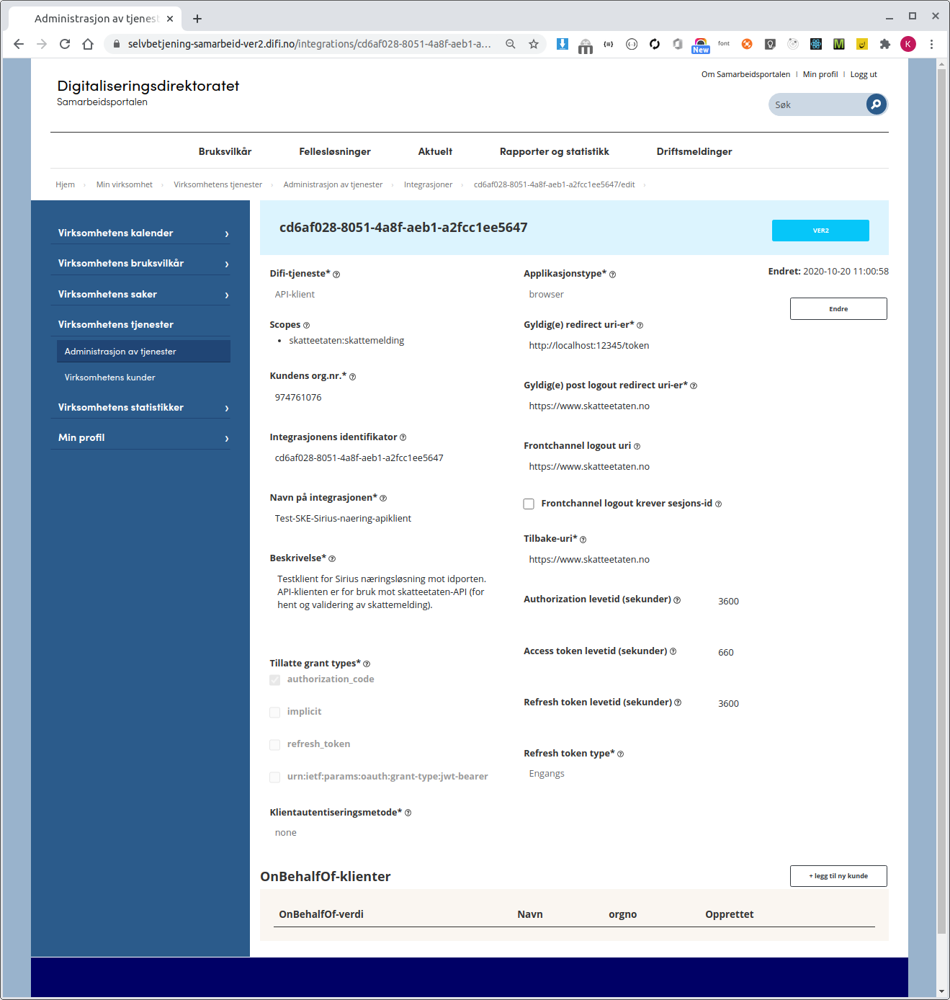

Det tilbys to sett med API-er:

- Skatteetatens-API: har tjenester for hent- og validering av skattemedlinger.
- Altinn3-API: for: har tjenester for opprettelse og innsending av en skattemeldinger.


# Skatteetatens-API

Skatteetaten har utviklet en testklient (i python) som viser hvordan koble seg på ID-porten og kalle skatteetatens-API:
[skattemelding-eksternt-api-test.zip](skattemelding-eksternt-api-test.zip)

## Autentisering

Når en skattepliktig skal benytte et sluttbrukersystem for å sende inn skattemeldingen og næringsopplysninger gjennom API må sluttbrukeren og/eller sluttbrukersystemet være autentisert og autorisert gjennom en påloggingsprosess.

Ved kall til skattemelding-API ønsker skatteetaten å kjenne til identiteten til innsender. Identiteten til pålogget bruker, kombinert med informasjon fra Altinn autorisasjon vil avgjøre hvilken person/selskap en pålogget bruker kan hente skattemeldingen til eller sende inn skattemelding for.

Autentisering skjer enten via ID-porten eller Maskinporten:

- Personlig innlogging vil skje via ID-porten.
- Systemer/maskiner som ønsker å opptre på vegne av en organisasjon kan autentisere seg via maskinporten.

**Merk** at dagens Altinn innlogging med brukernavn/passord vil ikke lenger kunne brukes.<br/>

### ID-porten

Via ID-porten kan selve sluttbrukeren autentiseres og da via sitt personnummer.


#### Dataflyt og sekvensdiagram

Figuren under skisserer hvordan innloggingsprosessen vil se ut:


#### Registrering av et sluttbrukersystem i ID-porten

Når et sluttbrukersystem initierer en påloggingsprosess mot ID-porten må SBS sende med en klient-ID. Denne klient-id-en er unik for SBS-typen og vil bli tildelt ved at programvareleverandøren av SBS på forhånd har gjennomført en registrering (onboarding) i en selvbetjeningsportal hos Digdir/Difi. Dette er beskrevet her: https://difi.github.io/felleslosninger/oidc_index.html. Lenken beskriver også standarden OIDC som ID-porten er basert på.

Under følger en beskrivelse av hvordan en integrasjon kan opprettes hos DigDir slik at dere kan få tildelt en klient-ID.

#### Hvordan opprette ID-porten interasjon hos DigDir

- Først må en integrasjon hos DigDir (gamle DIFI) opprettes gjennom deres [selvbetjeningsløsning](https://selvbetjening-samarbeid-ver2.difi.no/).
- Klikk på integrasjoner under Ver2, klikk så på knappen "ny Integrasjon".
- Det er denne integrasjonen som deres applikasjon vil snakke med seinere når deres sluttbruker skal autentisere seg mot ID-porten.
  - Verdien i feltet "Integrasjonens identifikator" (kalt klient-ID over) er en GUID som tildeles av Digdir/Difi og som SBS må sende med i kallet til ID-porten.
- Velg _"API-klient"_ under "Difi-tjeneste".
- Velg så et scope som angir hvilken offentlig API-tjeneste registreringen gjelder for:
  - Klikk på knappen "Rediger Scopes" og velg _"skatteetaten:skattemelding"_ fra lista over scopes.
  - PS: hvis dere ikke finner scopet _"skatteetaten:skattemelding"_ i lista må dere ta kontakt med skatteetaten slik at vi kan gi dere tilgang til scopet (i mellom tiden kan dere forsatt bruke denne integrasjonen da skatteetaen pt. ikke sjekker scope ved validering av access tokenet. Men denne sjekken er noe vi på et seinere tidspunkt kommer til å slå på).
- Skriv inn et redirect uri-er (komma seperert og uten mellomrom). Dette er Uri-(er) som klienten får lov å gå til etter innlogging (ref. pilnummer 6 i figuren over)
- Sett ønskede verdier for levetiden på autoriasjons-, access og refresh-token.
- Et eksempel på hvordan integrasjonen kan bli seende ut:



### Maskin-porten

Maskinporten sørger for sikker autentisering og tilgangskontroll for datautveksling mellom virksomheter. Løsningen garanterer identiteten mellom virksomheter og gjør det mulig å binde sammen systemer.

Et sluttbrukersystem som kjører på en sikker server kan integreres i Maskinporten og da være autentisert med sitt organisasjonsnummer. Det vil da være organisasjonen som autentiserer seg. Hvilken sluttbruker som utfører hvilken handling i deres system må organisasjonen selv holde kontroll på. En forutsetning for bruk av Maskinporten er derfor at organisasjonen har bygget et godt tilgangskontroll av sine sluttbrukere.

En autentisering gjort via Maskinporten tilrettelegger for høyere grad av automatisering da det ikke krever en personlig kodebrikke eller liknende. Vi tror Maskinporten vil passe for store selskap og regnskapsførere som skal levere skattemeldingen for mange.

Bruk av Maskinporten forutsetter at organisasjonen har et virksomhetssertifikat eller tilsvarende mekanisme. Figuren under skisserer hvordan samhandlingen fungerer:


Les detaljer om maksinporten her: https://difi.github.io/felleslosninger/maskinporten_guide_apikonsument.html

## Autorisasjon

API-ene som tilbys vil sjekke at sluttbrukeren eller eier av sluttbrukersystemet har tilgang til å utføre operasjoner gjennom API-et. Slik tilgangskontroll/autorisering skjer via Altinns autorisasjonskomponent.

Dette betyr at sluttbrukeren eller eier av sluttbrukersystemet må ha de nødvendige rollene i Altinn. Dette blir som i eksisterende løsninger.

## Ping tjeneste

API tilbyr en ping tjeneste som kan kalles for å teste at integrasjonen fungerer.

**URL** : `GET https://<env>/api/eksterntapi/formueinntekt/skattemelding/ping`

**Eksempel URL** : `GET https://mp-test.sits.no/api/eksterntapi/formueinntekt/skattemelding/ping`

**Forespørsel** : `<env>: Miljøspesifikk adresse`

**Respons** :

```json
{
    "name": "ping": "pong"
}
```

For detaljer om ping-tjenesten og "hent Skattemelding" tjenestene, se filen hent.py [skattemelding-eksternt-api-test.zip](skattemelding-eksternt-api-test.zip)

## Hent skattemelding

API som returnerer siste gjeldende skattemeldingen for skattepliktige for gitt inntektsår. Den siste gjeldende skattemeldingen kan enten være utkast eller fastsatt:

- Utkast er en preutfylt skattemelding Skatteetaten har laget for den skattepliktige basert på innrapporterte data og data fra skattemeldingen tidligere år.
- Fastsatt betyr at skattemeldingen er manuelt innlevert eller automatisk innlevert ved utløp av innleveringsfrist. Dette kan også inneholde et eller flere myndighetsfastsatte felter.

**URL** : `GET https://<env>/api/eksterntapi/formueinntekt/skattemelding/<inntektsaar>/<identifikator>/`

**Eksempel URL** : `GET https://mp-test.sits.no/api/eksterntapi/formueinntekt/skattemelding/2020/974761076`

**Forespørsel** :

- `<env>: Miljøspesifikk adresse`
- `<inntektsår>: Inntektsåret man spør om informasjon for, i formatet YYYY.`
- `<identifikator>: Fødselsnummer, D-nummer eller organisasjonsnummer til den skattepliktige som man spør om skattemeldingen for.`

**Respons** : se [skattemeldingognaeringsopplysningerforespoerselresponse_v1.xsd](https://github.com/Skatteetaten/skattemeldingen/blob/master/docs/documentation/informasjonsmodell/xsd/skattemeldingognaeringsopplysningerforespoerselresponse_v1_kompakt.xsd)

```xml
eksempel:
<hentSkattemeldingMvResponse xmlns="no:skatteetaten:fastsetting:formueinntekt:skattemelding:hentskattemeldingmv:response:v1">
    <dokumenter>
        <skattemeldingdokument>
            <id>SKI:138:5829</id>
            <encoding>utf-8</encoding>
            <content>Base64-enkodet skattemelding.xml iht XSD</content>
            <type>skattemeldingUtkastPersonligSkattepliktig</type>
        </skattemeldingdokument>
    </dokumenter>
</hentSkattemeldingMvResponse>
```

## Hent Skattemelding (basert på type)

API som returnerer siste gjeldende skattemeldingen av gitt type for skattepliktige for gitt inntektsår. Følgende type skattemeldinger er støttet:

- Utkast er en preutfylt skattemelding Skatteetaten har laget for den skattepliktige basert på innrapporterte data og data fra skattemeldingen tidligere år.
- Fastsatt betyr at skattemeldingen er manuelt innlevert eller automatisk innlevert ved utløp av innleveringsfrist. Dette kan også inneholde et eller flere myndighetsfastsatte felter.

**URL** : `GET https://<env>/api/eksterntapi/formueinntekt/skattemelding/<type>/<inntektsaar>/<identifikator>/`

**Eksempel URL** : `GET https://mp-test.sits.no/api/eksterntapi/formueinntekt/skattemelding/utkast/2020/974761076`

**Forespørsel** :

- `<env>: Miljøspesifikk adresse`
- `<inntektsår>: Inntektsåret man spør om informasjon for, i formatet YYYY.`
- `<identifikator>: Fødselsnummer, D-nummer eller organisasjonsnummer til den skattepliktige som man spør om skattemeldingen for.`

**Respons** : se [skattemeldingognaeringsopplysningerforespoerselresponse_v1.xsd](https://github.com/Skatteetaten/skattemeldingen/blob/master/docs/documentation/informasjonsmodell/xsd/skattemeldingognaeringsopplysningerforespoerselresponse_v1_kompakt.xsd)

```xml
eksempel:
<?xml version="1.0" encoding="UTF-8"?>
<skattemeldingerOgNaeringsopplysningerforespoerselResponse xmlns="no:skatteetaten:fastsetting:formueinntekt:skattemeldingerognaeringsopplysninger:forespoersel:response:v1">
   <dokumenter>
      <skattemeldingdokument>
         <id>SKI:138:7259</id>
         <encoding>utf-8</encoding>
         <content>PD94bWwgdmVyc2lvbj0iMS4wIiBlbmNvZGluZz0iVVRGLTgiPz48c2thdHRlbWVsZGluZyB4bWxucz0idXJuOm5vOnNrYXR0ZWV0YXRlbjpmYXN0c2V0dGluZzpmb3JtdWVpbm50ZWt0OnNrYXR0ZW1lbGRpbmc6ZWtzdGVybjp2OCI+PHBhcnRzcmVmZXJhbnNlPjMwMDAwNDU3ODU8L3BhcnRzcmVmZXJhbnNlPjxpbm50ZWt0c2Fhcj4yMDIwPC9pbm50ZWt0c2Fhcj48L3NrYXR0ZW1lbGRpbmc+</content>
         <type>skattemeldingUtkastPersonligSkattepliktig</type>
      </skattemeldingdokument>
   </dokumenter>
</skattemeldingerOgNaeringsopplysningerforespoerselResponse>
```

## Valider skattemelding

Tjenesten validerer innholdet i en skattemelding og returnerer en respons med eventuelle feil, avvik og advarsler. Tjenesten vil foreta følgende:

1. Kontroll av meldingsformatet.
2. Kontroll av innholdet og sammensetningen av elementene i skattemeldingen.
3. Beregninger/kalkyler.

Skatteetaten ønsker at valideringstjenesten blir kalt i forkant av innsending av skattemeldingen. Dette for å sikre at skattemeldingen er korrekt og vil mest sannsynligvis bli godkjent ved innsending.
Uansett versjon vil skatteetaten ikke lagre eller følge opp informasjonen som sendes inn i valideringstjenesten på noen måte. Skatteetaten anser at disse dataene eies av den skattepliktige og ikke av skatteetaten.

**URL** : `POST https://<env>/api/eksterntapi/formueinntekt/skattemelding/valider/<inntektsaar>/<identifikator>`

**Eksempel URL** : `POST https://mp-test.sits.no/api/eksterntapi/formueinntekt/skattemelding/valider/2020/01028312345`

**Forespørsel** :

- `<env>: Miljøspesifikk adresse`
- `<inntektsår>: Inntektsåret man spør om informasjon for, i formatet YYYY.`
- `<identifikator>: Fødselsnummer, D-nummer eller organisasjonsnummer til den skattepliktige`

**Body** : se [skattemeldingerognaeringsopplysningerequest_v1.xsd](https://github.com/Skatteetaten/skattemeldingen/blob/master/docs/documentation/informasjonsmodell/xsd/skattemeldingerognaeringsopplysningerequest_v1_kompakt.xsd)

```xml
Eksempel:
<skattemeldingerognaeringsopplysningerRequest xmlns="no:skatteetaten:fastsetting:formueinntekt:skattemeldingerognaeringsopplysninger:request:v1">
  <dokumenter>
    <dokument>
      <type>skattemeldingPersonligSkattepliktig</type>
      <encoding>utf-8</encoding>
      <content>Base64-enkodet skattemelding.xml iht xsd-en</content>
    </dokument>
  </dokumenter>
</skattemeldingerognaeringsopplysningerRequest>
```

**Respons** : se [skattemeldingerognaeringsopplysningerresponse_v1.xsd](https://github.com/Skatteetaten/skattemeldingen/blob/master/docs/documentation/informasjonsmodell/xsd/skattemeldingerognaeringsopplysningerresponse_v1_kompakt.xsd)

```xml
Eksempel:
<skattemeldingerOgNaeringsopplysningerResponse xmlns="no:skatteetaten:fastsetting:formueinntekt:skattemeldingerognaeringsopplysninger:response:v1">
    <dokumenter>
        <dokument>
            <type>skattemeldingEtterBeregning</type>
            <encoding>utf-8</encoding>
            <content>PD94bWwgdmVyc2lvbj0iMS4wIiBlbmNvZGluZz0iVVRGLTgiPz48c2thdHRlbWVsZGluZyB4bWxucz0idXJuOm5vOnNrYXR0ZWV0YXRlbjpmYXN0c2V0dGluZzpmb3JtdWVpbm50ZWt0OnNrYXR0ZW1lbGRpbmc6ZWtzdGVybjp2OCI+PHBhcnRzcmVmZXJhbnNlPjIyMjU3NjY2PC9wYXJ0c3JlZmVyYW5zZT48aW5udGVrdHNhYXI+MjAyMDwvaW5udGVrdHNhYXI+PGJvbGlnT2dFaWVuZGVsZXI+PGtqb2VyZXRvZXk+PGlkPjM3NzhhOTg2LTE4YzctNGYxNC05NDMwLTVjNmY0ZDUyNWVjNjwvaWQ+PGtqZW5uZW1lcmtlPjx0ZWtzdD4zMTM8L3Rla3N0Pjwva2plbm5lbWVya2U+PGFhckZvckZvZXJzdGVnYW5nc3JlZ2lzdHJlcmluZz48YWFyc3RhbGw+MTk5OTwvYWFyc3RhbGw+PC9hYXJGb3JGb2Vyc3RlZ2FuZ3NyZWdpc3RyZXJpbmc+PGZvcm11ZXN2ZXJkaUZvcktqb2VyZXRvZXk+PGJlbG9lcD48YmVsb2VwSU5vaz48YmVsb2VwU29tSGVsdGFsbD4xMDAwPC9iZWxvZXBTb21IZWx0YWxsPjwvYmVsb2VwSU5vaz48L2JlbG9lcD48L2Zvcm11ZXN2ZXJkaUZvcktqb2VyZXRvZXk+PC9ram9lcmV0b2V5PjwvYm9saWdPZ0VpZW5kZWxlcj48L3NrYXR0ZW1lbGRpbmc+</content>
        </dokument>
        <dokument>
            <type>naeringsopplysningerEtterBeregning</type>
            <encoding>utf-8</encoding>
            <content>PD94bWwgdmVyc2lvbj0nMS4wJyBlbmNvZGluZz0nVVRGLTgnPz48bmFlcmluZ3NvcHBseXNuaW5nZXIgeG1sbnM9InVybjpubzpza2F0dGVldGF0ZW46ZmFzdHNldHRpbmc6Zm9ybXVlaW5udGVrdDpuYWVyaW5nc29wcGx5c25pbmdlcjp2MSI+PHBhcnRzcmVmZXJhbnNlPjIyMjU3NjY2PC9wYXJ0c3JlZmVyYW5zZT48aW5udGVrdHNhYXI+MjAyMDwvaW5udGVrdHNhYXI+PHJlc3VsdGF0cmVnbnNrYXA+PGRyaWZ0c2lubnRla3Q+PHNhbGdzaW5udGVrdD48aWQ+MTwvaWQ+PHNhbGdzaW5udGVrdHN0eXBlPjxzYWxnc2lubnRla3RzdHlwZT40NTYwPC9zYWxnc2lubnRla3RzdHlwZT48L3NhbGdzaW5udGVrdHN0eXBlPjxiZWxvZXA+PGJlbG9lcD48YmVsb2VwPjEwMDwvYmVsb2VwPjwvYmVsb2VwPjwvYmVsb2VwPjwvc2FsZ3Npbm50ZWt0PjxzYWxnc2lubnRla3Q+PGlkPjI8L2lkPjxzYWxnc2lubnRla3RzdHlwZT48c2FsZ3Npbm50ZWt0c3R5cGU+NDU2MDwvc2FsZ3Npbm50ZWt0c3R5cGU+PC9zYWxnc2lubnRla3RzdHlwZT48YmVsb2VwPjxiZWxvZXA+PGJlbG9lcD4xNzwvYmVsb2VwPjwvYmVsb2VwPjwvYmVsb2VwPjwvc2FsZ3Npbm50ZWt0Pjxhbm5lbkRyaWZ0c2lubnRla3Q+PGlkPjI8L2lkPjxhbm5lbkRyaWZ0c2lubnRla3RzdHlwZT48YW5uZW5EcmlmdHNpbm50ZWt0c3R5cGU+MjAwPC9hbm5lbkRyaWZ0c2lubnRla3RzdHlwZT48L2FubmVuRHJpZnRzaW5udGVrdHN0eXBlPjxiZWxvZXA+PGJlbG9lcD48YmVsb2VwPjIxNzwvYmVsb2VwPjwvYmVsb2VwPjwvYmVsb2VwPjwvYW5uZW5EcmlmdHNpbm50ZWt0Pjxhbm5lbkRyaWZ0c2lubnRla3Q+PGlkPjM8L2lkPjxhbm5lbkRyaWZ0c2lubnRla3RzdHlwZT48YW5uZW5EcmlmdHNpbm50ZWt0c3R5cGU+NzAwPC9hbm5lbkRyaWZ0c2lubnRla3RzdHlwZT48L2FubmVuRHJpZnRzaW5udGVrdHN0eXBlPjxiZWxvZXA+PGJlbG9lcD48YmVsb2VwPi0xNzwvYmVsb2VwPjwvYmVsb2VwPjwvYmVsb2VwPjwvYW5uZW5EcmlmdHNpbm50ZWt0Pjxhbm5lbkRyaWZ0c2lubnRla3Q+PGlkPjE8L2lkPjxhbm5lbkRyaWZ0c2lubnRla3RzdHlwZT48YW5uZW5EcmlmdHNpbm50ZWt0c3R5cGU+MTAwPC9hbm5lbkRyaWZ0c2lubnRla3RzdHlwZT48L2FubmVuRHJpZnRzaW5udGVrdHN0eXBlPjxiZWxvZXA+PGJlbG9lcD48YmVsb2VwPjEwMDwvYmVsb2VwPjwvYmVsb2VwPjwvYmVsb2VwPjwvYW5uZW5EcmlmdHNpbm50ZWt0PjxzdW1EcmlmdHNpbm50ZWt0PjxiZWxvZXA+PGJlbG9lcD40MTc8L2JlbG9lcD48L2JlbG9lcD48L3N1bURyaWZ0c2lubnRla3Q+PC9kcmlmdHNpbm50ZWt0PjxkcmlmdHNrb3N0bmFkPjxzdW1EcmlmdHNrb3N0bmFkPjxiZWxvZXA+PGJlbG9lcD4wPC9iZWxvZXA+PC9iZWxvZXA+PC9zdW1EcmlmdHNrb3N0bmFkPjwvZHJpZnRza29zdG5hZD48c3VtRWtzdHJhb3JkaW5hZXJQb3N0PjxiZWxvZXA+PGJlbG9lcD4wPC9iZWxvZXA+PC9iZWxvZXA+PC9zdW1Fa3N0cmFvcmRpbmFlclBvc3Q+PHN1bVNrYXR0ZWtvc3RuYWQ+PGJlbG9lcD48YmVsb2VwPjA8L2JlbG9lcD48L2JlbG9lcD48L3N1bVNrYXR0ZWtvc3RuYWQ+PGFhcnNyZXN1bHRhdD48YmVsb2VwPjxiZWxvZXA+NDE3PC9iZWxvZXA+PC9iZWxvZXA+PC9hYXJzcmVzdWx0YXQ+PC9yZXN1bHRhdHJlZ25za2FwPjwvbmFlcmluZ3NvcHBseXNuaW5nZXI+</content>
        </dokument>
        <dokument>
            <type>beregnetSkatt</type>
            <encoding>utf-8</encoding>
            <content>PD94bWwgdmVyc2lvbj0iMS4wIiBlbmNvZGluZz0iVVRGLTgiPz48YmVyZWduZXRTa2F0dCB4bWxucz0idXJuOm5vOnNrYXR0ZWV0YXRlbjpmYXN0c2V0dGluZzpmb3JtdWVpbm50ZWt0OmJlcmVnbmV0c2thdHQ6djMiPjxza2F0dGVyZWduc2thcHNrb21tdW5lPjAwMjA8L3NrYXR0ZXJlZ25za2Fwc2tvbW11bmU+PHNrYXR0ZWtsYXNzZT4xPC9za2F0dGVrbGFzc2U+PGJlcmVnbmV0U2thdHRGb2VyU2thdHRlZnJhZHJhZz48Z3J1bm5sYWc+MDwvZ3J1bm5sYWc+PGJlbG9lcD4wPC9iZWxvZXA+PC9iZXJlZ25ldFNrYXR0Rm9lclNrYXR0ZWZyYWRyYWc+PGJlcmVnbmV0U2thdHQ+PGdydW5ubGFnPjA8L2dydW5ubGFnPjxiZWxvZXA+MDwvYmVsb2VwPjwvYmVyZWduZXRTa2F0dD48c2thdHRPZ0F2Z2lmdD48Zm9ybXVlc2thdHRUaWxTdGF0PjxncnVubmxhZz4xMDAwPC9ncnVubmxhZz48YmVsb2VwPjA8L2JlbG9lcD48L2Zvcm11ZXNrYXR0VGlsU3RhdD48Zm9ybXVlc2thdHRUaWxLb21tdW5lPjxncnVubmxhZz4xMDAwPC9ncnVubmxhZz48YmVsb2VwPjA8L2JlbG9lcD48L2Zvcm11ZXNrYXR0VGlsS29tbXVuZT48L3NrYXR0T2dBdmdpZnQ+PG9ldnJpZ2VSZXN1bHRhdGVyQXZCZXJlZ25pbmc+PG9ldnJpZ0Zvcm11ZT4xMDAwPC9vZXZyaWdGb3JtdWU+PC9vZXZyaWdlUmVzdWx0YXRlckF2QmVyZWduaW5nPjxhbnZlbmR0VG9sdmRlbFZlZEFyYmVpZHNvcHBob2xkSU5vcmdlPjEyPC9hbnZlbmR0VG9sdmRlbFZlZEFyYmVpZHNvcHBob2xkSU5vcmdlPjxhbnZlbmR0VG9sdmRlbEZvclRyaW5uc2thdHQ+MTI8L2FudmVuZHRUb2x2ZGVsRm9yVHJpbm5za2F0dD48YW52ZW5kdFN0YW5kYXJkZnJhZHJhZz5mYWxzZTwvYW52ZW5kdFN0YW5kYXJkZnJhZHJhZz48L2JlcmVnbmV0U2thdHQ+</content>
        </dokument>
        <dokument>
            <type>summertSkattegrunnlagForVisning</type>
            <encoding>utf-8</encoding>
            <content>PD94bWwgdmVyc2lvbj0iMS4wIiBlbmNvZGluZz0iVVRGLTgiPz48c2thdHRlZ3J1bm5sYWcgeG1sbnM9InVybjpza2U6ZmFzdHNldHRpbmc6Zm9ybXVlaW5udGVrdDpza2F0dGVncnVubmxhZzp2NSI+PHNrYXR0ZWdydW5ubGFnc29iamVrdD48dGVrbmlza05hdm4+YnJ1dHRvZm9ybXVlPC90ZWtuaXNrTmF2bj48YmVsb2VwPjEwMDA8L2JlbG9lcD48L3NrYXR0ZWdydW5ubGFnc29iamVrdD48c2thdHRlZ3J1bm5sYWdzb2JqZWt0Pjx0ZWtuaXNrTmF2bj5mb3JtdWVzdmVyZGlGb3JLam9lcmV0b2V5PC90ZWtuaXNrTmF2bj48YmVsb2VwPjEwMDA8L2JlbG9lcD48L3NrYXR0ZWdydW5ubGFnc29iamVrdD48c2thdHRlZ3J1bm5sYWdzb2JqZWt0Pjx0ZWtuaXNrTmF2bj5uZXR0b2Zvcm11ZTwvdGVrbmlza05hdm4+PGJlbG9lcD4xMDAwPC9iZWxvZXA+PC9za2F0dGVncnVubmxhZ3NvYmpla3Q+PC9za2F0dGVncnVubmxhZz4=</content>
        </dokument>
    </dokumenter>
    <avvikEtterBeregning>
        <avvik>
            <avvikstype>avvikNaeringsopplysninger</avvikstype>
            <forekomstidentifikator>global</forekomstidentifikator>
            <beregnetVerdi>417</beregnetVerdi>
            <sti>resultatregnskap/driftsinntekt/sumDriftsinntekt/beloep/beloep</sti>
        </avvik>
        <avvik>
            <avvikstype>manglerNaeringsopplysninger</avvikstype>
            <forekomstidentifikator>global</forekomstidentifikator>
            <beregnetVerdi>0</beregnetVerdi>
            <sti>resultatregnskap/driftskostnad/sumDriftskostnad/beloep/beloep</sti>
        </avvik>
    </avvikEtterBeregning>
    <veiledningEtterKontroll>
        <veiledning>
            <veiledningstype>KJØRETØY_MANGLER_VERDI_SOM_NY</veiledningstype>
            <forekomstidentifikator>3778a986-18c7-4f14-9430-5c6f4d525ec6</forekomstidentifikator>
            <sti>boligOgEiendeler/kjoeretoey</sti>
        </veiledning>
    </veiledningEtterKontroll>
</skattemeldingerOgNaeringsopplysningerResponse>
```

For detaljer om valider-tjenesten, se filen valider.py [skattemelding-eksternt-api-test.zip](skattemelding-eksternt-api-test.zip)

## Eiendom API

Eiendom API tilbyr endepunkter for å søke opp eiendommer, hente eiendommeners formuesgrunnlag og for å beregne eiendommers markedsverdi.

### Søk

Det er mulig å søke på alle norske vegadresser, matrikkelnummer og boligselskap (organisasjonsnummer og andelsnr/aksjeboenhetsnr)

**URL** : `GET https://<env>/api/formueinntekt/eiendom/soek/<inntektsår>?query=<tekst>`

**Eksempel URL vegadress** : `GET https://mp-test.sits.no/api/formueinntekt/eiendom/soek/2020?query=Storgata 1`

**Eksempel URL matrikkelnummer** : `GET https://mp-test.sits.no/api/formueinntekt/eiendom/soek/2020?query=36/120`

**Forespørsel** :

- `<env>: Miljøspesifikk adresse.`
- `<inntektsår>: Inntektsåret man spør om informasjon for, i formatet YYYY.`
- `<query>: Fritekst søkestreng.`

**_Fritekst søkestreng_**

- `Hvis første tegn man angir er et tall vil søket kun lete blant matrikkeladresser.`
- `Hvis første tegn man angir er en bokstav vil søket kun lete blant veiadresser.`
- `Søket krever streng plassering av tegn.`

\***\*Skal vi ta med søkeeksempler?\*\***
Kan hentes her http://eiendom-serg-utv-i.utv.paas.skead.no/docs/index.html#_s%C3%B8k

**Respons vegadresse** :

```json
{
  "resultatStorrelse": 1,
  "eiendommer": [],
  "vegadresser": [
    {
      "sergEiendomsidentifikator": 200,
      "unikeiendomsidentifikator": 200,
      "adressenavn": "Storgata",
      "husnr": 1,
      "postnummer": "4900",
      "poststedsnavn": "TVEDESTRAND",
      "highlight": "<em>Storgata</em> 1, 4900 Tvedestrand",
      "eiendommer": [
        {
          "sergEiendomsidentifikator": 200,
          "unikeiendomsidentifikator": 200,
          "eiendometablertdato": "2018-06-01",
          "kommunenr": "0914",
          "kommunenavn": "TVEDESTRAND",
          "gaardsnr": 97,
          "bruksnr": 13,
          "festenr": 0,
          "seksjonsnr": 0,
          "historisk": false,
          "highlight": "0914-97/13/0/0"
        }
      ]
    }
  ],
  "sokStart": "2020-10-05T09:53:06.118374",
  "sokSlutt": "2020-10-05T09:53:06.149235"
}
```

**Respons matrikkelnummer** :

```json
{
  "resultatStorrelse": 1,
  "eiendommer": [
    {
      "sergEiendomsidentifikator": 1,
      "unikeiendomsidentifikator": 1,
      "eiendometablertdato": "1925-03-31",
      "kommunenr": "1919",
      "kommunenavn": "GRATANGEN",
      "gaardsnr": 36,
      "bruksnr": 120,
      "festenr": 0,
      "seksjonsnr": 0,
      "highlight": "1919-<em>36/120</em>/0/0"
    }
  ],
  "vegadresser": [],
  "sokStart": "2020-10-05T09:55:03.197953",
  "sokSlutt": "2020-10-05T09:55:03.206961"
}
```

**_Forklaring til respons_**

- `sergEiendomsidentifikator: eiendomsidentifkator som skal benyttes for å hente eiendom og formuesinformajon.`

### Hent formuesgrunnlag

Hent formuesgrunnlag for valgt unik eiendomsidentifikator og inntektsår.

Merk at hvilken informasjon responsen vil inneholde avhenger av valgt inntektsår, og at formuesopplysninger vil variere basert på hvilken eiendomstype eiendomsidentifikator har. Noen detaljer vil fjernes fra responsen hvis skatteyter ikke er eier av eiendommen.

**URL** : `GET https://<env>/formueinntekt/eiendom/formuesgrunnlag/<inntektsår>/<eiendomsidentifikator>/<identifikator>`

**Eksempel URL** : `GET https://mp-test.sits.no/api/formueinntekt/eiendom/formuesgrunnlag/2020/1/02095300173`

**Forespørsel** :

- `<env>: Miljøspesifikk adresse.`
- `<inntektsår>: Inntektsåret man spør om informasjon for, i formatet YYYY.`
- `<eiendomsidentifikator>: Unik eiendomsidentifikator.`
- `<identifikator>: Fødselsnummer, D-nummer eller organisasjonsnummer til den skattepliktige som man henter eiendom for.`

**Respons** :

```json
{
  "formuesspesifikasjonForBolig": [
    {
      "eiendomstype": "selveidBolig",
      "byggeaar": "2000",
      "boligensAreal": "150",
      "boligtype": "enebolig",
      "internEiendomsidentifikator": "d7ea5b46-1b6c-4d74-9a72-f92282b5288dfastEiendom",
      "andelAvFormuesverdi": "100.00"
    }
  ],
  "fastEiendom": [
    {
      "vegadresse": [
        {
          "husnummer": "2",
          "husbokstav": "A",
          "adressenavn": "Storgata"
        }
      ],
      "kommunenummer": "1919",
      "postnummer": "9471",
      "poststedsnavn": "GRATANGEN",
      "sergEiendomsidentifikator": "1",
      "bruksnummer": "120",
      "gaardsnummer": "36",
      "internEiendomsidentifikator": "d7ea5b46-1b6c-4d74-9a72-f92282b5288dfastEiendom",
      "eierandel": "100.00"
    }
  ]
}
```

```json
{
  "ukjentEiendomINorge": [
    {
      "internEiendomsidentifikator": "bdb3a6b8-61d9-48e0-86e3-e4777edde687fastEiendom"
    }
  ],
  "fastEiendom": [
    {
      "vegadresse": [
        {
          "husnummer": "1",
          "husbokstav": "C",
          "adressenavn": "Giraffveien"
        }
      ],
      "kommunenummer": "1919",
      "postnummer": "9471",
      "poststedsnavn": "GRATANGEN",
      "sergEiendomsidentifikator": "3",
      "bruksnummer": "113",
      "gaardsnummer": "38",
      "internEiendomsidentifikator": "bdb3a6b8-61d9-48e0-86e3-e4777edde687fastEiendom"
    }
  ]
}
```

**_Forklaring til respons_**

`Responsen kan inneholde følgende objekt:`

- `fastEiendom: innholder eiendommens adresseinfomasjon og gjeldende skatteyters eierandel. Merk at det kan være flere vegadresser knyttet til eiendommen.`
- `formuesspesifikasjonFor*: innholder eiendommens formuesspesifikasjon og gjeldende skatteyters andel av formuesverdi. Detaljer som xxxx er med hvis skatteyter er eier av eiendommen. * Kan ha følgende verdier: Bolig, Flerboligbygning, SkalIkkeFastsettes, Tomt, SelveidFritidseiendom, AnnenFastEiendomInnenforInntektsgivendeAktivitet, AnnenFastEiendomUtenforInntektsgivendeAktivitet.`
- `ukjentEiendomINorge: hvis vi ikke støtter denne eiendomstypen.`

### Beregn markedsverdi for bolig

Beregningen er basert på sjablong fra SSB hvor boligeegenskaper, inntektsår inngår i beregningen.

Det er også mulig å oppgi dokumentert markedsverdi. Gyldig verdi skal være under klagegrense. Ugyldig dokumntert markedsverdi vil ikke hensyntas.

Sender man inn hele responsen fra hent formuesgrunnlag vil responsen på beregn innholde alt som ble sendt inn pluss de beregnede feltene.

**URL** : `POST https://<env>/formueinntekt/eiendom/markedsverdi/bolig/<inntektsår>/<eiendomsidentifikator>`

**Eksempel URL** : `POST https://mp-test.sits.no/api/formueinntekt/eiendom/markedsverdi/bolig/2020/1`

**Forespørsel** :

- `<env>: Miljøspesifikk adresse.`
- `<inntektsår>: Inntektsåret man spør om informasjon for, i formatet YYYY.`
- `<eiendomsidentifikator>: Unik eiendomsidentifikator.`

**Body uten dokumentert markedsverdi**

```json
{
  "formuesspesifikasjonForBolig": [
    {
      "eiendomstype": "selveidBolig",
      "byggeaar": "2000",
      "boligensAreal": "150",
      "boligtype": "enebolig",
      "andelAvFormuesverdi": "100.00"
    }
  ]
}
```

**Body med dokumentert markedsverdi**

```json
{
  "formuesspesifikasjonForBolig": [
    {
      "eiendomstype": "selveidBolig",
      "byggeaar": "2000",
      "boligensAreal": "150",
      "boligtype": "enebolig",
      "andelAvFormuesverdi": "100.00",
      "dokumentertMarkedsverdi": "2000000"
    }
  ]
}
```

**_Body full eiendom_**

```json
{
  "formuesspesifikasjonForBolig": [
    {
      "eiendomstype": "selveidBolig",
      "byggeaar": "2000",
      "boligensAreal": "150",
      "boligtype": "enebolig",
      "internEiendomsidentifikator": "1fb46159-19d5-4dc5-b5d6-706839b65103fastEiendom",
      "andelAvFormuesverdi": "100.00"
    }
  ],
  "fastEiendom": [
    {
      "vegadresse": [
        {
          "husnummer": "2",
          "husbokstav": "A",
          "adressenavn": "Storgata"
        }
      ],
      "kommunenummer": "1919",
      "postnummer": "9471",
      "poststedsnavn": "GRATANGEN",
      "sergEiendomsidentifikator": "1",
      "bruksnummer": "120",
      "gaardsnummer": "36",
      "internEiendomsidentifikator": "1fb46159-19d5-4dc5-b5d6-706839b65103fastEiendom",
      "eierandel": "100.00"
    }
  ]
}
```

**Respons uten dokumentert markedsverdi** :

```json
{
  "formuesspesifikasjonForBolig": [
    {
      "eiendomstype": "selveidBolig",
      "andelAvFormuesverdi": "100.00",
      "byggeaar": "2000",
      "boligensAreal": "150",
      "boligtype": "enebolig",
      "beregnetMarkedsverdi": "2592619"
    }
  ]
}
```

**Respons med dokumentert markedsverdi** :

```json
{
  "formuesspesifikasjonForBolig": [
    {
      "eiendomstype": "selveidBolig",
      "dokumentertMarkedsverdi": "2000000",
      "andelAvFormuesverdi": "100.00",
      "byggeaar": "2000",
      "boligensAreal": "150",
      "boligtype": "enebolig",
      "justertMarkedsverdi": "2000000",
      "beregnetMarkedsverdi": "2000000"
    }
  ]
}
```

**Respons full eiendom** :

```json
{
  "formuesspesifikasjonForBolig": [
    {
      "eiendomstype": "selveidBolig",
      "andelAvFormuesverdi": "100.00",
      "internEiendomsidentifikator": "1fb46159-19d5-4dc5-b5d6-706839b65103fastEiendom",
      "byggeaar": "2000",
      "boligensAreal": "150",
      "boligtype": "enebolig",
      "beregnetMarkedsverdi": "2592619"
    }
  ],
  "fastEiendom": [
    {
      "vegadresse": [
        {
          "husnummer": "2",
          "husbokstav": "A",
          "adressenavn": "Storgata"
        }
      ],
      "kommunenummer": "1919",
      "postnummer": "9471",
      "internEiendomsidentifikator": "1fb46159-19d5-4dc5-b5d6-706839b65103fastEiendom",
      "eierandel": "100.00",
      "poststedsnavn": "GRATANGEN",
      "sergEiendomsidentifikator": "1",
      "bruksnummer": "120",
      "gaardsnummer": "36"
    }
  ]
}
```

**_Forklaring til respons_**

- `beregnetMarkedsverdi: beregnet markedverdi for boligen.`
- `dokumentertMarkedsverdi: dokumentert markedsverdi når denne er innefor reglene slik at den er hensynstatt.`
- `justertMarkedsverdi: justert markedsverdi er med når dokumentert markedsverdi er hensynstatt.`

### Beregn markedsverdi for flerbolig

Beregningen er basert på sjablong fra SSB hvor boligeegenskaper, inntektsår inngår i beregningen.

Det beregnes markedsverdi for hver useksjonert boenhet.

Det er også mulig å oppgi dokumentert markedsverdi. Gyldig verdi skal være under klagegrense. Ugyldig dokumntert markedsverdi vil ikke hensyntas.

Sender man inn hele responsen fra hent formuesgrunnlag vil responsen på beregn innholde alt som ble sendt inn pluss de beregnede feltene.

**URL** : `POST https://<env>/formueinntekt/eiendom/markedsverdi/flerbolig/<inntektsår>/<eiendomsidentifikator>`

**Eksempel URL** : `POST https://mp-test.sits.no/api/formueinntekt/eiendom/markedsverdi/bolig/2020/102`

**Forespørsel** :

- `<env>: Miljøspesifikk adresse.`
- `<inntektsår>: Inntektsåret man spør om informasjon for, i formatet YYYY.`
- `<eiendomsidentifikator>: Unik eiendomsidentifikator.`

**Body uten dokumentert markedsverdi**

```json
{
  "formuesspesifikasjonForFlerboligbygning": [
    {
      "useksjonertBoenhet": [
        {
          "boligensAreal": "100",
          "byggeaar": "2016",
          "bruksenhetsnummer": "H0101",
          "boligtype": "leilighet"
        },
        {
          "boligensAreal": "101",
          "byggeaar": "2016",
          "bruksenhetsnummer": "H0102",
          "boligtype": "leilighet"
        },
        {
          "boligensAreal": "102",
          "byggeaar": "2016",
          "bruksenhetsnummer": "H0103",
          "boligtype": "leilighet"
        },
        {
          "boligensAreal": "102",
          "byggeaar": "2016",
          "bruksenhetsnummer": "H0104",
          "boligtype": "leilighet"
        },
        {
          "boligensAreal": "102",
          "byggeaar": "2016",
          "bruksenhetsnummer": "H0105",
          "boligtype": "leilighet"
        }
      ],
      "eiendomstype": "flerboligbygning"
    }
  ]
}
```

**Body med dokumentert markedsverdi**

```json
{
  "formuesspesifikasjonForFlerboligbygning": [
    {
      "useksjonertBoenhet": [
        {
          "boligensAreal": "100",
          "byggeaar": "2016",
          "bruksenhetsnummer": "H0101",
          "boligtype": "leilighet"
        },
        {
          "boligensAreal": "101",
          "byggeaar": "2016",
          "bruksenhetsnummer": "H0102",
          "boligtype": "leilighet"
        },
        {
          "boligensAreal": "102",
          "byggeaar": "2016",
          "bruksenhetsnummer": "H0103",
          "boligtype": "leilighet"
        },
        {
          "boligensAreal": "102",
          "byggeaar": "2016",
          "bruksenhetsnummer": "H0104",
          "boligtype": "leilighet"
        },
        {
          "boligensAreal": "102",
          "byggeaar": "2016",
          "bruksenhetsnummer": "H0105",
          "boligtype": "leilighet"
        }
      ],
      "eiendomstype": "flerboligbygning",
      "dokumentertMarkedsverdi": "11000000"
    }
  ]
}
```

**Respons uten dokumentert markedsverdi** :

```json
{
  "formuesspesifikasjonForFlerboligbygning": [
    {
      "useksjonertBoenhet": [
        {
          "boligensAreal": "100",
          "byggeaar": "2016",
          "bruksenhetsnummer": "H0101",
          "boligtype": "leilighet",
          "boligverdi": "2621994"
        },
        {
          "boligensAreal": "101",
          "byggeaar": "2016",
          "bruksenhetsnummer": "H0102",
          "boligtype": "leilighet",
          "boligverdi": "2639856"
        },
        {
          "boligensAreal": "102",
          "byggeaar": "2016",
          "bruksenhetsnummer": "H0103",
          "boligtype": "leilighet",
          "boligverdi": "2657663"
        },
        {
          "boligensAreal": "102",
          "byggeaar": "2016",
          "bruksenhetsnummer": "H0104",
          "boligtype": "leilighet",
          "boligverdi": "2657663"
        },
        {
          "boligensAreal": "102",
          "byggeaar": "2016",
          "bruksenhetsnummer": "H0105",
          "boligtype": "leilighet",
          "boligverdi": "2657663"
        }
      ],
      "eiendomstype": "flerboligbygning",
      "beregnetMarkedsverdi": "13234839"
    }
  ]
}
```

**Respons med dokumentert markedsverdi** :

```json
{
  "formuesspesifikasjonForFlerboligbygning": [
    {
      "useksjonertBoenhet": [
        {
          "boligensAreal": "100",
          "byggeaar": "2016",
          "bruksenhetsnummer": "H0101",
          "boligtype": "leilighet",
          "boligverdi": "2621994"
        },
        {
          "boligensAreal": "101",
          "byggeaar": "2016",
          "bruksenhetsnummer": "H0102",
          "boligtype": "leilighet",
          "boligverdi": "2639856"
        },
        {
          "boligensAreal": "102",
          "byggeaar": "2016",
          "bruksenhetsnummer": "H0103",
          "boligtype": "leilighet",
          "boligverdi": "2657663"
        },
        {
          "boligensAreal": "102",
          "byggeaar": "2016",
          "bruksenhetsnummer": "H0104",
          "boligtype": "leilighet",
          "boligverdi": "2657663"
        },
        {
          "boligensAreal": "102",
          "byggeaar": "2016",
          "bruksenhetsnummer": "H0105",
          "boligtype": "leilighet",
          "boligverdi": "2657663"
        }
      ],
      "eiendomstype": "flerboligbygning",
      "dokumentertMarkedsverdi": "11000000",
      "justertMarkedsverdi": "11000000",
      "beregnetMarkedsverdi": "11000000"
    }
  ]
}
```

**_Forklaring til respons_**

- `beregnetMarkedsverdi: beregnet markedverdi for boligen.`
- `boligverdi: beregnet markedsverdi for useksjonert boenhet. Beregnes uavhenig av dokumentert markedsverdi.`
- `dokumentertMarkedsverdi: dokumentert markedsverdi når denne er innefor reglene slik at den er hensynstatt.`
- `justertMarkedsverdi: justert markedsverdi er med når dokumentert markedsverdi er hensynstatt.`

**Feil response ifm bad request**

```json
{
  "feilkode": "EIENDOM-014",
  "beskrivelse": "Eiendommen finnes ikke."
}
```

**_Feilkoder ifm bad request_**

- EIENDOM-001: Ugyldig verdi: boligtype må være (enebolig, leilighet, smaahus).
- EIENDOM-002: Ugyldig verdi: byggeaar må være tall.
- EIENDOM-003: Ugyldig verdi: byggeaar må være mindre eller lik skatteleggingsperiode og større enn 1250.
- EIENDOM-004: Ugyldig verdi: boligensAreal må være et tall større enn 9 og mindre enn 10000.
- EIENDOM-005: Ugyldig verdi: dokumentertMarkedsverdiForBolig må være et tall.
- EIENDOM-008: Ugyldig verdi: Boligtype for boenhet må være leilighet.
- EIENDOM-013: Eiendom kunne ikke entydig identifiseres med oppgitte verdier.
- EIENDOM-014: Eiendommen finnes ikke.
- EIENDOM-015: Eiendommen er utgått.
- EIENDOM-016: Ingen bruksareal.
- EIENDOM-017: Ingen bruksareal. Flere bygninger har registrert bruksareal.
- EIENDOM-018: Ugyldig bruksareal.
- EIENDOM-019: Formuesgrunnlag mangler for denne eiendommen. Forespørselen kunne ikke fullføres.
- EIENDOM-020: Ugyldig verdi: Dokumentert markedsverdi kan ikke overstige 2.1 milliarder.
- EIENDOM-021: Ugyldig Naeringstype. Naeringstypen er ikke en gyldig naeringstype for ikke utleid naeringseiendom.
- EIENDOM-022: Ugyldig verdi: Dokumentert markedsverdi må være stoerre enn 0.
- EIENDOM-050: støtter ikke inntektsaar: <inntektsår>.
- EIENDOM-051: <Ulike mangler på input>.
- EIENDOM-999: Noe gikk galt. Forespørselen kunne ikke fullføres.

# Altinn3-API

For applikasjonsbrukere, dvs. organisasjoner og personer som kaller Altinn gjennom et klient API (typisk skattepliktige som bruker et sluttbrukersystem) tilbyr Altinn API-er med følgende funksjonalitet:

1. opprette en innstans i Altinn
2. populere instansen med metadata
3. Populere instansten med skattemeldingsdata
4. trigger neste steg slik at instansen havner i status _Bekreftelse_ (betyr "data lastet opp").
5. trigger neste steg slik at instansen havner i status _Tilbakemelding_ (betyr "skattemeldingen innsendt").
6. hente kvittering/tilbakemelding. Merk at det kan gå litt tid før kvittering er tilgjengelig (Skatteetaten må laste ned, behandle innsendingen og laste opp kvitteringen)

Les mer om Altinn API-ene på [altinn sine sider](https://docs.altinn.studio/teknologi/altinnstudio/altinn-api/). Altinn har utviklet POSTMAN skript som viser hvordan deres APIer kan bli kalt. Postman skriptene [finnes her](https://github.com/Altinn/altinn-studio/blob/master/src/test/Postman/collections/App.postman_collection.json)
Skatteetaten har også laget POSTMAN-skript som gjør kallene beskrevet under, se: [postman_collection.json](./skattemelding-app-Altinn3-API.postman_collection.json)

Tjenestene listet under kalles for å sende inn skattemelding til Altinn.

_Merk at Base URL-en_ til applikasjonen vår i Altinn er: `https://skd.apps.tt02.altinn.no/skd/sirius-skattemelding-v1/.`

## Hent token

Første trinn er å få generert et autentiseringstoken i Altinn. Autentisering skjer enten via maskinporten eller ID-porten. Les mer om det på [altinn sine sider](https://docs.altinn.studio/teknologi/altinnstudio/altinn-api/authentication/)

Tokenet fra maskinporten/ID-porten brukes til å veksle det inn i et Altinn JWT access token. Det er Altinn tokenet som brukes videre til å kalle Altinn-APIer beskervet under.

`curl --location --request GET 'https://platform.tt02.altinn.no//authentication/api/v1/exchange/id-porten' \ --header 'Authorization: Bearer <ID-porten/maskinporten Token>'`

Responsen til dette kallet vil være et Altinn-token, dette tokenet skal brukes i kallene under.
<br />

## Hent PartyId fra Altinn

Altinn krever at det brukes Altinn sin interne ID-en, kalt _PartyId_ ved opprettelse av instans.

`curl --location --request GET 'https://skd.apps.tt02.altinn.no/skd/sirius-skattemelding-v1/api/v1/profile/user' \ --header 'Authorization: Bearer <altinn Token>'`
<br />

## Opprett en instans i Altinn

Første trinn i innsendingsløpet er opprettelse av en instans av skattemeldingen. Plukk ut partyId fra forrige responsen og bruk det i body under.

`curl --location --request POST 'https://skd.apps.tt02.altinn.no/skd/sirius-skattemelding-v1/instances/' \ --header 'Content-Type: application/json' \ --header 'Authorization: Bearer <altinn Token>' \ --data-raw '{ "instanceOwner": { "partyId": "50028539" }, "appOwner":{ "labels" : [ "gr", "x2" ] }, "appId" : "skd/sirius-skattemelding-v1", "dueBefore": "2020-06-01T12:00:00Z", "visibleAfter": "2019-05-20T00:00:00Z", "title": { "nb": "Skattemelding" } }'`

**Respons** : Metadata om instansen som ble opprettet. En unik instanceId vil være med i responen og kan brukes seinere til å hente/oppdatere instansen.
<br />

## Oppdater skjema-metadata (skattemeldinv_V1.xml) til instansen

Neste trinn er å laste opp meta-data (informasjon om hvem innsender er, dato etc.) om skattemeldingen.

Meta-data skal være en XML-fil iht. [Skattemeldingsappv1.xsd](https://github.com/Skatteetaten/skattemeldingen/blob/master/docs/documentation/informasjonsmodell/xsd/Skattemeldingsapp_v1.xsd)
Beskrivelse av felt i XML-en følger her:

- `partsreferanse: Identifikasjonsnummer til skatteliktige i sluttbrukersystemet. Skattetaten bruker ikke dette feltet til noe`
- `inntektsaar: Inntektsår skattemeldingen gjelder for`
- `opprettetAv: Navn på sluttbrukersystemet.`
- `innsendingstype: Angir om innsendingen er komplett eller ikke-komplett. Gyldige verdier er komplett eller ikkeKomplett`
- `opprettingstidspunkt: Tidspunktet da innsendingen ble opprettet`
- `endringstidspunkt: Tidspunktet da innsendingen ble endret`

Se også eksempelfilene:
[Komplett innsending](https://github.com/Skatteetaten/skattemeldingen/blob/master/docs/documentation/informasjonsmodell/xsd/Skattemeldingsapp_v1.xml).
[Ikke-komplett innsending](https://github.com/Skatteetaten/skattemeldingen/blob/master/docs/documentation/informasjonsmodell/xsd/Skattemeldingsapp_ikkeKomplett_v1.xml).

Plukk ut _id_ og _data.id_ fra forrige responsen og bruk de på slutten av url-en under:

- erstatt 50028539/82652921-88e4-47d9-9551-b9da483e86c2/data/58c560b4-90a2-42ac-af26-98e1e60336cd med verdien fra _id_
- erstatt 58c560b4-90a2-42ac-af26-98e1e60336cd med verdien fra _data.id_

`curl --location --request PUT 'https://skd.apps.tt02.altinn.no/skd/sirius-skattemelding-v1/instances/50028539/82652921-88e4-47d9-9551-b9da483e86c2/data/58c560b4-90a2-42ac-af26-98e1e60336cd' \ --header 'Content-Type: application/xml' \ --header 'Authorization: Bearer <altinn Token>' \ --data-raw '<?xml version="1.0" encoding="utf-8"?> <SkattemeldingApp xmlns:xsi="http://www.w3.org/2001/XMLSchema-instance" xmlns:xsd="http://www.w3.org/2001/XMLSchema"> <partsreferanse>str1234</partsreferanse> <inntektsaar>2020</inntektsaar> <innsendingstype>komplett</innsendingstype> <opprettetAv>TurboSkatt AS...</opprettetAv> <opprettingstidspunkt>2012-06-03T12:12:12</opprettingstidspunkt> <endringstidspunkt>2012-06-03T12:12:12</endringstidspunkt> </SkattemeldingApp>'`  
<br />

## Last opp skattemeldingdata (skattemelding.xml) til instansen

Neste trinn er å laste opp skattemeldingsdata.

Plukk ut _id_ fra responsen til "Opprett en instans i Altinn"-kallet og bruk det på slutten av url-en under.
(ved ved en hvilken som helst xml-fil).

`curl --location --request POST 'https://skd.apps.tt02.altinn.no/skd/sirius-skattemelding-v1/instances/50028539/82652921-88e4-47d9-9551-b9da483e86c2/data?dataType=skattemelding' \ --header 'Content-Disposition: attachment; filename=skattemelding.xml' \ --header 'Content-Type: text/xml' \ --header 'Authorization: Bearer <Altinn token>' \ --data-binary '@/home/k83452/Documents/Altinn3/Testfiler/Eksempel1_skattemeldingen_v06..xml'`

**Body :** `data-binary '../skattemelding.xml'. Filen skattemelding.xml skal være på samme format som responsen fra tjenesten "Hent Skattemelding".`

**Respons :** `Respons vil inneholde metadata om objektet som ble opprettet. En unik identifikator (id) vil bli retunert som seinere kan brukes til å oppdatere, sjekke status etc..`

<br />

## Trigge prosess/next for å få prosessen til status _Bekreftelse_

Når data opplastingen er gjort kan følgende kall gjøres for å få instansen over i neste status:

Plukk ut _id_ fra responsen til "Opprett en instans i Altinn"-kallet og bruk det på slutten av url-en under.

`curl --location --request PUT 'https://skd.apps.tt02.altinn.no/skd/sirius-skattemelding-v1/instances/50028539/82652921-88e4-47d9-9551-b9da483e86c2/process/next' \ --header 'Content-Type: application/json' \ --header 'Authorization: Bearer <Altinn Token>' \ --data-raw '''`  
<br />

## Trigge prosess/next for å få prosessen til status _Tilbakemelding_

Gjør kall under for å gjøre seg ferdig med instansen/innsendingen, dette slik at skatteetaten kan plukke den opp og behandle:

Plukk ut _id_ fra responsen til "Opprett en instans i Altinn"-kallet og bruk det på slutten av url-en under.

`curl --location --request PUT 'https://skd.apps.tt02.altinn.no/skd/sirius-skattemelding-v1/instances/50028539/82652921-88e4-47d9-9551-b9da483e86c2/process/next' \ --header 'Content-Type: application/json' \ --header 'Authorization: Bearer <Altinn Token>' \ --data-raw ''`

<br />

## Hente kvittering

Etter at innsendingen er blitt behandlet hos skatteetaten vil det bli lastet opp en kvitteirng/tilbakemelding på instansen i altinn.
Kvitteringen (xml-fil) kan lastes ned ved å gjøre følgende kall:

`curl --location --request GET 'https://skd.apps.tt02.altinn.no/skd/sirius-skattemelding-v1/instances/50006836/cc3958f3-978f-4271-9089-c664d39d3d84/data?dataType=tilbakemelding' \ --header 'Authorization: Bearer <altinn Token>'`
``
