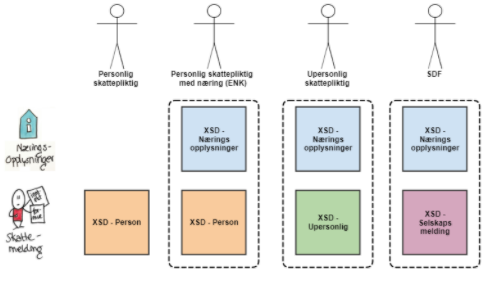

#Generelt
Skattemeldingen og næringsopplysninger skal leveres som XML-filer. Innhold og format på XML-filene er spesifisert gjennom XML Schema Definition, XSD. 

For inntektsåret 2020 som kun støtter lønnstakere, pensjonister og enkeltpersonsforetak er det 2 XSD-er som er aktuelle:

- skattemelding for lønnstakere og pensjonister
- næringsopplysninger

I tillegg kan det bli aktuelt å legge ved en metadatafil med teknisk innhold.

For inntektsårene etter 2020 vil det også komme andre varianter av skattemeldinger for å støtte ulike selskapsformer slik at totalsamlingen relevante skattemeldinger blir:

I utgangspunktet er planen at XSD for næringsopplysninger etterhvert skal inneholde alle de forholdene som er aktuelle å innrapportere fra næringsdrivende og selskap. Det kan imidlertid bli aktuelt at det legges til noen tilleggs-XSD-er for helt spesielle forhold.

#Årsrevisjon
XSD-spesifikasjonene vil gjennomgå en årlig revisjon slik at det normalt kommer en ny versjon av disse per inntektsår. Skatteetaten har valgt å ikke ha inntektsåret i filnavnet, men derimot ha et løpende versjonsnummer som er basert på "semantisk versjonering". Dette vil tre i kraft etter første produsjonsversjon (altså ikke aktuelt å innføre i testperioden i 2020).

##Semantic Versioning:

Given a version number MAJOR.MINOR.PATCH, increment the:

- MAJOR version when you make incompatible changes.
- MINOR version when you add functionality in a backwards compatible manner, and
- PATCH version when you make backwards compatible bug fixes.

Innenfor et inntektsår kan det forutsettes av det kun kommer MINOR- og PATCH-versjoner.

#XSD Skattemelding for lønnstakere og pensjonister for 2020
Versjon  8.0.0 av denne XSD'en ligger vedlagt og heter [skattemelding_v8.xsd](https://github.com/Skatteetaten/skattemeldingen/tree/master/docs/documentation/informasjonsmodell/xsd/skattemelding_v8.xsd)
Eksempel på innsendt XML fil for en person på siste versjon kommer.
Denne spesifikasjonen har både noen mangler og noen elementer som skal fjernes:

Versjon 8.0.0 er foreløpig en utviklingsversjon av skattemeldingen for lønnstakere og pensjonister slik den implementertes i ny skattemelding for lønnstakere og pensjonister for inntektsåret 2020 med en forskuttert utvidelse for tema Næring som ennå ikke er utviklet.  
Temaet "Næring" er introdusert som et tema parallelt med "Arbeid, trygd og pensjon" etc. i skattemeldingen for inntektsåret 2020. Informasjonen i dette temaet vil blant annet inneholde beløp avledet fra de tilhørende næringsopplysningene. Dette vil løses etter samme hovedmønster som eksisterende løsning mellom næringsoppgavene og de næringsspesifikke feltene i skattemeldingen RF-1030, men de vil realiseres i underliggende grupperingen ekvivalent med grupperinger innenfor de andre temaene. 
Siste versjon har fjernet interne konstruksjoner som ikke vil være relevant i en innsendingskontekst. Dette gjelder eksempelvis typen "Endringsmetadata" og id-felter som tidligere har blitt delt. 
XSD'en kommer ny og oppdatert versjon i senere versjoner av spesifikasjon/implementasjonsguide.

#XSD Næringsopplysninger for 2020
Versjon 1.0.0 av denne XSD'en ligger vedlagt og heter [naeringsopplysninger_v1.xsd](https://github.com/Skatteetaten/skattemeldingen/tree/master/docs/documentation/informasjonsmodell/xsd/naeringsopplysninger_v1.xsd)

Eksempel på innsendt XML fil fra et enkeltpersonforetak ligger vedlagt og heter [Naeringsopplysninger-ENK-Eksempel.xml](https://github.com/Skatteetaten/skattemeldingen/blob/master/docs/documentation/test/Naeringsingopplysninger-ENK-Eksempel.xml) 

Grafisk fremstilling ligger vedlagt og heter [Naeringsopplysninger-UML-modell.pdf](https://github.com/Skatteetaten/skattemeldingen/tree/master/docs/documentation/informasjonsmodell/Naeringsopplysninger-UML-modell.pdf)

'Mapping' mellom informasjonselementer i XSD'en og postnummer/OR-id i eksisterende RF-skjemaer ligger vedlagt og heter [Mapping-Xpath-Skjema-Orid.xlsx](https://github.com/Skatteetaten/skattemeldingen/tree/master/docs/documentation/informasjonsmodell/Mapping-Xpath-Skjema-Orid.xlsx)

I Resultatregnskap og Balanse benyttes kodelister til å spesifisere hvilke konti som kan benyttes.  I tillegg til kontonummer inneholder kodelistene regnskapspliktstype (1 = Ikke årsregnskapspliktig, 2 = Årsregnskapspliktig, 5 = Begrenset regnskapsplikt.  Tilsvarer dagens næringsoppgave 1, 2 og 5).  Dette for å indikere hvilke konti som er relevante for det enkelte foretaket.  Noen konti er for eksempel kun relevante for foretak med årsregnskapsplikt.
Det er en kodeliste pr. kontoklasse/gruppe (Resultatregnskap: Salgsinntekt, AnnenDriftsinntekt, Varekostnad, Lønnskostnad, AnnenDriftskostnad, Finansinntekt, Finanskostnad, EkstraordinærPost, Skattekostnad.  Balanse: Anleggsmidler, Omløpsmidler, Langsiktiggjeld, Kortsiktiggjeld og Egenkaptial).

Alle kodelistene er samlet i en fysisk fil hvor den enkelte kodeliste kalles "underkodeliste".  Kodelistefil i "lesbart" format ligger vedlagt og heter [Kodeliste_ResultatregnskapOgBalanse.xslx](https://github.com/Skatteetaten/skattemeldingen/blob/master/docs/documentation/informasjonsmodell/Kodeliste_ResultatregnskapOgBalanse.xlsx)
Kodelistefiler i XML format til bruk  i utvikling ligger vedlagt og heter [2020_resultatregnskapOgBalanse.xml](https://github.com/Skatteetaten/skattemeldingen/tree/master/docs/documentation/informasjonsmodell/kodeliste/2020_resultatregnskapOgBalanse.xml) og [2020_midlertidigOgPermanentForskjellstype.xml](https://github.com/Skatteetaten/skattemeldingen/tree/master/docs/documentation/informasjonsmodell/kodeliste/2020_midlertidigOgPermanentForskjellstype.xml).

Fra og med inntektsåret 2021 vil et utvalg av fastsatte verdier fra tidligere års fastsetting være tilgjengelig i næringsopplysninger og kan benyttes som inngående verdier i neste års næringsopplysninger. Denne funksjonaliteten har også blitt kalt "UB-master" fordi den presenterer Skatteetatens syn på hva som er gjeldene utgående verdi fra i fjor som igjen skal innrapporteres som inngående verdi i gjeldende år.

XSD'en kommer ny og oppdatert versjon i senere versjoner av spesifikasjon/implementasjonsguide.

#XSD Respons fra validering
Valideringstjenesten vil returnere en respons som beskriver avvik og feil. Et eksempel på en slik respons er vist i kapittelet om Valideringstjenesten, men XSD for denne tjenesten er ikke definert i denne versjonen av spesifikasjon/implementasjonsguide.

#XSD Tilbakemelding
Etter innsending av skattemelding/næringsopplysninger vil skatteetaten kvittere med en tilbakemeldingsfil i Innboksen i Altinn som inneholder status og eventuelle avvik. 

XSD for denne tjenesten er ikke definert i denne versjonen av spesifikasjon/implementasjonsguide.

