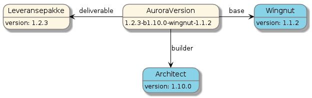
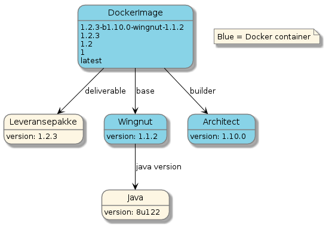
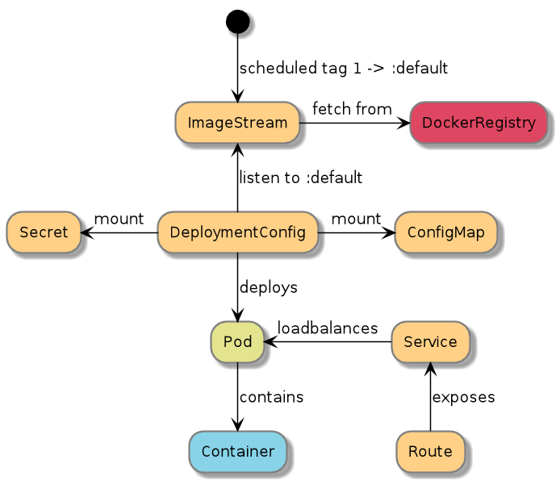

# Introduction

Welcome to the Aurora OpenShift Platform of the [Norwegian Tax Administration (NTA)](http://skatteetaten.no/en/person/) on GitHub. The Norwegian Tax
Administration is an agency under the authority of the Ministry of Finance and is responsible for taxation and the
population register.

These pages on GitHub are the home of the initiative to open source the platform that runs part of the NTA's digital tax
and customs services; the Aurora OpenShift Platform.

This document will describe what the Aurora OpenShift Platform is and how it came to be. It will also cover how we
are organized for developing software and our development process - including how we use the platform to build and
deploy our applications, and our guidelines and requirements to applications using the platform.

# A Short History

The work on what would become the Aurora OpenShift Platform started late in 2014 in the wake of a major project to
modernize the handling of the foundational data for most tax calculations in Norway. The project identified during its
course the need for a common platform for running and handling the vast amount of micro services across development,
test and reference environments that the project produced, and that would be produced by even larger projects down the
line.

A technology evaluation phase revealed the Red Hat OpenShift Container Platform (then Red Hat OpenShift Origin 3.0) to
be the most appropriate technology to base a new common platform on. Most of 2015 was spent on getting the first few
applications successfully running on OpenShift and device a suitable strategy for running, configuring and managing all
the applications that would, in time, be running on the platform.

As time passed it became clear that Kubernetes based
OpenShift was an extremely capable platform for running our applications. We also realized that handling integration
with the other infrastructure components (like database servers, logging/metrics/monitoring tools, and security
infrastructure), and handling the sheer amount of application instances and application runtime environments with all
their associated application versions, configurations and delivery schedules required more than OpenShift alone could
provide.

In the course of getting the first few applications running on OpenShift, quite a few departments of the
NTA had been involved in some sort of automation and integration work with the platform; some of them major
undertakings. By the end of 2016, as the tools and services that provided those integrations matured and got structured,
a select set of them became collectivly known as the Aurora OpenShift Platform.

In December 2016 it was decided that as much possible of the Aurora OpenShift Platform should be open sourced under
an APL 2.0 compatible license.

# Requirements for the Aurora OpenShift Platform

The Norwegian Tax Administration maintains millions of lines of code and employs 800 people in software development,
IT operations, management and supporting roles. When the need for new software arises - to either replace existing
systems or to handle new or changed responsibilities - a project is created for that purpose. The projects are often
supported with external consultants, and when complete they are transferred to the Line. The Line will
maintain and support the software over time, usually decades, and will initially be staffed with personnel from both the
project and from the Line itself.

Even before we started exploring OpenShift we knew that we would have to automate integration with our existing
infrastructure regardless of the platform we would end up using - so doing some sort of common initiative to provide
automation and integration services was given from the get-go. As we familiarized ourselves with OpenShift we saw
that there were several other areas that would also benefit from a central, common effort.

It was important to us that supporting applications on the platform developed by different teams, often with personnel
unfamiliar with developing software for the NTA, should be pretty much the same regardless of who developed it. For
instance, rolling out a Java Virtual Machine patch should be exactly the same for all applications, and it should be
possible for us to roll out such a patch for all applications across all environments in one go. Similarly, the
process of upgrading an application developed by one team deployed to a specific environment should be exactly the
same for any other application developed by a completely different team. Additionally, we wanted configuration to be
handled the same for all applications across all environments.

One of the things that struck us after getting some experience with OpenShift was how flexible it was to work with.
Although the platform certainly comes with its fair share of requirements and idiosyncrasies, we found that there was
hardly anything we were not able to do. However, we also very quickly realized that with all this flexibility comes a
quite steep learning curve on how "to do things right", and allowing individual teams to freely develop their
own strategies on how to use OpenShift would bear with it a high cost of entry, slower internal adoption and
difficulties streamlining maintenance and deployment activities across teams. Also, there were few obvious upsides to
letting teams freely use OpenShift their own way. For instance, we were hard press to find good answers to questions
like;

- What would be the benefit for teams to develop and maintain their own base image for their Java applications instead
  of collaborating on one?
- What would be the benefit for teams to device their own Docker Image build processes instead of adopting a common one?
- What would be the benefit for teams to develop and maintain their own scripts and tools for handing deployment and
  configuration across different environments?

Going back and forth, we almost always ended up at "not a whole lot". It became pretty clear that a common effort to
coordinate how the teams should use the platform and maintain reusable components and services was a good idea.

# What is the Aurora OpenShift Platform?

The Aurora OpenShift Platform is everything the Norwegian Tax Administration has developed to support
application configuration, deployment and management on OpenShift, common application base images, and a common build
and versioning mechanism for application archives and Docker images. A collect set of infrastructure integration and
automation components are also considered part of the platform.

The main user facing components implementing these mechanisms are:

- Aurora Konsoll: The most prominent feature of the Aurora OpenShift platform is the Aurora Konsoll. The Aurora Konsoll is a custom
  built web application that we use in conjunction with the platform provided OpenShift Console to better handle
  applications across teams and environments.
- [AO](https://github.com/Skatteetaten/ao): The Aurora OpenShift Command Line Client. Our custom built CLI that works with a set of high level configuration
  files that helps managing applications and configuration across environments.
- AuroraConfig: A DSL config format for describing applications and groupings of applications (environments)
- The Aurora API: The API that implements all our custom services. Used by the Aurora Konsoll and AO. [Gobo](https://github.com/Skatteetaten/gobo), [Boober](https://github.com/Skatteetaten/boober), [Mokey](https://github.com/Skatteetaten/mokey), [DBH](https://github.com/Skatteetaten/dbh), [Gillis](https://github.com/Skatteetaten/gillis)
- [Architect](https://github.com/Skatteetaten/architect): A Docker image that implements the image build process for all our supported runtime technologies
- Base Images: A set of Alpine Linux based Docker Images that all our applications are built from. [Wingnut](https://github.com/Skatteetaten/wingnut) and [Wrench](https://github.com/Skatteetaten/wrench)

The coming sections will describe these components in more detail.

# How we Develop and Build our Applications

## Coding and Application Build Requirements: Delivery Bundle

Coding an application targeted at the Aurora OpenShift Platform follows closely the principles of the
[Twelve-Factor App](https://12factor.net/) from Heroku. Additionally the following requirements must be met;

- The application must run on the JVM and, currently, must be written exclusively in Java. Node is supported when
  developing [Backends for Frontends](http://samnewman.io/patterns/architectural/bff/), but then only with very limited
  functionality.
- The application must currently be built using Apache Maven.
- The delivery mechanism is an assembly bundle zip file uploaded to our internal Nexus registry. We call this zip file
  a Leveransepakke (Delivery Bundle)
  - The Delivery Bundle must contain a lib folder with all the jars for the application.
  - The Delivery Bundle must contain a metadata/openshift.json file to provide build time metadata to the application
    image building process (Architect). This includes among other things information used to generate a start script for
    the application and metadata used to label the Docker image.
- We support both versioned releases and snapshots, but versioned releases must follow the
  [Semantic Versioning](http://semver.org/) system.
- The application must implement our proprietary management interface. This interface is described in more detail
  later.

Additionally we prefer that the applications are built via Jenkins and that the source repository of the application
contains a Jenkinsfile that describes the build process. Ideally, the Jenkinsfile uses our common Jenkins pipeline
scripts (making the Jenkinsfile less than 10 lines of code).

We provide a [Tailored Service Template](https://www.thoughtworks.com/radar/techniques/tailored-service-template) [openshift-reference-springboot-server](https://github.com/Skatteetaten/openshift-reference-springboot-server) for a
standard application that fulfill all these demands that teams building new applications can use to get started.

## The Image Build Process

Once the Delivery Bundle has been uploaded to Nexus we trigger (or create) an OpenShift BuildConfig for that specific
artifact (identified by the groupId and artifactId that was used when uploading to Nexus). We also provide the version
of the artifact that was just built as a parameter to the build.

The BuildConfig is configured to use the
OpenShift Container Platform’s [Custom build strategy](https://docs.openshift.com/container-platform/3.11/dev_guide/builds/build_strategies.html#custom-strategy-options)
and we have created our own Docker image, dubbed Architect, to build an application Docker image from the Delivery
Bundle based on our Java base image, dubbed Wingnut.

In addition to building the application image, Architect is also responsible for tagging the produced image with
several application and platform specific version tags that is the underpinning of our flexible deployment strategy.

Architect, Wingnut, our versioning strategy and our deployment strategy are described in more detail below.

In addition to passing parameters to Architect, the BuildConfig is also configured with two
[ImageChange triggers](https://docs.openshift.com/container-platform/3.11/dev_guide/builds/build_inputs.html#image-source).
One for Architect and one for Wingnut. This allows us to use OpenShift to automatically trigger a build of the most
recent version of any application when we release a new version of either Architect or Wingnut.

## The Application Image Builder: Architect

Architect is a Docker image built upon Alpine Linux that is responsible for building all our application images. It is
designed to work as an OpenShift
[CustomBuilder](https://docs.openshift.com/container-platform/3.11/creating_images/custom.html) and is mostly triggered
from BuildConfigs. It will download a prebuilt Delivery Bundle artifact from Nexus based on the groupId, artifactId and
version (GAV) provided as parameters and inspect the metadata/openshift.json-file in the bundle to determine the
technology used by the application. Based on the technology used, a suitable base image will be selected and the build
process determined. The build processes for the different technologies are implemented as generated Dockerfiles and will
vary depending on the runtime technology used.

### Building Java Applications

In addition to adding the Java application from the Delivery Bundle, a Java build will also add a custom certificate
store and our common logback.xml configuration file to the generated image. Applications are encouraged to use this
logback-file instead of providing their own to make sure that they are in compliance with the logging requirements.

For our Java applications, Architect supports generating a start script based on a few parameters set in the
metadata/openshift.json-file. Though not a requirement at this time (applications may provide their own start script),
providing a mechanism for automatically generating a start script has a few major benefits;

- Getting a start script for Java right on OpenShift is actually quite hard. The script must make sure that the main
  process is properly backgrounded, while still handling signals like SIGTERM. It must also trap the Java process to
  rewrite application exit codes; for instance, Java exits with 143, while OpenShift expects properly terminated
  applications to return 0. Additionally -Xmx must be set in relation to the available cgroup memory. Our generated start
  script handles all these issues.
- We require that the Jolokia agent is enabled for all Java processes to enable the hawt.io integration in OpenShift.
  Our generated start script enables this by default.

Additionally, the generated start script will create a deterministic class path from the lib folder, set JVM_OPTS and
APPLICATION_ARGS from the openshift.json file and optionally enable remote debugging.

The start script we use is heavily inspired by several other similar solutions, chief among them
[run-java-sh](https://github.com/fabric8io-images/run-java-sh).

### Common Steps

In addition to generating application and technology specific start scripts we also provide a required wrapper script
that acts as the actual entry point of the application Docker image. This script will, among a few other
things, read configuration files that have been mounted into the container and make them available as environment
variables for the application. This process is described in more detail later.

After the application Docker image has been built it is pushed to our internal Docker registry. We also tag the image
with several version tags to support our deployment strategy. Our versioning strategy is described below.

## Image Versioning Strategy: The AuroraVersion

The structure of the final application Docker image is affected not only by the application Delivery Bundle, but also
on the specific version of Architect that was used to build the image, and the version of the base image that was used.
This means that even if the application version does not change, we may still produce entirely different images by
changing the version of Architect or the base image. To reflect these dependencies, when tagging the image with the
final version, the version tag used contains not only the application version, but also the versions of Architect and
the base image, along with the base image name. We call this composite version tag the AuroraVersion and an example
can be seen in the diagram below;

When the application has a semver compliant version we additionally push individual tags for the major version,
for the major and minor version combined, for the major, minor and patch version combined, and finally the
latest tag. An example is provided in the following diagram;

A snapshot version is a version string that ends with the literal "-SNAPSHOT", like "1.0.0-SNAPSHOT" or
"some_new_feature-SNAPSHOT". When building a snapshot release, in addition to the AuroraVersion, we also push two
snapshot tags. Using "some_new_feature-SNAPSHOT" as an example we push

- SNAPSHOT-some_new_feature-{buildNumber}, where the buildNumber is fetched from Nexus
- some_new_feature-SNAPSHOT

By applying this versioning strategy to our Docker images we in turn get tremendous flexibility when it comes to
deploying and patching our applications on OpenShift. Our deployment and patching strategy is described next.

## Deployment and Patching Strategy

When deploying new applications to OpenShift we always use our proprietary AO command line tool. This tool ensures that all
deployed applications follow the same basic pattern. AO is described in depth later so we will not go
into all the details here, but for the purposes of describing our deployment and patching strategy we need to highlight
a couple of the objects that AO generates.

Based on the configuration files given to AO, we generate the OpenShift objects that are required to run the
application. We generate one
[ImageStream](https://docs.openshift.com/container-platform/3.11/architecture/core_concepts/builds_and_image_streams.html#image-streams)
for each application we deploy. This ImageStream contains one (and only one) scheduled tag. We then generate a
[DeploymentConfig](https://docs.openshift.com/container-platform/3.11/architecture/core_concepts/deployments.html#deployments-and-deployment-configurations)
with a single container that uses the previously generated ImageStream and scheduled tag as its image reference. We
also register a ImageChangeTrigger to trigger redeploys when the tag in the ImageStream changes.

To deploy the application we simply change the Docker tag that the scheduled tag in the ImageStream points to to the
application version we want to run. The application version can be any of the tags we have previously tagged the image
with (see "Image Versioning Strategy: The AuroraVersion"), and since the tag in the image stream is scheduled, it will
pick up any changes to the tag that may occur as a result of building new application images. For instance, we can set
the scheduled tag in the ImageStream to any of the following tags to determine the deployment strategy for a particular
application:

In the following list, the term infrastructure refers to the versions of the base image and Architect in the
AuroraVersion string.

- use **latest** to automatically deploy the latest image with a semver compliant version
- use _1_ to automatically deploy the newest image for a major version (any 1.x.y version) of an application. Following
  the semver semantics, this includes all new features and bugfixes but no breaking changes. Infrastructure changes are
  also included.
- use _1.1_ to automatically deploy the newest image for a minor version (any 1.1.x version) of an application.
  Following the semver semantics, this includes all bugfixes. Infrastructure changes are also included.
- use _1.1.1_ to automatically deploy the newest image for a patch version (any 1.1.1 version) of an application.
  Following the semver semantics, this actually excludes any other application version from being deployed, and hence,
  the application will only be deployed if the infrastructure changes.
- use the full **AuroraVersion** of a release to pin the deployment to that specific combination of application version
  and infrastructure. OpenShift will never automatically redeploy this application since the AuroraVersion tag will never
  change for an image.
- use **SNAPSHOT-versionname** to get the latest build from a snapshot

Like we mentioned in the section "The Image Build Process" the OpenShift BuildConfig is configured with two
ImageChange triggers. One for Architect and one for the base image. This allows us to automatically retrigger the build
of an application image when new versions of either Architect or the base image are released. Commonly, when releasing
for instance a new version of Wingnut, our base image for Java, with a new Java Runtime Environment version, hundreds of
application images are automatically rebuilt - and in many cases, based on the deployment strategy for the individual
applications, automatically redeployed by the platform.

## Application Configuration Strategy

Arriving at a strategy for configuring our applications for particular environments (development, test, etc) was a
long and winding road, taking us back to the drawing board several times. We explored many of the off the shelf
solutions for handling this, but in the end we did not want a runtime dependency for all our applications on a
configuration service. In addition we struggled to find a product that actually suited our needs and fit into our
network infrastructure.

We wanted a solution that would let us maintain several sets of configurations for an application, each set tailored
to the environment the application would run in, and we also needed to support several versions of the configuration
schema at the same time. For instance, version 1.0.0 of an application will often be configured differently than version
2.0.0 of that same application.

What we ended up doing was to let AO, from the AO config (described later), create a ConfigMap with a file that
contains the configuration for the application in the environment it is being deployed to. This configuration file is
mounted in the application Docker container by the DeploymentConfig, read by the entrypoint wrapper script
(described in "The Application Image Builder: Architect") and exposed as environment variables for the application.

Using only environment variables for configuration allows us to configure applications using completely different
runtime technologies the same way. In addition, many of our existing applications running outside OpenShift were already
configured using environment variables, and thus would require little modification to their configuration handling to
adapt to running on OpenShift. And, finally, we have no application runtime dependencies to third party services for
configuration that may or may not be available at application startup, significantly reducing risk.

## Development flow

In order to support rapid development on the platform a variant of the image build process has been created. The Architect
builder has received support for binary builds. This means that you can build a Delivery Bundle locally and then send it directly to the builder.

# AO

[AO](https://github.com/Skatteetaten/ao) (Aurora OpenShift CLI) is our custom command line client for deploying applications to OpenShift.

We started out using [OpenShift Templates](https://docs.okd.io/latest/dev_guide/templates.html) in 2015. A go-template based template engine that takes a list of parameters and replaces it into objects before applying them to the cluster. For our needs this technology was and is severly lacking. - no support for conditional logic - no support for loops - no support for optionaly including and entire object We then created a bash wrapper around the templates that would generate objects for it and modify them afterwards. The config for this bash wrapper resided along side the application code. After som experience with this we found several issues with it - writing good bash is hard and testing tools are lacking - no client-server model, so we had to duplicate functionality in web dashboard - you had to commit and change code in repo to change config. That means triggereing new jenkins builds when not really needed. This lead to the design of the start of the AuroraAPI with the [Boober](https://github.com/Skatteetaten/boober), [AuroraConfig](/documentation/aurora-config) and [AO](https://github.com/Skatteetaten/ao) components.

The need for a custom command line client became apparent when we saw that the teams started developing their own
scripts for deploying applications across different environments. These scripts quickly became quite complex,
and while basically solving the same problems, they were implemented differently. We also wanted to avoid the teams
having to maintain a huge set of OpenShift yaml or json files for their applications and because of the very limited
functionality in the OpenShift template mechanism, the templates we created to mitigate that were not powerful enough
on their own to be used entirely without some manipulation through scripting.

The first versions of AO interacted with OpenShift and supporting infrastructure directly, and though useful, it was
hard to extend, reuse functionality and roll out fixes. Recent versions of AO is a simple frontend for the Aurora
API, our core automation API on the Aurora OpenShift Platform. Over time, AO has matured into a tool not only for
coordinating deployments to OpenShift, but also for triggering other infrastructure automation tasks.

Finally, a custom command line client would allow us to more easily make sure that the applications were deployed and
configured the same, allowing us to make assumptions about applications when creating the Aurora Konsoll.

AO is driven by a set of configuration files (AuroraConfig) that describe how applications should be deployed and configured in
different environments. The configuration files are organized in a hierarchy and are cascading, allowing us to share and
overwrite configuration options across applications and environments. AO sends these configuration files to the
Aurora API which in turn creates or updates the appropriate OpenShift objects (like DeploymentConfig, Service, Route)
and performs other infrastructure automation tasks.

The following features can be configured in the AuroraConfig configuration

- The application to deploy
- Deployment strategy; the version to deploy
- What database schemas to generate/reuse
- Should a security token for secure communication be generated?
- Config variables
- Should a Route be generated for this application
- Enable rolling upgrades
- Configure Splunk index
- Create other routes/automate opening traffic in network infrastructure (webseal/BiG-IP)

The setup process of AO is idempotent so calling it several times will only update the required parts in the old
objects. After running AO on one single application the objects created on OpenShift is illustrated by the following
diagram.

# Aurora Konsoll

The Aurora Konsoll is our custom made companion web application to the of-the-shelf OpenShift Console. It does not
replace the OpenShift Console, nor does it try to, but it adds quite a bit of functionality that the OpenShift
Console does not have (and probably should not have). Some of it is related to viewing and manging infrastructure
items like firewall openings, proxy configurations, certificates and database schemas, and does not have anything to
do with OpenShift per se. Others take full advantage of the way we deploy our applications and provide powerful
screens for displaying, configuring, upgrading and monitoring applications for different teams across environments.

# The Aurora API

The Aurora API is our platform automation API and provides endpoints used by both AO and the Aurora Konsoll. The main
features of the API includes;

- Execution of the instructions given by the AuroraConfig configuration files.
- Provides abstractions that builds on the OpenShift objects and other infrastructure objects, mainly
  AuroraApplication, AuroraDeploymentConfiguration, AuroraVersion and AuroraStatus.
- Endpoints for managing infrastructure components and applications, like performing upgrades and configuration
  changes.
- Produce status metrics for an application on the platform. Fetches information from Docker registry, the cluster and the applications management interface.
- Miscellaneous tools to aid in development and debgging infrastructure issues.

# Application Monitoring

Although OpenShift provides many mechanisms for keeping applications running even when failures occur, of course, in the
real world applications sometimes, unavoidably, still go down. If it is your responsibility to monitor applications on
OpenShift, the native user interface is not actually great for that. It can be hard to get an overview of the status
of all applications in an OpenShift project/namespace, and it is nearly impossible to get such an overview across
namespaces. The support for providing application status to OpenShift is also quite limited; its either working
properly, or it is not, and getting feedback for application troubleshooting is nearly completely absent.

We required quite a bit more of the platform to confidently monitor our applications, and one of the most prominent
features of the Aurora Konsoll, the Application Monitoring Wallboard, addresses this. It presents a matrix of
applications and environments with all their associated statuses. The information in the wallboard is in part provided
by OpenShift and in part by the applications themselves, everything made available to the Wallboard via the Aurora API.
In order for the Aurora API to provide all this information, the applications running on the Aurora OpenShift platform
is required to implement our proprietary Management Interface (which is in part based on Spring Boot Actuator).

Information from the Management Interface of the applications in combination with information we collect about the
applications from OpenShift via the OpenShift API collectively contributes to an aggregated application status that we
call the AuroraStatus.
