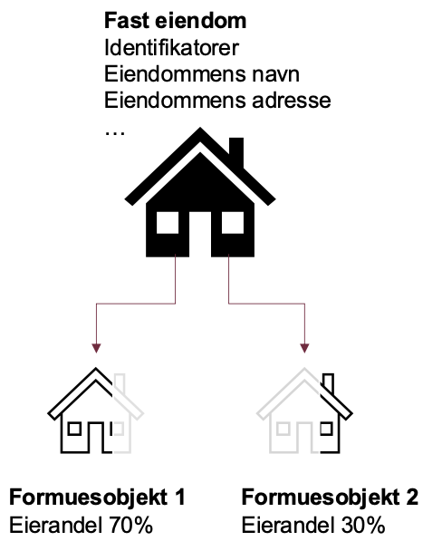

# Eiendom

Denne guiden er ment som en kom i gang med eiendom, og hvordan migrere datamodellen fra inntektsår 2023 til 2024. Tidligere dokumentasjon [er flyttet hit](./inntektsaar_2021_til_2023/README.md)


# Nytt for inntektsår 2024
For inntektsår 2024 er modellen restruktruert. Det er **ikke** tilført noen nye informasjonsmengder eller funksjonalitet. 
Den faste eiendommen er nå modellert med underliggende forekomster for de ulike rollene eiendommen kan. 


## FastEiendom før 2024
For å beskrive de ulike "rollene" en eiendom kan ha, fantest det ulike formuesobjketer.
FastEiendom og de forskjellige formuesobjektene var koblet sammen ved hjelp av en internEiendomsidentifikator.
 - fastEiendomSomFormuesobjekt
 - fastEiendomSomUtleieobjekt
 - fastEiendomSomRealisasjonsobjekt
 - fastEiendomSomKårytelse
Ved hjelp av en internEiendomsidentifikator koblet fastEiendom sammen med Formuesobjektet. 


## FastEiendom etter 2024
Informasjon om den fysiske eiendommen ligger nå kun på den faste eiendommen, dvs. på ett sted i modellen. 
Intern eiendomsidentifikator er fjernet
Eierandel har byttet plass, den er ikke lenger knyttet til det fysiske objektet, men i formuesobjektet. Så en kan forskjellig eierandel per formuesbojekt



## Egenskaper knyttet til fastEiendom.
En fast eiendom kan ha en eller flere formuesobjekter, for personlig skattmelding kan den også ha kårytelse, utleie, strømprodusent og realisasjonsobjekt. 


##  Oppdeling av eiendomstyper
For inntektsår 2019 - 2023 så var eiendomstyper oppdelt etter litt forskjellig regelverk, for eksempel 
så ble fritidseiendom splittet opp i regnskapsbehandlet eller fritaksbehandlet fritidseiendom. Mens næringseiendom 
ble delt opp om den var innenfor eller utenfor inntektsgivende aktivitet. Det førte til duplisering av regler for
eiendomstyper innenfor samme takseringsregelverk.
For inntektsår 2024 har eiendommen blitt delt opp i takseringsregelverk, nå er er eiendomstyper innenfor samme regelverk samlet sammen.
Eiendomstypen skal brukes når vi skal sette verdsettingsrabatt

## Endringer i eiendoms API'er
Eiendomsapier som henter formuesgrunnlaget (`api/skattemelding/v2/eiendom/formuesgrunnlag/`) og beregner 

## Eksempler på migrering fra gammel til ny modell
Eksemplene er hentet fra den personlige modellen
 
#### formuesspesifikasjonForBolig 2024 <a name="formuesspesifikasjonForBolig"></a>
Her er det to faste eiendommer, en som har grunnlagForBeregnetMarkedsverdi.boligverdi og en som har grunnlagForBeregnetMarkedsverdi.dokumentertMarkedsverdi

```xml
<fasteEiendommer>
  <fastEiendom>
    <sergEiendomsidentifikator>
        <tekst>4600573</tekst>
    </sergEiendomsidentifikator>
    <id>4600573</id>
    <vegadresse>
        <poststed>
            <poststedsnavn>
                <tekst>HASSELVIKA</tekst>
            </poststedsnavn>
            <postnummer>
                <postnummer>9863</postnummer>
            </postnummer>
        </poststed>
    </vegadresse>
    <fastEiendomSomFormuesobjekt>
        <formuesspesifikasjonForBolig>
            <boligegenskaper>
                <boligensAreal>
                    <heltall>56</heltall>
                </boligensAreal>
                <boligtype>
                    <boligtype>smaahus</boligtype>
                </boligtype>
                <byggeaar>
                    <aarstall>2009</aarstall>
                </byggeaar>
            </boligegenskaper>
            <boligbruk>
                <boligbruk>sekundaerbolig</boligbruk>
            </boligbruk>
            <grunnlagForBeregnetMarkedsverdi>
                <boligverdi>
                    <beloep>
                        <beloepINok>
                            <beloepSomHeltall>2291707</beloepSomHeltall>
                        </beloepINok>
                        <beloepIValuta>
                            <beloep>2291707</beloep>
                        </beloepIValuta>
                        <valutakode>
                            <valutakode>NOK</valutakode>
                        </valutakode>
                        <valutakurs>
                            <valutakurs>1</valutakurs>
                        </valutakurs>
                    </beloep>
                </boligverdi>
                <dokumentertMarkedsverdiForBolig>
                    <dokumentertMarkedsverdiTidligereInntektsaar>100000</dokumentertMarkedsverdiTidligereInntektsaar>
                    <aarForMottattMarkedsverdi>
                        <aarstall>2016</aarstall>
                    </aarForMottattMarkedsverdi>
                    <justertMarkedsverdi>
                        <beloep>
                            <beloepSomHeltall>2245873</beloepSomHeltall>
                        </beloep>
                    </justertMarkedsverdi>
                    <reduksjonsfaktorForJustertMarkedsverdi>
                        <desimaltall>0.98</desimaltall>
                    </reduksjonsfaktorForJustertMarkedsverdi>
                </dokumentertMarkedsverdiForBolig>
            </grunnlagForBeregnetMarkedsverdi>
            <beregnetMarkedsverdi>
                <beloep>
                    <beloepSomHeltall>2245873</beloepSomHeltall>
                </beloep>
            </beregnetMarkedsverdi>
            <markedsverdiErGrunnlagForBeregningAvFormuesverdiForBolig>
                <boolsk>false</boolsk>
            </markedsverdiErGrunnlagForBeregningAvFormuesverdiForBolig>
        </formuesspesifikasjonForBolig>
        <id>2c52362754b15473b1b36efc957375416e6ddeda</id>
        <eiendomstype>
            <eiendomstype>selveidBolig</eiendomstype>
        </eiendomstype>
        <eierandel>
            <prosent>100.00</prosent>
        </eierandel>
        <andelAvFormuesverdi>
            <prosent>100.00</prosent>
        </andelAvFormuesverdi>
        <formuesverdiPerEiendom>
            <beloep>
                <beloepSomHeltall>2245873</beloepSomHeltall>
            </beloep>
        </formuesverdiPerEiendom>
        <formuesverdiForFormuesandel>
            <beloep>
                <beloepSomHeltall>2245873</beloepSomHeltall>
            </beloep>
        </formuesverdiForFormuesandel>
        <verdiFoerVerdsettingsrabattForFormuesandel>2245873</verdiFoerVerdsettingsrabattForFormuesandel>
    </fastEiendomSomFormuesobjekt>
  </fastEiendom>
    <fastEiendomSomFormuesobjekt>
        <formuesspesifikasjonForBolig>
            <boligegenskaper>
                <boligensAreal>
                    <heltall>56</heltall>
                </boligensAreal>
                <boligtype>
                    <boligtype>smaahus</boligtype>
                </boligtype>
                <byggeaar>
                    <aarstall>2009</aarstall>
                </byggeaar>
            </boligegenskaper>
            <boligbruk>
                <boligbruk>sekundaerbolig</boligbruk>
            </boligbruk>
            <grunnlagForBeregnetMarkedsverdi>
                <boligverdi>
                    <beloep>
                        <beloepINok>
                            <beloepSomHeltall>2291707</beloepSomHeltall>
                        </beloepINok>
                        <beloepIValuta>
                            <beloep>2291707</beloep>
                        </beloepIValuta>
                        <valutakode>
                            <valutakode>NOK</valutakode>
                        </valutakode>
                        <valutakurs>
                            <valutakurs>1</valutakurs>
                        </valutakurs>
                    </beloep>
                </boligverdi>
                <dokumentertMarkedsverdiForBolig>
                    <dokumentertMarkedsverdiTidligereInntektsaar>100000</dokumentertMarkedsverdiTidligereInntektsaar>
                    <aarForMottattMarkedsverdi>
                        <aarstall>2016</aarstall>
                    </aarForMottattMarkedsverdi>
                    <justertMarkedsverdi>
                        <beloep>
                            <beloepSomHeltall>2245873</beloepSomHeltall>
                        </beloep>
                    </justertMarkedsverdi>
                    <reduksjonsfaktorForJustertMarkedsverdi>
                        <desimaltall>0.98</desimaltall>
                    </reduksjonsfaktorForJustertMarkedsverdi>
                </dokumentertMarkedsverdiForBolig>
            </grunnlagForBeregnetMarkedsverdi>
            <beregnetMarkedsverdi>
                <beloep>
                    <beloepSomHeltall>2245873</beloepSomHeltall>
                </beloep>
            </beregnetMarkedsverdi>
            <markedsverdiErGrunnlagForBeregningAvFormuesverdiForBolig>
                <boolsk>true</boolsk>
            </markedsverdiErGrunnlagForBeregningAvFormuesverdiForBolig>
        </formuesspesifikasjonForBolig>
        <id>2c52362754b15473b1b36efc957375416e6ddeda</id>
        <eiendomstype>
            <eiendomstype>selveidBolig</eiendomstype>
        </eiendomstype>
        <eierandel>
            <prosent>100.00</prosent>
        </eierandel>
        <andelAvFormuesverdi>
            <prosent>100.00</prosent>
        </andelAvFormuesverdi>
        <formuesverdiPerEiendom>
            <beloep>
                <beloepSomHeltall>2245873</beloepSomHeltall>
            </beloep>
        </formuesverdiPerEiendom>
        <formuesverdiForFormuesandel>
            <beloep>
                <beloepSomHeltall>2245873</beloepSomHeltall>
            </beloep>
        </formuesverdiForFormuesandel>
        <verdiFoerVerdsettingsrabattForFormuesandel>2245873</verdiFoerVerdsettingsrabattForFormuesandel>
    </fastEiendomSomFormuesobjekt>
</fasteEiendommer>
```

#### formuesspesifikasjonForFlerboligbygning med dokumentert markedsverdi 2024
```xml
<fastEiendom>
    <sergEiendomsidentifikator>
        <tekst>100</tekst>
    </sergEiendomsidentifikator>
    <id>100</id>
    <vegadresse>
        <adressenavn>
            <tekst>Flerboligveien</tekst>
        </adressenavn>
        <adressenummer>
            <husnummer>
                <tekst>1</tekst>
            </husnummer>
            <husbokstav>
                <tekst>B</tekst>
            </husbokstav>
        </adressenummer>
        <poststed>
            <poststedsnavn>
                <tekst>HALDEN</tekst>
            </poststedsnavn>
            <postnummer>
                <postnummer>1777</postnummer>
            </postnummer>
        </poststed>
    </vegadresse>
    <eksternEiendomsidentifikator>
        <kommunenummer>
            <kommunenummer>4225</kommunenummer>
        </kommunenummer>
        <sergMatrikkelnummer>
            <gaardsnummer>
                <gaardsnummer>100</gaardsnummer>
            </gaardsnummer>
            <bruksnummer>
                <bruksnummer>1</bruksnummer>
            </bruksnummer>
            <festenummer>
                <festenummer>0</festenummer>
            </festenummer>
            <seksjonsnummer>
                <seksjonsnummer>0</seksjonsnummer>
            </seksjonsnummer>
        </sergMatrikkelnummer>
    </eksternEiendomsidentifikator>
    <fastEiendomSomFormuesobjekt>
        <formuesspesifikasjonForFlerboligbygning>
            <beregnetMarkedsverdi>
                <beloep>
                    <beloepSomHeltall>8000000</beloepSomHeltall>
                </beloep>
            </beregnetMarkedsverdi>
            <grunnlagForBeregnetMarkedsverdi>
                <boligverdi>
                    <beloep>
                        <beloepINok>
                            <beloepSomHeltall>8741701</beloepSomHeltall>
                        </beloepINok>
                        <beloepIValuta>
                            <beloep>8741701</beloep>
                        </beloepIValuta>
                        <valutakode>
                            <valutakode>NOK</valutakode>
                        </valutakode>
                        <valutakurs>
                            <valutakurs>1</valutakurs>
                        </valutakurs>
                    </beloep>
                </boligverdi>
                <dokumentertMarkedsverdiForBolig>
                    <dokumentertMarkedsverdi>
                        <beloep>
                            <beloepINok>
                                <beloepSomHeltall>8000000</beloepSomHeltall>
                            </beloepINok>
                            <beloepIValuta>
                                <beloep>8000000</beloep>
                            </beloepIValuta>
                            <valutakurs>
                                <valutakurs>1</valutakurs>
                            </valutakurs>
                        </beloep>
                    </dokumentertMarkedsverdi>
                    <justertMarkedsverdi>
                        <beloep>
                            <beloepSomHeltall>8000000</beloepSomHeltall>
                        </beloep>
                    </justertMarkedsverdi>
                </dokumentertMarkedsverdiForBolig>
            </grunnlagForBeregnetMarkedsverdi>
            <useksjonertBoenhet>
                <id>ce315988209f1e5c0a1a069d6daf1d094f883698</id>
                <boligegenskaper>
                    <boligensAreal>
                        <heltall>150</heltall>
                    </boligensAreal>
                    <boligtype>
                        <boligtype>leilighet</boligtype>
                    </boligtype>
                    <byggeaar>
                        <aarstall>1952</aarstall>
                    </byggeaar>
                </boligegenskaper>
                <boligbruk>
                    <boligbruk>sekundaerbolig</boligbruk>
                </boligbruk>
                <bruksenhetsnummer>
                    <tekst>H0101</tekst>
                </bruksenhetsnummer>
                <boligverdiForUseksjonertBoenhet>
                    <beloep>
                        <beloepSomHeltall>1892511</beloepSomHeltall>
                    </beloep>
                </boligverdiForUseksjonertBoenhet>
                <formuesverdiForFormuesandel>
                    <beloep>
                        <beloepSomHeltall>1892511</beloepSomHeltall>
                    </beloep>
                </formuesverdiForFormuesandel>
                <verdiFoerVerdsettingsrabattForFormuesandel>1892511</verdiFoerVerdsettingsrabattForFormuesandel>
            </useksjonertBoenhet>
            <useksjonertBoenhet>
                <id>c5dba23c9b0ac0279d4a9c2d418d2b945a184b73</id>
                <boligegenskaper>
                    <boligensAreal>
                        <heltall>120</heltall>
                    </boligensAreal>
                    <boligtype>
                        <boligtype>leilighet</boligtype>
                    </boligtype>
                    <byggeaar>
                        <aarstall>1952</aarstall>
                    </byggeaar>
                </boligegenskaper>
                <boligbruk>
                    <boligbruk>sekundaerbolig</boligbruk>
                </boligbruk>
                <bruksenhetsnummer>
                    <tekst>H0102</tekst>
                </bruksenhetsnummer>
                <boligverdiForUseksjonertBoenhet>
                    <beloep>
                        <beloepSomHeltall>1628794</beloepSomHeltall>
                    </beloep>
                </boligverdiForUseksjonertBoenhet>
                <formuesverdiForFormuesandel>
                    <beloep>
                        <beloepSomHeltall>1628794</beloepSomHeltall>
                    </beloep>
                </formuesverdiForFormuesandel>
                <verdiFoerVerdsettingsrabattForFormuesandel>1628794</verdiFoerVerdsettingsrabattForFormuesandel>
            </useksjonertBoenhet>
            <useksjonertBoenhet>
                <id>68c9327899eef11a889600d1774f15382c64d97a</id>
                <boligegenskaper>
                    <boligensAreal>
                        <heltall>130</heltall>
                    </boligensAreal>
                    <boligtype>
                        <boligtype>leilighet</boligtype>
                    </boligtype>
                    <byggeaar>
                        <aarstall>1952</aarstall>
                    </byggeaar>
                </boligegenskaper>
                <boligbruk>
                    <boligbruk>sekundaerbolig</boligbruk>
                </boligbruk>
                <bruksenhetsnummer>
                    <tekst>H0201</tekst>
                </bruksenhetsnummer>
                <boligverdiForUseksjonertBoenhet>
                    <beloep>
                        <beloepSomHeltall>1718873</beloepSomHeltall>
                    </beloep>
                </boligverdiForUseksjonertBoenhet>
                <formuesverdiForFormuesandel>
                    <beloep>
                        <beloepSomHeltall>1718873</beloepSomHeltall>
                    </beloep>
                </formuesverdiForFormuesandel>
                <verdiFoerVerdsettingsrabattForFormuesandel>1718873</verdiFoerVerdsettingsrabattForFormuesandel>
            </useksjonertBoenhet>
            <useksjonertBoenhet>
                <id>49bc43a44be16d2b37f9069480ffb259f9ab9c6b</id>
                <boligegenskaper>
                    <boligensAreal>
                        <heltall>152</heltall>
                    </boligensAreal>
                    <boligtype>
                        <boligtype>leilighet</boligtype>
                    </boligtype>
                    <byggeaar>
                        <aarstall>1952</aarstall>
                    </byggeaar>
                </boligegenskaper>
                <boligbruk>
                    <boligbruk>primaerbolig</boligbruk>
                </boligbruk>
                <bruksenhetsnummer>
                    <tekst>H0202</tekst>
                </bruksenhetsnummer>
                <boligverdiForUseksjonertBoenhet>
                    <beloep>
                        <beloepSomHeltall>1909444</beloepSomHeltall>
                    </beloep>
                </boligverdiForUseksjonertBoenhet>
                <formuesverdiForFormuesandel>
                    <beloep>
                        <beloepSomHeltall>477361</beloepSomHeltall>
                    </beloep>
                </formuesverdiForFormuesandel>
                <verdiFoerVerdsettingsrabattForFormuesandel>1909444</verdiFoerVerdsettingsrabattForFormuesandel>
            </useksjonertBoenhet>
            <useksjonertBoenhet>
                <id>6f06aa0f108434af4de1e851542d4ef6e103e6ac</id>
                <boligegenskaper>
                    <boligensAreal>
                        <heltall>116</heltall>
                    </boligensAreal>
                    <boligtype>
                        <boligtype>leilighet</boligtype>
                    </boligtype>
                    <byggeaar>
                        <aarstall>1952</aarstall>
                    </byggeaar>
                </boligegenskaper>
                <boligbruk>
                    <boligbruk>sekundaerbolig</boligbruk>
                </boligbruk>
                <bruksenhetsnummer>
                    <tekst>H0203</tekst>
                </bruksenhetsnummer>
                <boligverdiForUseksjonertBoenhet>
                    <beloep>
                        <beloepSomHeltall>1592079</beloepSomHeltall>
                    </beloep>
                </boligverdiForUseksjonertBoenhet>
                <formuesverdiForFormuesandel>
                    <beloep>
                        <beloepSomHeltall>1592079</beloepSomHeltall>
                    </beloep>
                </formuesverdiForFormuesandel>
                <verdiFoerVerdsettingsrabattForFormuesandel>1592079</verdiFoerVerdsettingsrabattForFormuesandel>
            </useksjonertBoenhet>

            <markedsverdiErGrunnlagForBeregningAvFormuesverdiForFlerboligbygning>
                <boolsk>true</boolsk>
            </markedsverdiErGrunnlagForBeregningAvFormuesverdiForFlerboligbygning>
        </formuesspesifikasjonForFlerboligbygning>
        <id>81c476624af798703c5ab12295c9b55e34407489</id>
        <eiendomstype>
            <eiendomstype>flerboligbygning</eiendomstype>
        </eiendomstype>
        <eierandel>
            <prosent>100.00</prosent>
        </eierandel>
        <andelAvFormuesverdi>
            <prosent>100.00</prosent>
        </andelAvFormuesverdi>
        <formuesverdiPerEiendom>
            <beloep>
                <beloepSomHeltall>8000000</beloepSomHeltall>
            </beloep>
        </formuesverdiPerEiendom>
        <formuesverdiForFormuesandel>
            <beloep>
                <beloepSomHeltall>8000000</beloepSomHeltall>
            </beloep>
        </formuesverdiForFormuesandel>
        <verdiFoerVerdsettingsrabattForFormuesandel>8000000</verdiFoerVerdsettingsrabattForFormuesandel>
    </fastEiendomSomFormuesobjekt>
</fastEiendom>
```