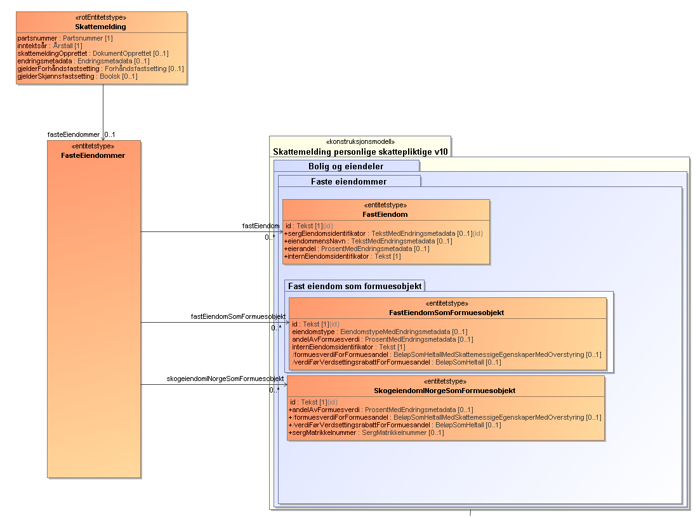

# Eiendom

Denne guiden er ment som en "kom i gang på eiendom". 
Den beskriver en tiltenkt flyt, forholdet mellom tema/forekomst fast eiendom og formuesgrunnlaget for eiendommen.
Tilslutt følger det en del eksempler på forskjellige eiendomstyper 

## Prosess


Uavhengig av hvilken eiendomstype en skal legge til, så er målet å finne **markedsverdi**, slik at Skatteetaten kan
finne **formuesverdi** som inngår i skatteberegningen

- Hvis eiendom ikke er preutfylt i skattemeldingen, må den legges til. Det gjøres
  via [søke-api'et](../../api-v2/README.md#søk)
    - Merk, det er kun privatpersoner som får preutfylt eiendomsinformasjon
- Når eiendommen er valgt så må en finne formuesgrunnlaget. Enten egenfastsettes dette, eller en kan hente det
  Skatteetaten har på eiendommen via api'et `hent formuesgrunnlag`
- Når formuesgrunnlaget er hentet og eiendomstypen fylt ut, så må en beregne markedsverdien, hvis eiendommen er av
  typene nedenfor, så kan en bruke kalkulatoren til eiendoms api'et. Merk at det er en egen kalkulator for hver av disse
  typene av eiendommer
    - bolig
    - flerbolig
    - ikke utleid næringseiendom
- Hvis eiendommen ikke er en av disse, f.eks utleid næringseiendom og fritidsbolig, så må alle obligatoriske felter
  fylles ut for eiendomstypen, og markedsverdien egenfastsettes
- Når markedsverdien er funnet, så må en fastsette eierandel og andel formuesverdi (for selskaper skal andel formuesverdi
  og eierandel være lik). Den eierandelen skatteetaten sitter på vil bli returnert når en henter formuesgrunnlaget. 
- Da skal informasjonselementene i FastEiendom og FastEiendomSomFormuesobjekt være korrekt utfylt og klar til å bli lagt
  inn i skattemeldingen

## Informasjonsmodell

Selskapsmeldingen, skattemelding upersonlig og skattemelding personlig har alle den samme oppbygningen av eiendom.
Siden modellen er lik for alle tre, så er beskrivelsen tatt utgangspunkt i skattemelding for person.
Forskjellen er at personer får preutfylt informasjon om eiendommer, mens upersonlige og selskaper må legge disse inn
selv.
For upersonlig og selskapsmeldingen skal `fastEiendom.eierandel` og `fastEiendomSomFormuesobjekt.andelAvFormuesverdi`
være like hverandre

Hver eiendomstype består av:

- FastEiendom objekt
- FastEiendomSomFormuesobjekt.



Figuren ovenfor viser hva som er likt for FastEiendommer og FastEiendomSomFormuesobjekt. FastEiendomSomFormuesobjekt har
forskjellige informasjonselementer avhengig av hvilken eiendomstype det gjelder.

Disse to objektene (FastEiendommer og FastEiendomSomFormuesobjekt) lenkes sammen med `internEiendomsidentifikator`

### FastEiendom og FastEiendomSomFormuesverdi eksempler

Her er en liste med eksempler over forskjellige formuesobjekter
- [formuesspesifikasjonForTomt](#formuesspesifikasjonForTomt)
- [formuesspesifikasjonForBolig](#formuesspesifikasjonForBolig)
- [formuesspesifikasjonForSelveidFritidseiendom](#formuesspesifikasjonForSelveidFritidseiendom)
- [formuesspesifikasjonForAnnenFastEiendomInnenforInntektsgivendeAktivitet](#formuesspesifikasjonForAnnenFastEiendomInnenforInntektsgivendeAktivitet)
- [formuesspesifikasjonForAnnenFastEiendomUtenforInntektsgivendeAktivitet](#formuesspesifikasjonForAnnenFastEiendomUtenforInntektsgivendeAktivitet)
- [formuesspesifikasjonForFlerboligbygning](#formuesspesifikasjonForFlerboligbygning)
- [formuesspesifikasjonForSkalIkkeFastsettes](#formuesspesifikasjonForSkalIkkeFastsettes)
- [formuesspesifikasjonForBorett](#formuesspesifikasjonForBorett)
- [formuesspesifikasjonForRegnskapsbehandletBolig](#formuesspesifikasjonForRegnskapsbehandletBolig)
- [formuesspesifikasjonForEgenFritaksbehandletBolig](#formuesspesifikasjonForEgenFritaksbehandletBolig)
- [formuesspesifikasjonForRegnskapsbehandletFritidseiendom](#formuesspesifikasjonForRegnskapsbehandletFritidseiendom)
- [formuesspesifikasjonForEgenFritaksbehandletFritidseiendom](#formuesspesifikasjonForEgenFritaksbehandletFritidseiendom)
- [formuesspesifikasjonForGaardsbruk](#formuesspesifikasjonForGaardsbruk)
- [formuesspesifikasjonForIkkeUtleidNaeringseiendomINorge](#formuesspesifikasjonForIkkeUtleidNaeringseiendomINorge)
- [formuesspesifikasjonForUtleidFlerboligbygningIUtlandet](#formuesspesifikasjonForUtleidFlerboligbygningIUtlandet)
- [formuesspesifikasjonForUtleidNaeringseiendom](#formuesspesifikasjonForUtleidNaeringseiendom)
- [formuesspesifikasjonForIkkeUtleidNaeringseiendomIUtlandet](#formuesspesifikasjonForIkkeUtleidNaeringseiendomIUtlandet)
- [formuesspesifikasjonForSkogeiendomIUtlandet](#formuesspesifikasjonForSkogeiendomIUtlandet)


#### Tomt som går til bolig

Gitt følgende eksempel på en eiendomstype tomt, som går fra tomt til en sekundær bolig.

#### formuesspesifikasjonForTomt <a name="formuesspesifikasjonForTomt"></a>
**FastEiendoms objektet**

```xml

<fastEiendom>
    <id>e8600da6951d13548bd5521589c3e55b14131679fastEiendom</id>
    <adresseopplysninger>
        <poststed>
            <poststedsnavn>
                <tekst>SOLSAND</tekst>
            </poststedsnavn>
            <postnummer>
                <postnummer>1101</postnummer>
            </postnummer>
        </poststed>
        <vegadresse>
            <adressenavn>
                <tekst>Liksomveien</tekst>
            </adressenavn>
            <adressenummer>
                <husnummer>
                    <tekst>7</tekst>
                </husnummer>
            </adressenummer>
        </vegadresse>
    </adresseopplysninger>
    <sergEiendomsidentifikator>
        <tekst>400000000</tekst>
    </sergEiendomsidentifikator>
    <eksternEiendomsidentifikator>
        <kommunenummer>
            <kommunenummer>9090</kommunenummer>
        </kommunenummer>
        <sergMatrikkelnummer>
            <gaardsnummer>
                <gaardsnummer>4</gaardsnummer>
            </gaardsnummer>
            <bruksnummer>
                <bruksnummer>0</bruksnummer>
            </bruksnummer>
            <festenummer>
                <festenummer>0</festenummer>
            </festenummer>
            <seksjonsnummer>
                <seksjonsnummer>0</seksjonsnummer>
            </seksjonsnummer>
        </sergMatrikkelnummer>
    </eksternEiendomsidentifikator>
    <eierandel>
        <prosent>100.00</prosent>
    </eierandel>
    <internEiendomsidentifikator>internId1</internEiendomsidentifikator>
</fastEiendom>

```

**Formues objektet**

```xml

<fastEiendomSomFormuesobjekt>
  <formuesspesifikasjonForTomt>
    <formuesverdiForTomt>
      <beloep>
        <beloepSomHeltall>48400</beloepSomHeltall>
      </beloep>
    </formuesverdiForTomt>
    <grunnlagForFormuesverdi>
      <formuesverdiFraForegaaendeInntektsaar>
        <beloep>
          <beloepSomHeltall>48400</beloepSomHeltall>
        </beloep>
      </formuesverdiFraForegaaendeInntektsaar>
    </grunnlagForFormuesverdi>
  </formuesspesifikasjonForTomt>
  <id>e9513d76f3ed78d35f7b1e0a66bfe32e857ce27a</id>
  <eiendomstype>
    <eiendomstype>tomt</eiendomstype>
  </eiendomstype>
  <andelAvFormuesverdi>
    <prosent>50.00</prosent>
  </andelAvFormuesverdi>
  <internEiendomsidentifikator>internId1</internEiendomsidentifikator>
  <formuesverdiForFormuesandel>
    <beloep>
      <beloepSomHeltall>24200</beloepSomHeltall>
    </beloep>
  </formuesverdiForFormuesandel>
  <verdiFoerVerdsettingsrabattForFormuesandel>24200</verdiFoerVerdsettingsrabattForFormuesandel>
</fastEiendomSomFormuesobjekt>
```

F.eks hvis det har blitt bygget en bolig på denne tomten så må formuesobjektet endres og beregnes iht til de aktuelle
reglene for gitt eiendomstype

#### formuesspesifikasjonForBolig <a name="formuesspesifikasjonForBolig"></a>

```xml
<fastEiendomSomFormuesobjekt>
  <formuesspesifikasjonForBolig>
    <boligegenskaper>
      <boligensAreal>
        <heltall>106</heltall>
      </boligensAreal>
      <boligtype>
        <boligtype>enebolig</boligtype>
      </boligtype>
      <byggeaar>
        <aarstall>1952</aarstall>
      </byggeaar>
    </boligegenskaper>
    <boligbruk>
      <boligbruk>primaerbolig</boligbruk>
    </boligbruk>
    <beregnetMarkedsverdiForBolig>
      <beregnetMarkedsverdiForBolig>
        <beloep>
          <beloepSomHeltall>1996025</beloepSomHeltall>
        </beloep>
      </beregnetMarkedsverdiForBolig>
      <grunnlagForBeregnetMarkedsverdiForBolig>
        <boligverdi>
          <beloep>
            <beloepINok>
              <beloepSomHeltall>1996025</beloepSomHeltall>
            </beloepINok>
            <beloepIValuta>
              <beloep>1996025</beloep>
            </beloepIValuta>
            <valutakode>
              <valutakode>NOK</valutakode>
            </valutakode>
            <valutakurs>
              <valutakurs>1</valutakurs>
            </valutakurs>
          </beloep>
        </boligverdi>
      </grunnlagForBeregnetMarkedsverdiForBolig>
    </beregnetMarkedsverdiForBolig>
    <formuesverdiForBolig>
      <beloep>
        <beloepSomHeltall>499006</beloepSomHeltall>
      </beloep>
    </formuesverdiForBolig>
    <markedsverdiErGrunnlagForBeregningAvFormuesverdiForBolig>
      <boolsk>false</boolsk>
    </markedsverdiErGrunnlagForBeregningAvFormuesverdiForBolig>
    <formuesaar>
      <aarstall>2022</aarstall>
    </formuesaar>
  </formuesspesifikasjonForBolig>
  <id>11d8ee5d25bfbda04cab8560ffc11dc5ed7714ac</id>
  <eiendomstype>
    <eiendomstype>selveidBolig</eiendomstype>
  </eiendomstype>
  <andelAvFormuesverdi>
    <prosent>50.00</prosent>
  </andelAvFormuesverdi>
  <internEiendomsidentifikator>11d8ee5d25bfbda04cab8560ffc11dc5ed7714acfastEiendom</internEiendomsidentifikator>
  <formuesverdiForFormuesandel>
    <beloep>
      <beloepSomHeltall>249503</beloepSomHeltall>
    </beloep>
  </formuesverdiForFormuesandel>
  <verdiFoerVerdsettingsrabattForFormuesandel>998013</verdiFoerVerdsettingsrabattForFormuesandel>
</fastEiendomSomFormuesobjekt>
```

Her ser dere at grunnlag for beregnet markedsverdi er kjørt via kalkulatoren. For å finne markedsverdien er det fylt ut
areal, boligtype, byggeår.
andelAvFormuesverdi er satt til 50% og boligbruk til sekundærbolig. På bakgrunnen av denne informasjonen beregnes
formuesverdiForFormuesandel og verdiFoerVerdsettingsrabattForFormuesandel

#### formuesspesifikasjonForSelveidFritidseiendom <a name="formuesspesifikasjonForSelveidFritidseiendom"></a>
```xml

<fasteEiendommer>
    <fastEiendomSomFormuesobjekt>
        <formuesspesifikasjonForSelveidFritidseiendom>
            <formuesverdiForSelveidFritidseiendom>
                <beloep>
                    <beloepSomHeltall>122415</beloepSomHeltall>
                </beloep>
            </formuesverdiForSelveidFritidseiendom>
            <grunnlagForFormuesverdi>
                <formuesverdiFraForegaaendeInntektsaar>
                    <beloep>
                        <beloepSomHeltall>122415</beloepSomHeltall>
                    </beloep>
                </formuesverdiFraForegaaendeInntektsaar>
            </grunnlagForFormuesverdi>
        </formuesspesifikasjonForSelveidFritidseiendom>
        <id>03e5d02800be0c36b78dfefd8d2e39c49e63140f</id>
        <eiendomstype>
            <eiendomstype>selveidFritidseiendom</eiendomstype>
        </eiendomstype>
        <andelAvFormuesverdi>
            <prosent>50.00</prosent>
        </andelAvFormuesverdi>
        <internEiendomsidentifikator>03e5d02800be0c36b78dfefd8d2e39c49e63140ffastEiendom</internEiendomsidentifikator>
        <formuesverdiForFormuesandel>
            <beloep>
                <beloepSomHeltall>61208</beloepSomHeltall>
            </beloep>
        </formuesverdiForFormuesandel>
        <verdiFoerVerdsettingsrabattForFormuesandel>61208</verdiFoerVerdsettingsrabattForFormuesandel>
    </fastEiendomSomFormuesobjekt>
    <fastEiendom>
        <id>03e5d02800be0c36b78dfefd8d2e39c49e63140ffastEiendom</id>
        <adresseopplysninger>
            <poststed>
                <poststedsnavn>
                    <tekst>ISE</tekst>
                </poststedsnavn>
                <postnummer>
                    <postnummer>3431</postnummer>
                </postnummer>
            </poststed>
            <vegadresse>
                <adressenavn>
                    <tekst>Vei 210</tekst>
                </adressenavn>
                <adressenummer>
                    <husnummer>
                        <tekst>614</tekst>
                    </husnummer>
                </adressenummer>
            </vegadresse>
        </adresseopplysninger>
        <sergEiendomsidentifikator>
            <tekst>FellesBolig</tekst>
        </sergEiendomsidentifikator>
        <eksternEiendomsidentifikator>
            <kommunenummer>
                <kommunenummer>0301</kommunenummer>
            </kommunenummer>
            <sergMatrikkelnummer>
                <gaardsnummer>
                    <gaardsnummer>56</gaardsnummer>
                </gaardsnummer>
                <bruksnummer>
                    <bruksnummer>5</bruksnummer>
                </bruksnummer>
                <festenummer>
                    <festenummer>0</festenummer>
                </festenummer>
                <seksjonsnummer>
                    <seksjonsnummer>0</seksjonsnummer>
                </seksjonsnummer>
            </sergMatrikkelnummer>
        </eksternEiendomsidentifikator>
        <eierandel>
            <prosent>50.00</prosent>
        </eierandel>
        <internEiendomsidentifikator>03e5d02800be0c36b78dfefd8d2e39c49e63140ffastEiendom</internEiendomsidentifikator>
    </fastEiendom>
</fasteEiendommer>
```

#### formuesspesifikasjonForAnnenFastEiendomInnenforInntektsgivendeAktivitet <a name="formuesspesifikasjonForAnnenFastEiendomInnenforInntektsgivendeAktivitet"></a>

```xml

<fasteEiendommer>
  <fastEiendomSomFormuesobjekt>
    <formuesspesifikasjonForAnnenFastEiendomInnenforInntektsgivendeAktivitet>
      <formuesverdiForAnnenFastEiendomInnenforInntektsgivendeAktivitet>
        <beloep>
          <beloepSomHeltall>11000000</beloepSomHeltall>
        </beloep>
      </formuesverdiForAnnenFastEiendomInnenforInntektsgivendeAktivitet>
      <grunnlagForFormuesverdi>
        <formuesverdiFraForegaaendeInntektsaar>
          <beloep>
            <beloepSomHeltall>11000000</beloepSomHeltall>
          </beloep>
        </formuesverdiFraForegaaendeInntektsaar>
      </grunnlagForFormuesverdi>
    </formuesspesifikasjonForAnnenFastEiendomInnenforInntektsgivendeAktivitet>
    <id>70c95dbe16ac82024592a4beb51813bc5dddb48b</id>
    <eiendomstype>
      <eiendomstype>annenFastEiendomInnenforInntektsgivendeAktivitet</eiendomstype>
    </eiendomstype>
    <andelAvFormuesverdi>
      <prosent>20.00</prosent>
    </andelAvFormuesverdi>
    <internEiendomsidentifikator>39a8dddb8dc6a8efeef34619e78e8b2386f7f6bd</internEiendomsidentifikator>
    <formuesverdiForFormuesandel>
      <beloep>
        <beloepSomHeltall>2200000</beloepSomHeltall>
      </beloep>
    </formuesverdiForFormuesandel>
    <verdiFoerVerdsettingsrabattForFormuesandel>2933333</verdiFoerVerdsettingsrabattForFormuesandel>
  </fastEiendomSomFormuesobjekt>
  <fastEiendom>
    <id>39a8dddb8dc6a8efeef34619e78e8b2386f7f6bd</id>
    <adresseopplysninger>
      <internasjonalAdresse>
        <landkode>
          <landkode>DK</landkode>
        </landkode>
      </internasjonalAdresse>
    </adresseopplysninger>
    <eierandel>
      <prosent>20.00</prosent>
    </eierandel>
    <internEiendomsidentifikator>39a8dddb8dc6a8efeef34619e78e8b2386f7f6bd</internEiendomsidentifikator>
  </fastEiendom>
</fasteEiendommer>
```

#### formuesspesifikasjonForAnnenFastEiendomUtenforInntektsgivendeAktivitet <a name="formuesspesifikasjonForAnnenFastEiendomUtenforInntektsgivendeAktivitet"></a>

```xml

<fasteEiendommer>
  <fastEiendomSomFormuesobjekt>
    <formuesspesifikasjonForAnnenFastEiendomUtenforInntektsgivendeAktivitet>
      <formuesverdiForAnnenFastEiendomUtenforInntektsgivendeAktivitet>
        <beloep>
          <beloepSomHeltall>1580</beloepSomHeltall>
        </beloep>
      </formuesverdiForAnnenFastEiendomUtenforInntektsgivendeAktivitet>
      <grunnlagForFormuesverdi>
        <formuesverdiFraForegaaendeInntektsaar>
          <beloep>
            <beloepSomHeltall>1580</beloepSomHeltall>
          </beloep>
        </formuesverdiFraForegaaendeInntektsaar>
      </grunnlagForFormuesverdi>
    </formuesspesifikasjonForAnnenFastEiendomUtenforInntektsgivendeAktivitet>
    <id>0d19170cd4c76b6a21f5a947bd5331d8a286de1e</id>
    <eiendomstype>
      <eiendomstype>annenFastEiendomUtenforInntektsgivendeAktivitet</eiendomstype>
    </eiendomstype>
    <andelAvFormuesverdi>
      <prosent>50.00</prosent>
    </andelAvFormuesverdi>
    <internEiendomsidentifikator>0d19170cd4c76b6a21f5a947bd5331d8a286de1efastEiendom</internEiendomsidentifikator>
    <formuesverdiForFormuesandel>
      <beloep>
        <beloepSomHeltall>790</beloepSomHeltall>
      </beloep>
    </formuesverdiForFormuesandel>
    <verdiFoerVerdsettingsrabattForFormuesandel>790</verdiFoerVerdsettingsrabattForFormuesandel>
  </fastEiendomSomFormuesobjekt>
  <fastEiendom>
    <id>0d19170cd4c76b6a21f5a947bd5331d8a286de1efastEiendom</id>
    <adresseopplysninger>
      <poststed>
        <poststedsnavn>
          <tekst>LIER</tekst>
        </poststedsnavn>
        <postnummer>
          <postnummer>3894</postnummer>
        </postnummer>
      </poststed>
    </adresseopplysninger>
    <sergEiendomsidentifikator>
      <tekst>605573</tekst>
    </sergEiendomsidentifikator>
    <eksternEiendomsidentifikator>
      <kommunenummer>
        <kommunenummer>3407</kommunenummer>
      </kommunenummer>
      <sergMatrikkelnummer>
        <gaardsnummer>
          <gaardsnummer>84</gaardsnummer>
        </gaardsnummer>
        <bruksnummer>
          <bruksnummer>86</bruksnummer>
        </bruksnummer>
        <festenummer>
          <festenummer>0</festenummer>
        </festenummer>
        <seksjonsnummer>
          <seksjonsnummer>0</seksjonsnummer>
        </seksjonsnummer>
      </sergMatrikkelnummer>
    </eksternEiendomsidentifikator>
    <eierandel>
      <prosent>50.00</prosent>
    </eierandel>
    <internEiendomsidentifikator>0d19170cd4c76b6a21f5a947bd5331d8a286de1efastEiendom</internEiendomsidentifikator>
  </fastEiendom>
</fasteEiendommer>
```

#### formuesspesifikasjonForFlerboligbygning <a name="formuesspesifikasjonForFlerboligbygning"></a>

```xml

<fasteEiendommer>
    <fastEiendomSomFormuesobjekt>
        <formuesspesifikasjonForFlerboligbygning>
            <useksjonertBoenhet>
                <id>55864cc3e076660e977bdb3b389d1558915155d5</id>
                <bruksenhetsnummer>
                    <tekst>U1111</tekst>
                </bruksenhetsnummer>
                <boligegenskaper>
                    <boligensAreal>
                        <heltall>105</heltall>
                    </boligensAreal>
                    <boligtype>
                        <boligtype>leilighet</boligtype>
                    </boligtype>
                    <byggeaar>
                        <aarstall>1988</aarstall>
                    </byggeaar>
                </boligegenskaper>
                <boligbruk>
                    <boligbruk>sekundaerbolig</boligbruk>
                </boligbruk>
            </useksjonertBoenhet>
            <useksjonertBoenhet>
                <id>ff4f778899ae112d4a75fe3192f3ec5505619bdf</id>
                <bruksenhetsnummer>
                    <tekst>U1155</tekst>
                </bruksenhetsnummer>
                <boligegenskaper>
                    <boligtype>
                        <boligtype>leilighet</boligtype>
                    </boligtype>
                </boligegenskaper>
                <boligbruk>
                    <boligbruk>sekundaerbolig</boligbruk>
                </boligbruk>
            </useksjonertBoenhet>
            <useksjonertBoenhet>
                <id>c2140bd2cc97ff50989f7321c77939bcce00854b</id>
                <bruksenhetsnummer>
                    <tekst>U5511</tekst>
                </bruksenhetsnummer>
                <boligegenskaper>
                    <boligtype>
                        <boligtype>leilighet</boligtype>
                    </boligtype>
                </boligegenskaper>
                <boligbruk>
                    <boligbruk>sekundaerbolig</boligbruk>
                </boligbruk>
            </useksjonertBoenhet>
            <useksjonertBoenhet>
                <id>c3e5c1de9fba8ebf1664a883e16d747e5619ee15</id>
                <bruksenhetsnummer>
                    <tekst>U5555</tekst>
                </bruksenhetsnummer>
                <boligegenskaper>
                    <boligtype>
                        <boligtype>leilighet</boligtype>
                    </boligtype>
                </boligegenskaper>
                <boligbruk>
                    <boligbruk>sekundaerbolig</boligbruk>
                </boligbruk>
            </useksjonertBoenhet>
            <useksjonertBoenhet>
                <id>8cdbced4e9c6519d917876a41e831f38f78990c4</id>
                <bruksenhetsnummer>
                    <tekst>U9911</tekst>
                </bruksenhetsnummer>
                <boligegenskaper>
                    <boligtype>
                        <boligtype>leilighet</boligtype>
                    </boligtype>
                </boligegenskaper>
                <boligbruk>
                    <boligbruk>sekundaerbolig</boligbruk>
                </boligbruk>
            </useksjonertBoenhet>
            <useksjonertBoenhet>
                <id>813301acd2e68d2a5abbbbe8c4f0e186dda6a4ae</id>
                <bruksenhetsnummer>
                    <tekst>U9955</tekst>
                </bruksenhetsnummer>
                <boligegenskaper>
                    <boligtype>
                        <boligtype>leilighet</boligtype>
                    </boligtype>
                </boligegenskaper>
                <boligbruk>
                    <boligbruk>sekundaerbolig</boligbruk>
                </boligbruk>
            </useksjonertBoenhet>
            <useksjonertBoenhet>
                <id>48f6e0bee47a676bf20e77e7ddb360757407a111</id>
                <bruksenhetsnummer>
                    <tekst>U9980</tekst>
                </bruksenhetsnummer>
                <boligegenskaper>
                    <boligtype>
                        <boligtype>leilighet</boligtype>
                    </boligtype>
                </boligegenskaper>
                <boligbruk>
                    <boligbruk>sekundaerbolig</boligbruk>
                </boligbruk>
            </useksjonertBoenhet>
            <useksjonertBoenhet>
                <id>149d659abbfa93fddf411066bc26791714550691</id>
                <bruksenhetsnummer>
                    <tekst>U9999</tekst>
                </bruksenhetsnummer>
                <boligegenskaper>
                    <boligtype>
                        <boligtype>leilighet</boligtype>
                    </boligtype>
                </boligegenskaper>
                <boligbruk>
                    <boligbruk>sekundaerbolig</boligbruk>
                </boligbruk>
            </useksjonertBoenhet>
            <useksjonertBoenhet>
                <id>50e19f9e-bc95-4669-86d5-18ebaf2c77a7</id>
                <formuesverdiForFormuesandel>
                    <beloep>
                        <beloepSomHeltall>0</beloepSomHeltall>
                    </beloep>
                </formuesverdiForFormuesandel>
                <verdiFoerVerdsettingsrabattForFormuesandel>0</verdiFoerVerdsettingsrabattForFormuesandel>
            </useksjonertBoenhet>
            <useksjonertBoenhet>
                <id>3b7c1c4e-a668-4b20-a399-19d468bbccf7</id>
                <formuesverdiForFormuesandel>
                    <beloep>
                        <beloepSomHeltall>0</beloepSomHeltall>
                    </beloep>
                </formuesverdiForFormuesandel>
                <verdiFoerVerdsettingsrabattForFormuesandel>0</verdiFoerVerdsettingsrabattForFormuesandel>
            </useksjonertBoenhet>
            <useksjonertBoenhet>
                <id>936cbbf9-07dd-4cb7-bb3a-e5fc17c97ccf</id>
                <formuesverdiForFormuesandel>
                    <beloep>
                        <beloepSomHeltall>0</beloepSomHeltall>
                    </beloep>
                </formuesverdiForFormuesandel>
                <verdiFoerVerdsettingsrabattForFormuesandel>0</verdiFoerVerdsettingsrabattForFormuesandel>
            </useksjonertBoenhet>
            <useksjonertBoenhet>
                <id>d8600d55-ea98-45c4-bbc8-004b203bc017</id>
                <formuesverdiForFormuesandel>
                    <beloep>
                        <beloepSomHeltall>0</beloepSomHeltall>
                    </beloep>
                </formuesverdiForFormuesandel>
                <verdiFoerVerdsettingsrabattForFormuesandel>0</verdiFoerVerdsettingsrabattForFormuesandel>
            </useksjonertBoenhet>
            <useksjonertBoenhet>
                <id>42e9ac2e-63bd-462a-b467-599f123d411a</id>
                <formuesverdiForFormuesandel>
                    <beloep>
                        <beloepSomHeltall>0</beloepSomHeltall>
                    </beloep>
                </formuesverdiForFormuesandel>
                <verdiFoerVerdsettingsrabattForFormuesandel>0</verdiFoerVerdsettingsrabattForFormuesandel>
            </useksjonertBoenhet>
            <useksjonertBoenhet>
                <id>a52cf1e8-b3fe-45dd-8832-cdc09e30c1e5</id>
                <formuesverdiForFormuesandel>
                    <beloep>
                        <beloepSomHeltall>0</beloepSomHeltall>
                    </beloep>
                </formuesverdiForFormuesandel>
                <verdiFoerVerdsettingsrabattForFormuesandel>0</verdiFoerVerdsettingsrabattForFormuesandel>
            </useksjonertBoenhet>
            <useksjonertBoenhet>
                <id>311436e7-dab6-4bde-8bc1-7385e4e41fea</id>
                <formuesverdiForFormuesandel>
                    <beloep>
                        <beloepSomHeltall>0</beloepSomHeltall>
                    </beloep>
                </formuesverdiForFormuesandel>
                <verdiFoerVerdsettingsrabattForFormuesandel>0</verdiFoerVerdsettingsrabattForFormuesandel>
            </useksjonertBoenhet>
            <useksjonertBoenhet>
                <id>417e78f4-6953-4ea0-b13b-ac24fe6c9594</id>
                <formuesverdiForFormuesandel>
                    <beloep>
                        <beloepSomHeltall>0</beloepSomHeltall>
                    </beloep>
                </formuesverdiForFormuesandel>
                <verdiFoerVerdsettingsrabattForFormuesandel>0</verdiFoerVerdsettingsrabattForFormuesandel>
            </useksjonertBoenhet>
            <formuesverdiForFlerboligbygning>
                <beloep>
                    <beloepSomHeltall>0</beloepSomHeltall>
                </beloep>
            </formuesverdiForFlerboligbygning>
            <markedsverdiErGrunnlagForBeregningAvFormuesverdiForFlerboligbygning>
                <boolsk>false</boolsk>
            </markedsverdiErGrunnlagForBeregningAvFormuesverdiForFlerboligbygning>
        </formuesspesifikasjonForFlerboligbygning>
        <id>2ce9055ad98021ef9789677d5d40e615c5c8016d</id>
        <eiendomstype>
            <eiendomstype>flerboligbygning</eiendomstype>
        </eiendomstype>
        <andelAvFormuesverdi>
            <prosent>20.00</prosent>
        </andelAvFormuesverdi>
        <internEiendomsidentifikator>2ce9055ad98021ef9789677d5d40e615c5c8016dfastEiendom</internEiendomsidentifikator>
        <formuesverdiForFormuesandel>
            <beloep>
                <beloepSomHeltall>0</beloepSomHeltall>
            </beloep>
        </formuesverdiForFormuesandel>
        <verdiFoerVerdsettingsrabattForFormuesandel>0</verdiFoerVerdsettingsrabattForFormuesandel>
    </fastEiendomSomFormuesobjekt>
    <fastEiendom>
        <id>2ce9055ad98021ef9789677d5d40e615c5c8016dfastEiendom</id>
        <adresseopplysninger>
            <poststed>
                <poststedsnavn>
                    <tekst>KONGSFJORD</tekst>
                </poststedsnavn>
                <postnummer>
                    <postnummer>0217</postnummer>
                </postnummer>
            </poststed>
            <vegadresse>
                <adressenavn>
                    <tekst>Ankerveien</tekst>
                </adressenavn>
                <adressenummer>
                    <husnummer>
                        <tekst>30</tekst>
                    </husnummer>
                </adressenummer>
            </vegadresse>
        </adresseopplysninger>
        <sergEiendomsidentifikator>
            <tekst>3157859</tekst>
        </sergEiendomsidentifikator>
        <eksternEiendomsidentifikator>
            <kommunenummer>
                <kommunenummer>0301</kommunenummer>
            </kommunenummer>
            <sergMatrikkelnummer>
                <gaardsnummer>
                    <gaardsnummer>12</gaardsnummer>
                </gaardsnummer>
                <bruksnummer>
                    <bruksnummer>252</bruksnummer>
                </bruksnummer>
                <festenummer>
                    <festenummer>0</festenummer>
                </festenummer>
                <seksjonsnummer>
                    <seksjonsnummer>0</seksjonsnummer>
                </seksjonsnummer>
            </sergMatrikkelnummer>
        </eksternEiendomsidentifikator>
        <eierandel>
            <prosent>20.00</prosent>
        </eierandel>
        <internEiendomsidentifikator>2ce9055ad98021ef9789677d5d40e615c5c8016dfastEiendom</internEiendomsidentifikator>
    </fastEiendom>
</fasteEiendommer>
```

#### formuesspesifikasjonForSkalIkkeFastsettes <a name="formuesspesifikasjonForSkalIkkeFastsettes"></a>

```XML

<fasteEiendommer>
    <fastEiendomSomFormuesobjekt>
        <formuesspesifikasjonForSkalIkkeFastsettes>
            <aarsakTilIkkeFastsetting>tilleggseiendom</aarsakTilIkkeFastsetting>
            <tilhoererEiendom>
                <tekst>1295956</tekst>
            </tilhoererEiendom>
        </formuesspesifikasjonForSkalIkkeFastsettes>
        <id>22f1d54a62f809ac22103243dab9d0b8bdc3ef26</id>
        <eiendomstype>
            <eiendomstype>skalIkkeFastsettes</eiendomstype>
        </eiendomstype>
        <internEiendomsidentifikator>22f1d54a62f809ac22103243dab9d0b8bdc3ef26fastEiendom</internEiendomsidentifikator>
    </fastEiendomSomFormuesobjekt>
    <fastEiendom>
        <id>22f1d54a62f809ac22103243dab9d0b8bdc3ef26fastEiendom</id>
        <adresseopplysninger>
            <poststed>
                <poststedsnavn>
                    <tekst>HUSØYSUND</tekst>
                </poststedsnavn>
                <postnummer>
                    <postnummer>7070</postnummer>
                </postnummer>
            </poststed>
            <vegadresse>
                <adressenavn>
                    <tekst>Fuluvegen</tekst>
                </adressenavn>
                <adressenummer>
                    <husnummer>
                        <tekst>152</tekst>
                    </husnummer>
                </adressenummer>
            </vegadresse>
        </adresseopplysninger>
        <sergEiendomsidentifikator>
            <tekst>1290654</tekst>
        </sergEiendomsidentifikator>
        <eksternEiendomsidentifikator>
            <kommunenummer>
                <kommunenummer>3416</kommunenummer>
            </kommunenummer>
            <sergMatrikkelnummer>
                <gaardsnummer>
                    <gaardsnummer>99</gaardsnummer>
                </gaardsnummer>
                <bruksnummer>
                    <bruksnummer>11</bruksnummer>
                </bruksnummer>
                <festenummer>
                    <festenummer>0</festenummer>
                </festenummer>
                <seksjonsnummer>
                    <seksjonsnummer>0</seksjonsnummer>
                </seksjonsnummer>
            </sergMatrikkelnummer>
        </eksternEiendomsidentifikator>
        <eierandel>
            <prosent>100.00</prosent>
        </eierandel>
        <internEiendomsidentifikator>22f1d54a62f809ac22103243dab9d0b8bdc3ef26fastEiendom</internEiendomsidentifikator>
    </fastEiendom>
</fasteEiendommer>
```

#### formuesspesifikasjonForBorett <a name="formuesspesifikasjonForBorett"></a>

```xml
<fasteEiendommer>
  <fastEiendomSomFormuesobjekt>
    <formuesspesifikasjonForBorett>
      <formuesverdiForBorett>
        <beloep>
          <beloepSomHeltall>8187500</beloepSomHeltall>
        </beloep>
        <metodeVedDobbeltbeskatning>
          <metodeVedDobbeltbeskatning>kredit</metodeVedDobbeltbeskatning>
        </metodeVedDobbeltbeskatning>
      </formuesverdiForBorett>
      <grunnlagForFormuesverdi>
        <formuesverdiFraForegaaendeInntektsaar>
          <beloep>
            <beloepSomHeltall>8187500</beloepSomHeltall>
          </beloep>
          <metodeVedDobbeltbeskatning>
            <metodeVedDobbeltbeskatning>kredit</metodeVedDobbeltbeskatning>
          </metodeVedDobbeltbeskatning>
        </formuesverdiFraForegaaendeInntektsaar>
      </grunnlagForFormuesverdi>
    </formuesspesifikasjonForBorett>
    <id>3b71212afb5e5819c96b213e5d69419400deda6f</id>
    <eiendomstype>
      <eiendomstype>borett</eiendomstype>
    </eiendomstype>
    <andelAvFormuesverdi>
      <prosent>80.00</prosent>
    </andelAvFormuesverdi>
    <internEiendomsidentifikator>a7f977ece468e0702a7be9165b5a9319bad27718</internEiendomsidentifikator>
    <formuesverdiForFormuesandel>
      <beloep>
        <beloepSomHeltall>6550000</beloepSomHeltall>
      </beloep>
    </formuesverdiForFormuesandel>
    <verdiFoerVerdsettingsrabattForFormuesandel>6550000</verdiFoerVerdsettingsrabattForFormuesandel>
  </fastEiendomSomFormuesobjekt>
  <fastEiendom>
    <id>1a3325a4d54438eaf9c4ff37c1b06e82b7ae8e47</id>
    <adresseopplysninger>
      <internasjonalAdresse>
        <landkode>
          <landkode>FR</landkode>
        </landkode>
      </internasjonalAdresse>
    </adresseopplysninger>
    <eierandel>
      <prosent>80.00</prosent>
    </eierandel>
    <internEiendomsidentifikator>1a3325a4d54438eaf9c4ff37c1b06e82b7ae8e47</internEiendomsidentifikator>
  </fastEiendom>
</fasteEiendommer>
```

#### formuesspesifikasjonForRegnskapsbehandletBolig <a name="formuesspesifikasjonForRegnskapsbehandletBolig"></a>
```xml
<fasteEiendommer>
  <fastEiendomSomFormuesobjekt>
    <formuesspesifikasjonForRegnskapsbehandletBolig>
      <formuesverdiForRegnskapsbehandletBolig>
        <beloep>
          <beloepSomHeltall>6000000</beloepSomHeltall>
        </beloep>
      </formuesverdiForRegnskapsbehandletBolig>
      <grunnlagForFormuesverdi>
        <formuesverdiFraForegaaendeInntektsaar>
          <beloep>
            <beloepSomHeltall>6000000</beloepSomHeltall>
          </beloep>
        </formuesverdiFraForegaaendeInntektsaar>
      </grunnlagForFormuesverdi>
    </formuesspesifikasjonForRegnskapsbehandletBolig>
    <id>b6dc6adbece493ed0aac37b0e7d8f1ca9aec3501</id>
    <eiendomstype>
      <eiendomstype>regnskapsbehandletBolig</eiendomstype>
    </eiendomstype>
    <andelAvFormuesverdi>
      <prosent>100.00</prosent>
    </andelAvFormuesverdi>
    <internEiendomsidentifikator>41e49ef7a924a72611dcfc90fcafc18d76ab0df0</internEiendomsidentifikator>
    <formuesverdiForFormuesandel>
      <beloep>
        <beloepSomHeltall>6000000</beloepSomHeltall>
      </beloep>
    </formuesverdiForFormuesandel>
    <verdiFoerVerdsettingsrabattForFormuesandel>8000000</verdiFoerVerdsettingsrabattForFormuesandel>
  </fastEiendomSomFormuesobjekt>
  <fastEiendom>
    <id>41e49ef7a924a72611dcfc90fcafc18d76ab0df0</id>
    <adresseopplysninger>
      <internasjonalAdresse>
        <landkode>
          <landkode>DK</landkode>
        </landkode>
      </internasjonalAdresse>
    </adresseopplysninger>
    <eierandel>
      <prosent>100.00</prosent>
    </eierandel>
    <internEiendomsidentifikator>41e49ef7a924a72611dcfc90fcafc18d76ab0df0</internEiendomsidentifikator>
  </fastEiendom>
</fasteEiendommer>
```

#### formuesspesifikasjonForEgenFritaksbehandletBolig <a name="formuesspesifikasjonForEgenFritaksbehandletBolig"></a>
```xml
<fasteEiendommer>
  <fastEiendomSomFormuesobjekt>
    <formuesspesifikasjonForEgenFritaksbehandletBolig>
      <formuesverdiForEgenFritaksbehandletBolig>
        <beloep>
          <beloepSomHeltall>121787</beloepSomHeltall>
        </beloep>
      </formuesverdiForEgenFritaksbehandletBolig>
      <grunnlagForFormuesverdi>
        <formuesverdiFraForegaaendeInntektsaar>
          <beloep>
            <beloepSomHeltall>121787</beloepSomHeltall>
          </beloep>
        </formuesverdiFraForegaaendeInntektsaar>
      </grunnlagForFormuesverdi>
    </formuesspesifikasjonForEgenFritaksbehandletBolig>
    <id>ba3bdf292a8ea56810ab8872385a203b64ac6d31</id>
    <eiendomstype>
      <eiendomstype>egenFritaksbehandletBolig</eiendomstype>
    </eiendomstype>
    <andelAvFormuesverdi>
      <prosent>100.00</prosent>
    </andelAvFormuesverdi>
    <internEiendomsidentifikator>ba3bdf292a8ea56810ab8872385a203b64ac6d31fastEiendom</internEiendomsidentifikator>
    <formuesverdiForFormuesandel>
      <beloep>
        <beloepSomHeltall>121787</beloepSomHeltall>
      </beloep>
    </formuesverdiForFormuesandel>
    <verdiFoerVerdsettingsrabattForFormuesandel>121787</verdiFoerVerdsettingsrabattForFormuesandel>
  </fastEiendomSomFormuesobjekt>
  <fastEiendom>
    <id>ba3bdf292a8ea56810ab8872385a203b64ac6d31fastEiendom</id>
    <adresseopplysninger>
      <poststed>
        <poststedsnavn>
          <tekst>LUND</tekst>
        </poststedsnavn>
        <postnummer>
          <postnummer>4610</postnummer>
        </postnummer>
      </poststed>
      <vegadresse>
        <adressenavn>
          <tekst>Vei 505</tekst>
        </adressenavn>
        <adressenummer>
          <husnummer>
            <tekst>74</tekst>
          </husnummer>
        </adressenummer>
      </vegadresse>
    </adresseopplysninger>
    <sergEiendomsidentifikator>
      <tekst>999</tekst>
    </sergEiendomsidentifikator>
    <eksternEiendomsidentifikator>
      <kommunenummer>
        <kommunenummer>2100</kommunenummer>
      </kommunenummer>
      <sergMatrikkelnummer>
        <gaardsnummer>
          <gaardsnummer>48</gaardsnummer>
        </gaardsnummer>
        <bruksnummer>
          <bruksnummer>317</bruksnummer>
        </bruksnummer>
        <festenummer>
          <festenummer>0</festenummer>
        </festenummer>
        <seksjonsnummer>
          <seksjonsnummer>36</seksjonsnummer>
        </seksjonsnummer>
      </sergMatrikkelnummer>
    </eksternEiendomsidentifikator>
    <eierandel>
      <prosent>100.00</prosent>
    </eierandel>
    <internEiendomsidentifikator>ba3bdf292a8ea56810ab8872385a203b64ac6d31fastEiendom</internEiendomsidentifikator>
  </fastEiendom>
</fasteEiendommer>
```

#### formuesspesifikasjonForRegnskapsbehandletFritidseiendom <a name="formuesspesifikasjonForRegnskapsbehandletFritidseiendom"></a>
```xml
<fasteEiendommer>
    <fastEiendomSomFormuesobjekt>
        <id>bb67b448e2e234ad0880b19f83c1d3681d09b31a</id>
        <formuesspesifikasjonForRegnskapsbehandletFritidseiendom>
            <formuesverdiForRegnskapsbehandletFritidseiendom>
                <beloep>
                    <beloepSomHeltall>2085</beloepSomHeltall>
                </beloep>
            </formuesverdiForRegnskapsbehandletFritidseiendom>
            <markedsverdiForRegnskapsbehandletFritidseiendom>
                <beloep>
                    <beloepINok>
                        <beloepSomHeltall>12636</beloepSomHeltall>
                    </beloepINok>
                    <beloepIValuta>
                        <beloep>10000</beloep>
                    </beloepIValuta>
                    <valutakode>
                        <valutakode>TTD</valutakode>
                    </valutakode>
                    <valutakurs>
                        <valutakurs>1.26356</valutakurs>
                    </valutakurs>
                </beloep>
            </markedsverdiForRegnskapsbehandletFritidseiendom>
        </formuesspesifikasjonForRegnskapsbehandletFritidseiendom>
        <eiendomstype>
            <eiendomstype>regnskapsbehandletFritidseiendom</eiendomstype>
        </eiendomstype>
        <andelAvFormuesverdi>
            <prosent>100.00</prosent>
        </andelAvFormuesverdi>
        <internEiendomsidentifikator>3a232f669043875f99463269baed4ad301027d34</internEiendomsidentifikator>
        <formuesverdiForFormuesandel>
            <beloep>
                <beloepSomHeltall>2085</beloepSomHeltall>
            </beloep>
        </formuesverdiForFormuesandel>
        <verdiFoerVerdsettingsrabattForFormuesandel>3791</verdiFoerVerdsettingsrabattForFormuesandel>
    </fastEiendomSomFormuesobjekt>
    <fastEiendom>
        <id>3a232f669043875f99463269baed4ad301027d34</id>
        <adresseopplysninger>
            <internasjonalAdresse>
                <landkode>
                    <landkode>DE</landkode>
                </landkode>
            </internasjonalAdresse>
        </adresseopplysninger>
        <eierandel>
            <prosent>100.00</prosent>
        </eierandel>
        <internEiendomsidentifikator>3a232f669043875f99463269baed4ad301027d34</internEiendomsidentifikator>
    </fastEiendom>
</fasteEiendommer>
```

#### formuesspesifikasjonForEgenFritaksbehandletFritidseiendom  <a name="formuesspesifikasjonForEgenFritaksbehandletFritidseiendom"></a>
```xml
<fasteEiendommer>
  <fastEiendomSomFormuesobjekt>
    <formuesspesifikasjonForEgenFritaksbehandletFritidseiendom>
      <formuesverdiForEgenFritaksbehandletFritidseiendom>
        <beloep>
          <beloepSomHeltall>1166886</beloepSomHeltall>
        </beloep>
      </formuesverdiForEgenFritaksbehandletFritidseiendom>
      <grunnlagForFormuesverdi>
        <formuesverdiFraForegaaendeInntektsaar>
          <beloep>
            <beloepSomHeltall>1166886</beloepSomHeltall>
          </beloep>
        </formuesverdiFraForegaaendeInntektsaar>
      </grunnlagForFormuesverdi>
    </formuesspesifikasjonForEgenFritaksbehandletFritidseiendom>
    <id>01796b2d4c55f7d533a94c1f7c90c63ff78d9853</id>
    <eiendomstype>
      <eiendomstype>egenFritaksbehandletFritidseiendom</eiendomstype>
    </eiendomstype>
    <andelAvFormuesverdi>
      <prosent>50.00</prosent>
    </andelAvFormuesverdi>
    <internEiendomsidentifikator>41dae048882333a02019a348dbb5546fa8795945</internEiendomsidentifikator>
    <formuesverdiForFormuesandel>
      <beloep>
        <beloepSomHeltall>583443</beloepSomHeltall>
      </beloep>
    </formuesverdiForFormuesandel>
    <verdiFoerVerdsettingsrabattForFormuesandel>583443</verdiFoerVerdsettingsrabattForFormuesandel>
  </fastEiendomSomFormuesobjekt>
  <fastEiendom>
    <id>41dae048882333a02019a348dbb5546fa8795945</id>
    <adresseopplysninger>
      <internasjonalAdresse>
        <landkode>
          <landkode>SE</landkode>
        </landkode>
      </internasjonalAdresse>
    </adresseopplysninger>
    <eierandel>
      <prosent>50.00</prosent>
    </eierandel>
    <internEiendomsidentifikator>41dae048882333a02019a348dbb5546fa8795945</internEiendomsidentifikator>
  </fastEiendom>
</fasteEiendommer>
```

#### formuesspesifikasjonForGaardsbruk <a name="formuesspesifikasjonForGaardsbruk"></a>

```xml

<fasteEiendommer>
    <fastEiendomSomFormuesobjekt>
    <formuesspesifikasjonForGaardsbruk>
      <formuesverdiForGaardsbruk>
        <beloep>
          <beloepSomHeltall>1582327</beloepSomHeltall>
        </beloep>
      </formuesverdiForGaardsbruk>
      <grunnlagForFormuesverdi>
        <formuesverdiFraForegaaendeInntektsaar>
          <beloep>
            <beloepSomHeltall>1582327</beloepSomHeltall>
          </beloep>
        </formuesverdiFraForegaaendeInntektsaar>
      </grunnlagForFormuesverdi>
    </formuesspesifikasjonForGaardsbruk>
    <id>c89c8965fdf79b0ed2046688b7de960af71999da</id>
    <eiendomstype>
      <eiendomstype>gaardsbruk</eiendomstype>
    </eiendomstype>
    <andelAvFormuesverdi>
      <prosent>100.00</prosent>
    </andelAvFormuesverdi>
    <internEiendomsidentifikator>c89c8965fdf79b0ed2046688b7de960af71999dafastEiendom</internEiendomsidentifikator>
    <formuesverdiForFormuesandel>
      <beloep>
        <beloepSomHeltall>1582327</beloepSomHeltall>
      </beloep>
    </formuesverdiForFormuesandel>
    <verdiFoerVerdsettingsrabattForFormuesandel>2109769</verdiFoerVerdsettingsrabattForFormuesandel>
  </fastEiendomSomFormuesobjekt>
    <fastEiendom>
        <id>c89c8965fdf79b0ed2046688b7de960af71999dafastEiendom</id>
        <adresseopplysninger>
            <poststed>
                <poststedsnavn>
                    <tekst>KINN</tekst>
                </poststedsnavn>
                <postnummer>
                    <postnummer>1873</postnummer>
                </postnummer>
            </poststed>
            <vegadresse>
                <adressenavn>
                    <tekst>Skjulstadvegen</tekst>
                </adressenavn>
                <adressenummer>
                    <husnummer>
                        <tekst>*</tekst>
                    </husnummer>
                </adressenummer>
            </vegadresse>
        </adresseopplysninger>
        <sergEiendomsidentifikator>
            <tekst>1295956</tekst>
        </sergEiendomsidentifikator>
        <eksternEiendomsidentifikator>
            <kommunenummer>
                <kommunenummer>3416</kommunenummer>
            </kommunenummer>
            <sergMatrikkelnummer>
                <gaardsnummer>
                    <gaardsnummer>39</gaardsnummer>
                </gaardsnummer>
                <bruksnummer>
                    <bruksnummer>11</bruksnummer>
                </bruksnummer>
                <festenummer>
                    <festenummer>0</festenummer>
                </festenummer>
                <seksjonsnummer>
                    <seksjonsnummer>0</seksjonsnummer>
                </seksjonsnummer>
            </sergMatrikkelnummer>
        </eksternEiendomsidentifikator>
        <eierandel>
            <prosent>100.00</prosent>
        </eierandel>
        <internEiendomsidentifikator>c89c8965fdf79b0ed2046688b7de960af71999dafastEiendom</internEiendomsidentifikator>
    </fastEiendom>
</fasteEiendommer>
```

#### formuesspesifikasjonForIkkeUtleidNaeringseiendomINorge <a name="formuesspesifikasjonForIkkeUtleidNaeringseiendomINorge"></a>

```xml

<fasteEiendommer>
  <fastEiendomSomFormuesobjekt>
    <formuesspesifikasjonForIkkeUtleidNaeringseiendomINorge>
      <formuesverdiForNaeringseiendom>
        <beloep>
          <beloepSomHeltall>2466347</beloepSomHeltall>
        </beloep>
      </formuesverdiForNaeringseiendom>
      <beregnetUtleieverdiForNaeringseiendom>
        <beloep>
          <beloepSomHeltall>3288462</beloepSomHeltall>
        </beloep>
      </beregnetUtleieverdiForNaeringseiendom>
      <grunnlagForBeregnetUtleieverdiForNaeringseiendom>
        <utleieverdiFraSerg>
          <beloep>
            <beloepSomHeltall>3288462</beloepSomHeltall>
          </beloep>
        </utleieverdiFraSerg>
      </grunnlagForBeregnetUtleieverdiForNaeringseiendom>
      <areal>
        <heltall>100</heltall>
      </areal>
      <naeringseiendomstype>
        <naeringseiendomstype>tomtGrunnarealHovedfunksjon</naeringseiendomstype>
      </naeringseiendomstype>
    </formuesspesifikasjonForIkkeUtleidNaeringseiendomINorge>
    <id>e2600a1bb801d734f0d8a0cd8c3cabdb103e63f3</id>
    <eiendomstype>
      <eiendomstype>ikkeUtleidNaeringseiendomINorge</eiendomstype>
    </eiendomstype>
    <andelAvFormuesverdi>
      <prosent>10.00</prosent>
    </andelAvFormuesverdi>
    <internEiendomsidentifikator>e2600a1bb801d734f0d8a0cd8c3cabdb103e63f3fastEiendom</internEiendomsidentifikator>
    <formuesverdiForFormuesandel>
      <beloep>
        <beloepSomHeltall>246635</beloepSomHeltall>
      </beloep>
    </formuesverdiForFormuesandel>
    <verdiFoerVerdsettingsrabattForFormuesandel>328846</verdiFoerVerdsettingsrabattForFormuesandel>
  </fastEiendomSomFormuesobjekt>
  <fastEiendom>
    <id>e2600a1bb801d734f0d8a0cd8c3cabdb103e63f3fastEiendom</id>
    <sergEiendomsidentifikator>
      <tekst>1924291</tekst>
    </sergEiendomsidentifikator>
    <eksternEiendomsidentifikator>
      <kommunenummer>
        <kommunenummer>1108</kommunenummer>
      </kommunenummer>
      <sergMatrikkelnummer>
        <gaardsnummer>
          <gaardsnummer>74</gaardsnummer>
        </gaardsnummer>
        <bruksnummer>
          <bruksnummer>81</bruksnummer>
        </bruksnummer>
        <festenummer>
          <festenummer>0</festenummer>
        </festenummer>
        <seksjonsnummer>
          <seksjonsnummer>0</seksjonsnummer>
        </seksjonsnummer>
      </sergMatrikkelnummer>
    </eksternEiendomsidentifikator>
    <eierandel>
      <prosent>10.00</prosent>
    </eierandel>
    <internEiendomsidentifikator>e2600a1bb801d734f0d8a0cd8c3cabdb103e63f3fastEiendom</internEiendomsidentifikator>
  </fastEiendom>
</fasteEiendommer>
```

#### formuesspesifikasjonForUtleidFlerboligbygningIUtlandet <a name="formuesspesifikasjonForUtleidFlerboligbygningIUtlandet"></a>
```xml
<fasteEiendommer>
  <fastEiendomSomFormuesobjekt>
    <formuesspesifikasjonForUtleidFlerboligbygningIUtlandet>
      <formuesverdiForUtleidFlerboligbygningIUtlandet>
        <beloep>
          <beloepSomHeltall>19000000</beloepSomHeltall>
        </beloep>
      </formuesverdiForUtleidFlerboligbygningIUtlandet>
      <grunnlagForFormuesverdi>
        <formuesverdiFraForegaaendeInntektsaar>
          <beloep>
            <beloepSomHeltall>19000000</beloepSomHeltall>
          </beloep>
        </formuesverdiFraForegaaendeInntektsaar>
      </grunnlagForFormuesverdi>
    </formuesspesifikasjonForUtleidFlerboligbygningIUtlandet>
    <id>cd47695500eff1e51f57abf63671d94e701e6bff</id>
    <eiendomstype>
      <eiendomstype>utleidFlerboligbygningIUtlandet</eiendomstype>
    </eiendomstype>
    <andelAvFormuesverdi>
      <prosent>100.00</prosent>
    </andelAvFormuesverdi>
    <internEiendomsidentifikator>80847b9a5730b0cfb283c3135625a3885839b6fb</internEiendomsidentifikator>
    <formuesverdiForFormuesandel>
      <beloep>
        <beloepSomHeltall>19000000</beloepSomHeltall>
      </beloep>
    </formuesverdiForFormuesandel>
    <verdiFoerVerdsettingsrabattForFormuesandel>25333333</verdiFoerVerdsettingsrabattForFormuesandel>
  </fastEiendomSomFormuesobjekt>
  <fastEiendom>
    <id>80847b9a5730b0cfb283c3135625a3885839b6fb</id>
    <adresseopplysninger>
      <internasjonalAdresse>
        <landkode>
          <landkode>FR</landkode>
        </landkode>
      </internasjonalAdresse>
    </adresseopplysninger>
    <eierandel>
      <prosent>100.00</prosent>
    </eierandel>
    <internEiendomsidentifikator>80847b9a5730b0cfb283c3135625a3885839b6fb</internEiendomsidentifikator>
  </fastEiendom>
</fasteEiendommer>
```

#### formuesspesifikasjonForUtleidNaeringseiendom <a name="formuesspesifikasjonForUtleidNaeringseiendom"></a>
```xml
<fasteEiendommer>
  <fastEiendomSomFormuesobjekt>
    <formuesspesifikasjonForUtleidNaeringseiendom>
      <formuesverdiForNaeringseiendom>
        <beloep>
          <beloepSomHeltall>105468</beloepSomHeltall>
        </beloep>
      </formuesverdiForNaeringseiendom>
      <beregnetUtleieverdiForNaeringseiendom>
        <beloep>
          <beloepSomHeltall>140625</beloepSomHeltall>
        </beloep>
      </beregnetUtleieverdiForNaeringseiendom>
      <grunnlagForBeregnetUtleieverdiForNaeringseiendom>
        <sisteRapporterteUtleieinntekt>
          <beloep>
            <beloepINok>
              <beloepSomHeltall>10000</beloepSomHeltall>
            </beloepINok>
            <beloepIValuta>
              <beloep>10000</beloep>
            </beloepIValuta>
            <valutakode>
              <valutakode>NOK</valutakode>
            </valutakode>
            <valutakurs>
              <valutakurs>1</valutakurs>
            </valutakurs>
          </beloep>
        </sisteRapporterteUtleieinntekt>
        <aarForMottattMarkedsverdi>
          <aarstall>2020</aarstall>
        </aarForMottattMarkedsverdi>
        <justertMarkedsverdiForNaeringseiendom>
          <desimaltall>2354</desimaltall>
        </justertMarkedsverdiForNaeringseiendom>
        <datoForDokumentertMarkedsverdiForNaeringseiendom>
          <dato>2020-01-01</dato>
        </datoForDokumentertMarkedsverdiForNaeringseiendom>
      </grunnlagForBeregnetUtleieverdiForNaeringseiendom>
      <areal>
        <heltall>200</heltall>
      </areal>
      <naeringseiendomstype>
        <naeringseiendomstype>fritidseiendom</naeringseiendomstype>
      </naeringseiendomstype>
    </formuesspesifikasjonForUtleidNaeringseiendom>
    <id>3217adfe-e09e-40d1-89f3-32101aa82a8b</id>
    <eiendomstype>
      <eiendomstype>naeringseiendom</eiendomstype>
    </eiendomstype>
    <andelAvFormuesverdi>
      <prosent>100</prosent>
    </andelAvFormuesverdi>
    <internEiendomsidentifikator>4ed19445-209b-486b-a982-033c48a9ad41</internEiendomsidentifikator>
    <formuesverdiForFormuesandel>
      <beloep>
        <beloepSomHeltall>105468</beloepSomHeltall>
      </beloep>
    </formuesverdiForFormuesandel>
    <verdiFoerVerdsettingsrabattForFormuesandel>140625</verdiFoerVerdsettingsrabattForFormuesandel>
  </fastEiendomSomFormuesobjekt>
  <fastEiendom>
    <id>1b76c56b-1699-4dff-81e8-aeec2d19eb9b</id>
    <adresseopplysninger>
      <vegadresse>
        <adressenavn>
          <tekst>asdasd</tekst>
        </adressenavn>
      </vegadresse>
      <internasjonalAdresse>
        <landkode>
          <landkode>FR</landkode>
        </landkode>
      </internasjonalAdresse>
    </adresseopplysninger>
    <eierandel>
      <prosent>100</prosent>
    </eierandel>
    <internEiendomsidentifikator>4ed19445-209b-486b-a982-033c48a9ad41</internEiendomsidentifikator>
  </fastEiendom>
</fasteEiendommer>
```

#### formuesspesifikasjonForIkkeUtleidNaeringseiendomIUtlandet <a name="formuesspesifikasjonForIkkeUtleidNaeringseiendomIUtlandet"></a>
```xml
<fasteEiendommer>
  <fastEiendomSomFormuesobjekt>
    <formuesspesifikasjonForIkkeUtleidNaeringseiendomIUtlandet>
      <formuesverdiForIkkeUtleidNaeringseiendomIUtlandet>
        <beloep>
          <beloepSomHeltall>30000</beloepSomHeltall>
        </beloep>
      </formuesverdiForIkkeUtleidNaeringseiendomIUtlandet>
      <grunnlagForFormuesverdi>
        <formuesverdiFraForegaaendeInntektsaar>
          <beloep>
            <beloepSomHeltall>30000</beloepSomHeltall>
          </beloep>
        </formuesverdiFraForegaaendeInntektsaar>
      </grunnlagForFormuesverdi>
    </formuesspesifikasjonForIkkeUtleidNaeringseiendomIUtlandet>
    <id>7186db69e9cc262176bdda5474a83f7a1c7363c3</id>
    <eiendomstype>
      <eiendomstype>ikkeUtleidNaeringseiendomIUtlandet</eiendomstype>
    </eiendomstype>
    <andelAvFormuesverdi>
      <prosent>100.00</prosent>
    </andelAvFormuesverdi>
    <internEiendomsidentifikator>b670f452063f84938fa15043a1237c7133d18efe</internEiendomsidentifikator>
    <formuesverdiForFormuesandel>
      <beloep>
        <beloepSomHeltall>30000</beloepSomHeltall>
      </beloep>
    </formuesverdiForFormuesandel>
    <verdiFoerVerdsettingsrabattForFormuesandel>30000</verdiFoerVerdsettingsrabattForFormuesandel>
  </fastEiendomSomFormuesobjekt>
  <fastEiendom>
    <id>b670f452063f84938fa15043a1237c7133d18efe</id>
    <adresseopplysninger>
      <internasjonalAdresse>
        <landkode>
          <landkode>VE</landkode>
        </landkode>
      </internasjonalAdresse>
    </adresseopplysninger>
    <eierandel>
      <prosent>100.00</prosent>
    </eierandel>
    <internEiendomsidentifikator>b670f452063f84938fa15043a1237c7133d18efe</internEiendomsidentifikator>
  </fastEiendom>
</fasteEiendommer>
```

#### formuesspesifikasjonForSkogeiendomIUtlandet <a name="formuesspesifikasjonForSkogeiendomIUtlandet"></a>
OSB! formuesverdiForNaeringseiendom må fastsettes på egen hånd for denne typen, selv om den står som avledet=true i xsd'n.

```xml
<fasteEiendommer>
  <fastEiendomSomFormuesobjekt>
    <formuesspesifikasjonForSkogeiendomIUtlandet>
      <formuesverdiForSkogeiendomIUtlandet>
        <beloep>
          <beloepSomHeltall>60000</beloepSomHeltall>
        </beloep>
      </formuesverdiForSkogeiendomIUtlandet>
      <grunnlagForFormuesverdi>
        <markedsverdi>
          <beloep>
            <beloepINok>
              <beloepSomHeltall>100000</beloepSomHeltall>
            </beloepINok>
            <beloepIValuta>
              <beloep>100000</beloep>
            </beloepIValuta>
            <valutakode>
              <valutakode>NOK</valutakode>
            </valutakode>
            <valutakurs>
              <valutakurs>1</valutakurs>
            </valutakurs>
          </beloep>
        </markedsverdi>
      </grunnlagForFormuesverdi>
    </formuesspesifikasjonForSkogeiendomIUtlandet>
    <id>dce7b845-5e5a-4374-9a31-b4da501c2a1e</id>
    <eiendomstype>
      <eiendomstype>skogeiendomIUtlandet</eiendomstype>
    </eiendomstype>
    <andelAvFormuesverdi>
      <prosent>100</prosent>
    </andelAvFormuesverdi>
    <internEiendomsidentifikator>17eb9e86-3d79-41bd-9a17-d9f0a34cca65</internEiendomsidentifikator>
    <formuesverdiForFormuesandel>
      <beloep>
        <beloepSomHeltall>60000</beloepSomHeltall>
      </beloep>
    </formuesverdiForFormuesandel>
    <verdiFoerVerdsettingsrabattForFormuesandel>80000</verdiFoerVerdsettingsrabattForFormuesandel>
  </fastEiendomSomFormuesobjekt>
  <fastEiendom>
    <id>bfb438de-cc8d-4813-81e1-1daec55e5e73</id>
    <adresseopplysninger>
      <vegadresse>
        <adressenavn>
          <tekst>asd</tekst>
        </adressenavn>
      </vegadresse>
      <internasjonalAdresse>
        <landkode>
          <landkode>AZ</landkode>
        </landkode>
      </internasjonalAdresse>
    </adresseopplysninger>
    <eierandel>
      <prosent>100</prosent>
    </eierandel>
    <internEiendomsidentifikator>17eb9e86-3d79-41bd-9a17-d9f0a34cca65</internEiendomsidentifikator>
  </fastEiendom>
</fasteEiendommer>
```