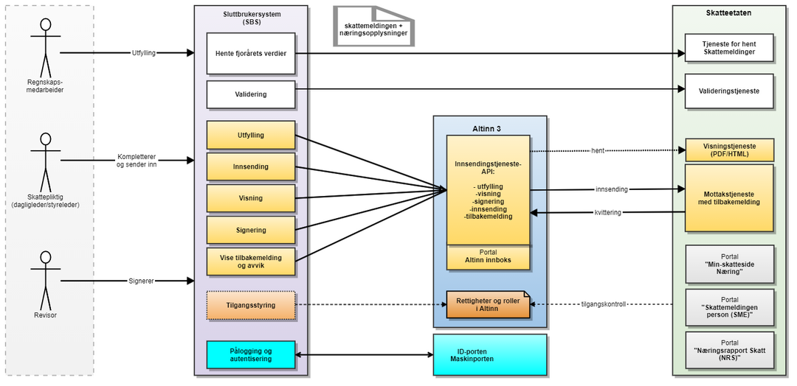

# Implementasjonsguide for systeminnsending av skattemelding

## Bakgrunn og behov

SIRIUS-prosjektet utvikler ny skattemelding for personlige og upersonlige skattepliktige. Målet er å heve kvalitet på innleverte opplysninger, gjøre det enklere å levere riktige opplysninger og effektivisere Skatteetatens behandling av skattemeldingen.

Utvikling av ny skattemelding foregår iterativt og innføres trinnvis. Først ut er ny skattemelding for lønnstakere og pensjonister. Denne innføres i perioden 2019-2021.

Systeminnsending av ny skattemelding for personlige skattepliktige (lønnstakere og pensjonister/personlige næringsdrivende) innføres fra 2021. I 2021 vil den dekke alle personlige forhold og utvalgte næringsforhold som skal testes ut i en pilot. Deretter vil vi innføre ny skattemelding for alle næringsforhold og upersonlig skattepliktige (selskap mv).

I forbindelse med en forskriftsendring vil det bli innført et pålegg om at næringsdrivende som hovedregel skal levere sin skattemelding på et bestemt digitalt format. Dette innebærer at flere næringsdrivende enn i dag må levere sin skattemelding fra et årsoppgjørsprogram eller regnskapssystem. Unntaket vil være næringsdrivende med enkle forhold (avgrensning ikke besluttet). Disse skal tilbys en portal for utfylling.

## Overordnet løsningsoversikt - komponenter, API og meldinger

Her beskrives arkitekturen i den nye løsningen. Figuren under viser en oversikt over aktører og komponenter.

- Et SBS oppretter skattemeldinger og næringsopplysninger gjennom et brukergrensesnitt mot sluttbrukere.
- SBS kan utføre operasjoner på skattemeldingene gjennom et API mot Altinn3. Disse API-en blir nye og er ikke de samme som benyttes i dag for Altinn2-innsending.
- Det tilbys API for å hente skattedata, validere skattemeldingen og næringsopplysninger, signere og sende inn.
- Skattemeldingen og næringsopplysninger vil være XML-filer og disse vil sendes som binære vedleggsfiler i API-ene. XML-filene vil ikke bli bundet til Altinn-skjema som i dag, men være ihht. nye XSD-er for skattemelding og næringsopplysninger. Skatteetaten spesifiser innholdet i XML-filene gjennom XSD-spesifikasjoner.
- Eksisterende funksjonalitet i Altinn2 for Innboks og roller og rettigheter vil videreføres i den nye løsningen.
- Skattepliktig og ev revisor kan gå i Altinn for å se på innsendte data og signere og sende inn til Skatteetaten (dette punktet gjelder ikke for pilot)
- Skatteetaten vil tilby portalløsning som gir personlige skattepliktige mulighet til innsyn og ev endring med påfølgende innsending av skattemeldingen.
- Pålogging, autentisering av sluttbrukeren og/eller sluttbrukersystemet skal gjøres via ID-porten og/eller Maskinporten.

## Funksjonell spesifikasjon

Sirius sin nye løsning for skattemelding for næringsdrivende vil støtte oppunder de samme lover og krav til næringsdrivende som dagens løsning.

Løsningen legger opp til at en innsending skal ha skattemelding og næringsopplysninger. For piloten er det de personlige skattepliktige med næring (ENK) som det utvikles støtte for.
Det stiplede rektangel identifiserer hva som ansees som en enhet med informasjon som skal sendes inn til Skatteetaten sine tjenester for validering og innsending.

Som i dagens løsning vil det være mulig å hente ned den informasjonene som Skatteeetaten vet om den skattepliktige og bruke dette som grunnlag for utfyllingen av skattemeldingen.
Etter pilot vil det også bli utviklet muligheter til å hente ned den informasjonen som Skatteetaten vet om den næringsdrivende og som kan brukes som utgangspunkt for å fylle ut næringsopplysningene.

### Detaljert Funksjonell spesifikasjon
En mer detaljer funksjonell spesifikasjon kan lastes ned her.
[Funksjonell spesifikasjon.pdf](Funksjonell spesifikasjon.pdf)
