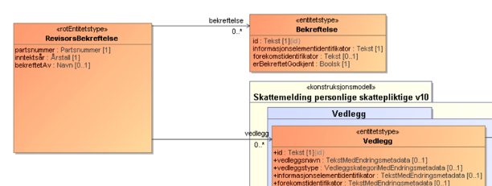

# Revisors signering
Enkelte elementer i skattemelding og næringsspesifikasjonen kan signeres av revisor, her beskrvies hvilke elementer og hvordan det utføres. 


## Elementer som kan få signering av revisor
### Skattemelding personlig
Forskning og utvikling (`prosjektSkalBekreftesAvRevisor`)?

### Skattemelding upersonlig
Følgende elementer kan signeres av revisor
Konsernbidrag (`konsernbidragSkalBekreftesAvRevisor`)
Forskning og utvikling (`prosjektSkalBekreftesAvRevisor`)

### Selskapsmelding
? 

### Næringsspesifikasjon
Hele

## Altinn3
For å starte signeringssteget i Altinn3 så må instansen opprettes med paramteret
`"skalBekreftesAvRevisor": true` i `"dataValues":` elemenet. Eksempel på opprettet instans data vil da være: 
```
{
  "instanceOwner": {
    "organisationNumber": "99999999"
  },
  "appOwner": {
    "labels": [
      "gr",
      "x2"
    ]
  },
  "appId": "skd/formueinntekt-skattemelding-v2",
  "dataValues": {
    "inntektsaar": 2022,
    "skalBekreftesAvRevisor": true
  },
  "dueBefore": "2023-06-01T12:00:00Z",
  "visibleAfter": "2023-01-20T00:00:00Z",
  "title": {
    "nb": "Skattemelding"
  }
}
```


Dersom instansen er merket med ‘skalBekreftesAvRevisor’ er det to bekreftelsessteg.

Bekreftelsesstegene kan fullføres:
- Ved å gå til altinn inboks, åpne instansen og gå til visningsklienten for å signere (begge steg- rollestyrt) 
- eller utføre bekreftelsen fra eget sluttbrukersystem

1. Første steg, den skattepliktige signerer, utførs med en ‘next’ som er tilgangsstyrt
2. Andre steg, revisor signerer, utføres ved å laste opp et signeringsdokument og deretter ‘next’, tilgangsstyrt
(beskrivelse av dokumetet på neste side). 

Etter to `next` sendes skattemeldingen inn (går til feedback steget), og Skatt vil retunere en kvittering (ok/ikke ok)

## Signeringsdokumenet
TODO: Lenke til xsd

Bekreftelse: referere informasjonselementidentifikator (entitet) som signeres og ev forekomstidentifikator
Vedlegg: peke på informasjonselementidentifikator (entitet) vedlegget peker mot
Vedlegg brukes kun hvis revisors signatur (erBekreftetGodkjent) er false og man laster opp dokumentasjon om hvorfor
