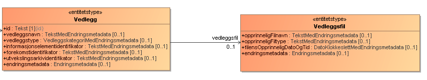

# Vedlegg til Skattemelding
## Innledning
Denne veiledningen beskriver hvordan en kan legge ved vedlegg til skattemeldingen og/eller næringsspesifikasjonen. 
API-beskrivelsen for laste opp vedlegg er beskrevet i detalj under api-v2/README.

## Vedleggsmodellen i XSD

Hver XSD (skattemelding, skattemelding-upersonlig, selskapsmeldingen, næringsspesifikasjonen) har et informasjonselement som heter vedlegg.
Bildet over viser hvordan vedleggsmodellen ser ut for 2023. Denne kan være forskjellig for forskjellige inntektsår, men flyten beskrevet nedenfor gjelder. 

## Vedleggstype
Vedleggstypen som skal brukes, finner en i [kodelisten vedleggskategori](../../src/resources/kodeliste/2023/2023_vedleggskategori.xml). Forskjellige vedleggstyper behandles forskjellig i kontrollarbeidet. 

## Validering
Validerings-API-et bryr seg stort sett ikke om vedlegg, men det er noen kontroller som krever vedlegg, for eksempel hvis en skattepliktig ønsker å endre på
- skjønnsfastsetting
- endre på et myndighetsfastsatt felt
- endringsanmodninger (endre skattemeldingen 3 år etter inntektsåret for personlig og ett år etter for upersonlig)

I disse tilfellene vil en kontroll slå ut og gi "faktisk feil" og hindre innsending om skattemeldingen eller næringsspesifikasjonen ikke inneholder en vedleggstype som reflekterer endringen en ønsker, som f.eks. klage og endringsanmodning. 

Det er derfor viktig å ha med informasjonselementet allerede på valideringstidspunktet, selv om en ikke har lastet opp vedlegget enda, om en ønsker å få validert skattemeldingen OK

## Opplasting før innsending
Binærfilen som lastes opp som vedlegg gjøres via Altinn3 sitt API, se "api-v2/README Last opp vedlegg (ved behov)" for detaljert beskrivelse

**Begrensninger:**
- Opptil 70 vedlegg
- Opptil 100MB per vedlegg

## Send inn
Send inn skattemeldingen på normal måte. 

## Last ned vedlegg fra en fastsatt skattemelding
Se "api-v2/README Hent vedlegg" for dokumentasjon for hvordan laste ned vedlegg fra fastsatt skattemelding.